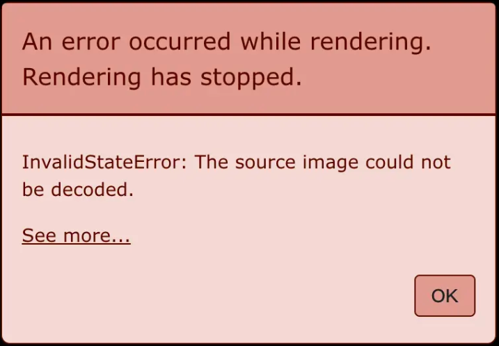
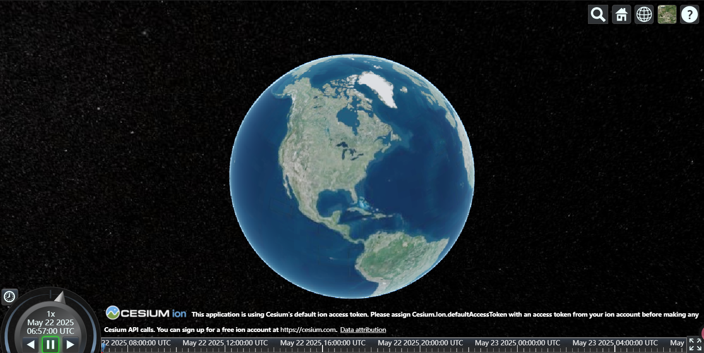

# Cesium 快速入门指南

## 环境准备
创建vue项目，安装Cesium，安装vite插件(为了解决渲染错误)，若不下载vite-plugin-cesium,则需要配置window.CESIUM_BASE_URL（这里不介绍，可参考[官网教程](https://cesium.com/learn/cesiumjs-learn/cesiumjs-quickstart/)）
```bash
# 创建vue项目 npm 7+，需要添加额外的 --
npm create vite@latest my-vue-cesium -- --template vue
# 安装Cesium
npm install cesium --save
# 安装vite插件(为了解决渲染错误)
npm i vite-plugin-cesium -D
```

## 工程配置
vite.config.js文件
```js
import { defineConfig } from "vite";
import vue from "@vitejs/plugin-vue";
import cesium from "vite-plugin-cesium";

// https://vite.dev/config/
export default defineConfig({
  plugins: [vue(), cesium()],
});
```

## 组件实现
```vue
<template>
  <div ref="cesiumContainer" style="width: 100%; height: 80vh;"></div>
</template>

<script setup>
import { ref, onMounted } from "vue";
import * as Cesium from "cesium";
const cesiumContainer = ref(null);
let viewer = null;

onMounted(() => {
  // 初始化Viewer
  viewer = new Cesium.Viewer(cesiumContainer.value, {});
});
</script>
```

## 效果验证
未配置插件时的典型渲染错误


正确配置后的地球显示效果


