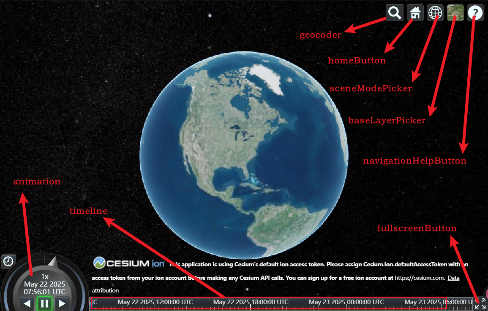

# 页面控件、logo隐藏
初始化页面存在默认的控件和logo，可通过以下方式隐藏

## 隐藏控件
```js
 viewer = new Cesium.Viewer(cesiumContainer.value, {
    geocoder: false, // 关闭地理编码搜索
    homeButton: false, // 关闭主页按钮
    sceneModePicker: false, // 关闭场景模式选择器
    baseLayerPicker: false, // 关闭底图选择器
    navigationHelpButton: false, // 关闭导航帮助
    animation: false, // 关闭动画控件
    timeline: false, // 关闭时间轴
    fullscreenButton: false, // 关闭全屏按钮
  });
```
## 隐藏logo
logo需要控制css来隐藏
```js
viewer.cesiumWidget.creditContainer.style.display = "none";
```
## 效果图
