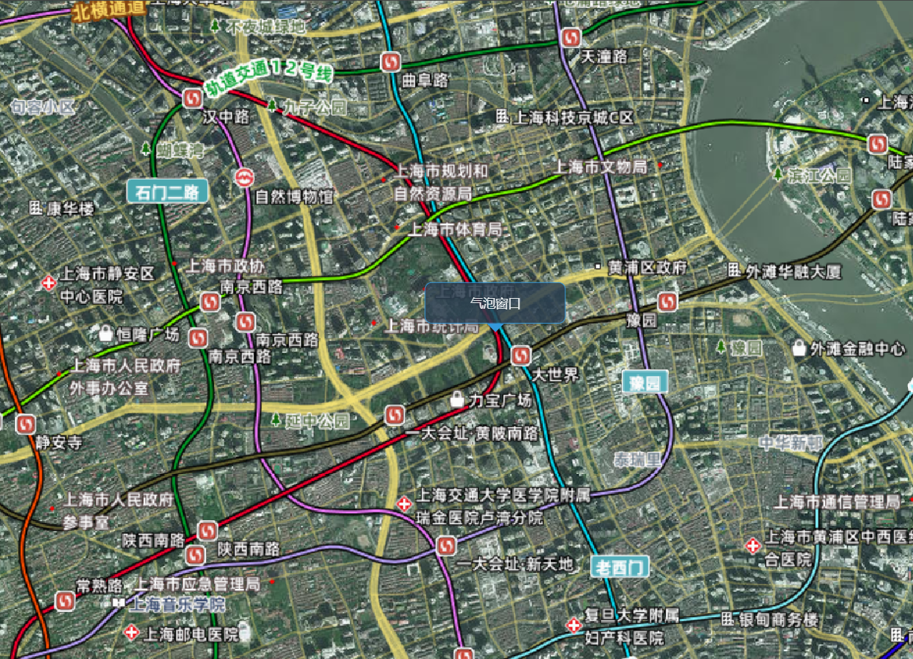

# Viewer：三维场景的“外壳”

[Viewer](https://cesium.com/learn/cesiumjs/ref-doc/Viewer.html?classFilter=viewer) 是 Cesium 的核心容器，作为 Cesium 应用入口，封装场景渲染、相机控制、交互逻辑等核心功能


## 创建 Viewer 实例

- container：指定容器元素，通常是一个 HTML 元素。
- options：可选配置项，包括控件设置、实体类型设置等。

```js
const viewer = new Cesium.Viewer(container, options);
```

## 核心特性

### 集成控件

常见控件：
| 控件名称 | 描述 | 类型 | 默认值 |
| --- | --- | --- | --- |
| geocoder | 地理编码搜索 | boolean | true |
| homeButton | 主页按钮 | boolean | true |
| sceneModePicker | 场景模式选择器 | boolean | true |
| baseLayerPicker | 底图选择器 | boolean | true |
| navigationHelpButton | 导航帮助按钮 | boolean | true |
| animation | 动画控件 | boolean | true |
| timeline | 时间轴 | boolean | true |
| fullscreenButton | 全屏按钮 | boolean | true |
| vrButton | VR 按钮 | boolean | false |
| infoBox | 信息框 | boolean | true |
| selectionIndicator | 选择指示器 | boolean | true |

使用方式：

```js
const viewer = new Cesium.Viewer(cesiumContainer.value, {
  geocoder: false, // 关闭地理编码搜索
  homeButton: false, // 关闭主页按钮
  sceneModePicker: false, // 关闭场景模式选择器
  baseLayerPicker: false, // 关闭底图选择器
  navigationHelpButton: false, // 关闭导航帮助
  animation: false, // 关闭动画控件
  timeline: false, // 关闭时间轴
  fullscreenButton: false, // 关闭全屏按钮
});
```

### 场景管理(scene)

Scene 是 Viewer 的内部对象，管理 WebGL 渲染、相机、光照和几何体绘制

#### 隐藏地球

```js
scene.globe.show = false; // 隐藏地球
```

#### 场景模式切换

```js
// 切换到2D模式
scene.morphTo2D(2); // 2秒过渡时间

// 切换到3D模式
scene.morphTo3D(2);

// 切换到哥伦布视图（2.5D）
scene.morphToColumbusView(2);
```

#### 天空盒

设置背景颜色，cesium 默认是**_星系背景_**，可自定义更换，`需将skyBox属性设置为false，否则会覆盖背景颜色`

```js
const viewer = new Cesium.Viewer(cesiumContainer.value, {
  skyBox: false, // 方式一：关闭天空盒
});
// viewer.scene.skyBox.show = false; // 方式二
// 设置场景背景颜色为天空蓝
viewer.scene.backgroundColor = Cesium.Color.SKYBLUE;
```


`自定义天空盒背景图，添加自定义图片`，[官网 API](https://cesium.com/learn/cesiumjs/ref-doc/SkyBox.html)

```js
// 引入图片资源
import mx from "./skyBox/tycho2t3_80_mx.jpg";
import my from "./skyBox/tycho2t3_80_my.jpg";
import mz from "./skyBox/tycho2t3_80_mz.jpg";
import px from "./skyBox/tycho2t3_80_px.jpg";
import py from "./skyBox/tycho2t3_80_py.jpg";
import pz from "./skyBox/tycho2t3_80_pz.jpg";
// 动态加载图片
viewer.scene.skyBox = new Cesium.SkyBox({
  sources: {
    positiveX: mx,
    negativeX: px,
    positiveY: my,
    negativeY: py,
    positiveZ: mz,
    negativeZ: pz,
  },
});
```


#### 关闭大气层显示

```js
// 方式一
viewer.scene.skyAtmosphere.show = false;
// 方式二：在options中设置
const viewer = new Cesium.Viewer(cesiumContainer.value, {
  skyAtmosphere: false, // 关闭大气层
});
```


#### 显示帧率

```js
viewer.scene.debugShowFramesPerSecond = true;
```

#### 添加气泡窗口



自定义 html 内容，添加到场景中。可以通过`scene.cartesianToCanvasCoordinates`来实现

```html
<!-- 添加气泡窗口 -->
<div
  ref="popup"
  style="
      position: absolute;
      padding: 10px;
      border: 1px solid aqua;
      border-radius: 5px;
    "
>
  气泡窗口
</div>
```

```js
viewer.camera.setView({
  destination: Cesium.Cartesian3.fromDegrees(121.4737, 31.2304, 5000),
  orientation: {
    heading: Cesium.Math.toRadians(0),
    pitch: Cesium.Math.toRadians(-90),
    roll: 0,
  },
});
// 添加preRender事件，使窗口位置保持不变
viewer.scene.preRender.addEventListener(function () {
  const htmlPop = viewer.scene.cartesianToCanvasCoordinates(
    Cesium.Cartesian3.fromDegrees(121.4737, 31.2304, 0),
    new Cesium.Cartesian2()
  );
  popup.value.style.left = htmlPop.x + "px";
  popup.value.style.top = htmlPop.y + "px";
});
```

<!-- #### 深度检测与地形遮挡

```js
// 开启深度检测（解决地形与模型穿插）
scene.globe.depthTestAgainstTerrain = true;

// 设置地形遮挡（裁剪平面）
const clippingPlane = new Cesium.ClippingPlane({
  normal: new Cesium.Cartesian3(0.0, 0.0, -1.0), // 法线方向
  distance: -100.0, // 裁剪距离
});

scene.globe.clippingPlanes = new Cesium.ClippingPlaneCollection({
  planes: [clippingPlane],
  enabled: true,
});
``` -->

### 实体添加(entity)、GeoJson 数据添加

#### 实体添加：

这里提供一个简单的实体，介绍一下配置项中的选择指示器`selectionIndicator`和信息框`infoBox`，详细实体介绍参考[实体类型](./08_实体.md)

```js
const rectangle = viewer.entities.add({
  rectangle: {
    coordinates: Cesium.Rectangle.fromDegrees(
      116.3975,
      39.9075,
      116.4075,
      39.9175
    ),
    material: Cesium.Color.RED.withAlpha(0.5),
  },
});
viewer.zoomTo(rectangle);
```


点击实体会出现标识控件和提示框，可通过设置为 false 来关闭。

```js
new Cesium.Viewer(cesiumContainer.value, {
  selectionIndicator: false, // 关闭选择指示器
  infoBox: false, // 关闭信息框
});
```

#### GeoJson 数据添加：

GeoJson 是一种用于描述地理空间数据的开放标准，支持点、线、面等几何对象。以下为一个简单的 GeoJson 示例，更多可参考[数据加载](./15_数据加载.md)

```js
// 模拟一个GeoJson数据
const geojson = {
  type: "FeatureCollection",
  features: [
    {
      type: "Feature",
      properties: {
        name: "City A",
      },
      geometry: {
        type: "Point",
        coordinates: [116.404, 39.915],
      },
    },
  ],
};
// 加载GeoJson数据
const dataSource = Cesium.GeoJsonDataSource.load(geojson);
viewer.dataSources.add(dataSource);
viewer.flyTo(dataSource);
```

### 地形(terrain)

Cesium 的地形系统允许在三维地球表面呈现真实高程数据（山脉、峡谷、河流等地貌），结合 地形瓦片 和 LOD（细节层次） 技术实现高效渲染。

#### 默认地形

```js
// 使用默认地形
const viewer = new Cesium.Viewer("cesiumContainer", {
  terrainProvider: await Cesium.createWorldTerrainAsync({
    requestVertexNormals: true, // 真实光照效果
    requestWaterMask: true, // 真实水面流动效果
  }),
});
```


#### 本地地形

```js
// 加载本地地形切片
const localTerrain = new Cesium.CesiumTerrainProvider({
  url: "./assets/terrain",
  requestVertexNormals: true,
  requestWaterMask: true,
});
viewer.terrainProvider = localTerrain;
```

#### 获取地形的高度

使用`sampleTerrainMostDetailed`,可接受一个或多个位置，返回一个包含高度信息的数组。它是一个异步方法，返回一个 Promise。

```js
// 获取某一点的地形高度
const position = Cesium.Cartographic.fromDegrees(longitude, latitude);
const height = await Cesium.sampleTerrainMostDetailed(viewer.terrainProvider, [
  position,
]);
console.log(height[0].height); // 该点的地形高度
```

### Viewer 常用方法

- `zoomTo(target,offset)`：相机自动调整到指定实体的视野。(实体)
- `flyTo(target, options)`：相机平滑过渡到指定实体的位置。(实体)
- `camera.setView(options)`：立即设置相机位置。
- `camera.flyTo(options)`：相机平滑过渡到指定位置。(注意与 flyTo 的区别)
- `trackedEntity`：锁定相机视角跟随实体移动（适合动态目标跟踪）
- `entities.add()`：添加实体到场景。
- `scene.pick(position)`：根据屏幕坐标拾取场景中的实体。
- `destroy()`：销毁 Viewer 实例。
