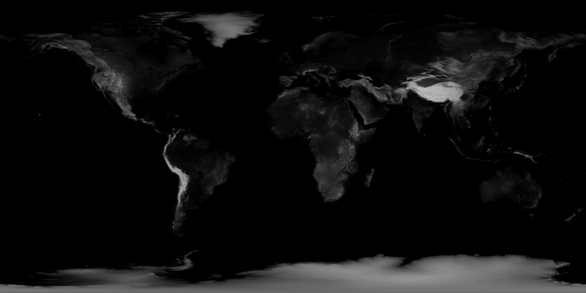

# 底图更换

Cesium 默认使用 Bing Maps 作为地图源，但由于 Bing Maps 在国内可能存在访问限制，开发者常需替换为更适合国内使用的地图服务,以下以天地图为例来更换底图

## 底图类型与选择建议

| 瓦片类型        | 协议标准     | 优点                         | 缺点               | 适用场景                         |
| --------------- | ------------ | ---------------------------- | ------------------ | -------------------------------- |
| **WMTS**        | OGC 标准     | 支持严格地理参考，多级比例尺 | URL 复杂，配置项多 | 天地图、国家地理信息公共服务平台 |
| **XYZ**         | 非标准但通用 | 配置简单，URL 直观           | 部分服务有访问限制 | 高德、谷歌、OSM 等主流地图       |
| **Single Tile** | 单张图片     | 适合自定义背景图，离线场景   | 精度低，不支持缩放 | 简化地图、专题图背景             |

## 天地图 WMTS 服务（推荐国内使用）

`WebMapTileServiceImageryProvider`添加 WMTS 影像，下面为天地图加载

> 1. 需要将`viewer`配置项中`baseLayer`和`baseLayerPicker`设置为`false`，否则 Cesium 同时会加载 Bing Maps
> 2. 这里添加了天地图影像和地理标注，后添加的会覆盖前面的
> 3. 后续案例中会使用天地图作为默认底图

### 前置工作

- 需要申请[天地图](http://lbs.tianditu.gov.cn/home.html)的 key，代码中提供了我自己的 key，方便大家调试，实际使用时请替换为自己的 key

:::details 展开代码

```vue
<template>
  <div ref="cesiumContainer" class="container"></div>
</template>

<script setup>
import { ref, onMounted } from "vue";
import * as Cesium from "cesium";
const cesiumContainer = ref(null);
let viewer = null;

// 天地图TOKEN
const token = "05be06461004055923091de7f3e51aa6";

onMounted(() => {
  // 初始化Viewer
  viewer = new Cesium.Viewer(cesiumContainer.value, {
    baseLayer: false, // 关闭默认地图
    baseLayerPicker: false, // 关闭底图选择器
  });
  initMap();
});

// 加载天地图
const initMap = () => {
  // 以下为天地图及天地图标注加载
  const tiandituProvider = new Cesium.WebMapTileServiceImageryProvider({
    url:
      "http://{s}.tianditu.gov.cn/img_w/wmts?service=wmts&request=GetTile&version=1.0.0&LAYER=img&tileMatrixSet=w&TileMatrix={TileMatrix}&TileRow={TileRow}&TileCol={TileCol}&style=default&format=tiles&tk=" +
      token,
    layer: "img",
    style: "default",
    format: "tiles",
    tileMatrixSetID: "w", // 天地图使用 Web 墨卡托投影（EPSG:3857），需确保 tileMatrixSetID: "w"
    subdomains: ["t0", "t1", "t2", "t3", "t4", "t5", "t6", "t7"], // 子域名
    maximumLevel: 18,
    credit: new Cesium.Credit("天地图影像"),
  });

  // 添加地理标注
  const labelProvider = new Cesium.WebMapTileServiceImageryProvider({
    url:
      "http://{s}.tianditu.gov.cn/cia_w/wmts?service=wmts&request=GetTile&version=1.0.0&LAYER=cia&tileMatrixSet=w&tileMatrix={TileMatrix}&tileRow={TileRow}&tileCol={TileCol}&style=default&format=tiles&tk=" +
      token,
    layer: "img",
    style: "default",
    format: "tiles",
    tileMatrixSetID: "w",
    subdomains: ["t0", "t1", "t2", "t3", "t4", "t5", "t6", "t7"], // 子域名轮询
    maximumLevel: 18,
    credit: new Cesium.Credit("天地图影像"),
  });
  // 天地图影像添加到viewer实例的影像图层集合中
  viewer.imageryLayers.addImageryProvider(tiandituProvider);
  // 天地图地理标注（后添加的会覆盖前面的）
  viewer.imageryLayers.addImageryProvider(labelProvider);
};
</script>
<style scoped>
.container {
  width: 100vw;
  height: 100vh;
}
</style>
```

:::


### 关键参数说明

| 参数              | 取值范围   | 说明                                                         |
| ----------------- | ---------- | ------------------------------------------------------------ |
| `tileMatrixSetID` | "w" \| "c" | "w"=Web 墨卡托投影（EPSG:3857），"c"=经纬度投影（EPSG:4326） |
| `subdomains`      | 数组       | 天地图提供 8 个子域名，用于分散请求压力                      |
| `maximumLevel`    | 1-18       | 18 级为最高精度（约 0.5 米/像素）                            |

## 高德地图 XYZ 影像瓦片

`UrlTemplateImageryProvider`添加 XYZ 影像，下面为高德地图瓦片加载

:::details 展开代码

```vue
<template>
  <div ref="cesiumContainer" class="container"></div>
</template>

<script setup>
import { ref, onMounted } from "vue";
import * as Cesium from "cesium";
const cesiumContainer = ref(null);
let viewer = null;

onMounted(() => {
  // 初始化Viewer
  viewer = new Cesium.Viewer(cesiumContainer.value, {
    baseLayer: false, // 关闭默认地图
    baseLayerPicker: false, // 关闭底图选择器
  });
  initMap();
});

// 加载高德地图
const initMap = () => {
  const gaodeProvider = new Cesium.UrlTemplateImageryProvider({
    url: "https://webst0{s}.is.autonavi.com/appmaptile?style=6&x={x}&y={y}&z={z}",
    subdomains: ["1", "2", "3", "4"],
  });
  viewer.imageryLayers.addImageryProvider(gaodeProvider);
};
</script>
<style scoped>
.container {
  width: 100vw;
  height: 100vh;
}
</style>
```

:::

## 添加顶级影像瓦片

`SingleTileImageryProvider`添加顶级影像瓦片，下面为单张图片加载

:::details 展开代码

```vue
<template>
  <div ref="cesiumContainer" class="container"></div>
</template>

<script setup>
import { ref, onMounted } from "vue";
import * as Cesium from "cesium";
const cesiumContainer = ref(null);
let viewer = null;

onMounted(() => {
  // 初始化Viewer
  viewer = new Cesium.Viewer(cesiumContainer.value, {
    baseLayer: false, // 关闭默认地图
    baseLayerPicker: false, // 关闭底图选择器
  });
  initMap();
});

// 加载单图像图层
const initMap = () => {
  const singleTileLayer = Cesium.ImageryLayer.fromProviderAsync(
    Cesium.SingleTileImageryProvider.fromUrl("/src/assets/earthbump1k.jpg", {
      rectangle: Cesium.Rectangle.fromDegrees(-180.0, -90.0, 180.0, 90.0),
    })
  );
  // singleTileLayer.alpha = 0.8; // 设置透明度
  viewer.imageryLayers.add(singleTileLayer);
};
</script>
<style scoped>
.container {
  width: 100vw;
  height: 100vh;
}
</style>
```

:::

img 图片：


添加后效果图，可通过`alpha`属性设置透明度

