# 实体学习

实体（Entity）是 Cesium 中用于表示 动态时空对象 的核心概念，用于可视化点、线、面、模型、标签等对象，并支持时间动态属性和数据绑定

## 添加实体

- 使用`viewer.entities.add()`添加实体

### 实体公共属性

| 属性名      | 类型       | 描述             |
| ----------- | ---------- | ---------------- |
| id          | String     | 实体的唯一标识符 |
| name        | String     | 实体的名称       |
| show        | Boolean    | 实体的可见性     |
| description | String     | 实体的描述信息   |
| position    | Cartesian3 | 实体的位置坐标   |
| orientation | Quaternion | 实体的朝向       |
| properties  | Object     | 实体的属性集合   |

### 实体类型

- 以下为全部实体类型,[官网传送门](https://cesium.com/learn/cesiumjs/ref-doc/Entity.html?classFilter=entity#.ConstructorOptions),

| 实体类型            | 描述                   |
| ------------------- | ---------------------- |
| 点（Point）         | 要与此实体关联的点     |
| 线（Polyline）      | 要与此实体关联的多段线 |
| 多边形（Polygon）   | 要与此实体关联的多边形 |
| 广告牌（Billboard） | 要与此实体关联的公告板 |
| 箱（Box）           | 要与此实体关联的框     |
| 矩形（Rectangle）   | 要与此实体关联的矩形   |
| 椭圆（Ellipse）     | 要与此实体关联的椭圆   |
| 椭圆体（Ellipsoid） | 要与此实体关联的椭球体 |
| 圆柱体（Cylinder）  | 要与此实体关联的圆柱体 |
| 标签（Label）       | 与此实体关联的标签     |
| 路径（Path）        | 要与此实体关联的路径   |
| 平面（Plane）       | 要与此实体关联的平面   |
| 墙（Wall）          | 要与此实体关联的墙     |
| 走廊（Corridor）    | 要与此实体关联的走廊   |
| 模型（Model）       | 要与此实体关联的模型   |

## 点（Point）

| 属性                     | 类型                     | 默认值      | 描述                                                                                               |
| ------------------------ | ------------------------ | ----------- | -------------------------------------------------------------------------------------------------- |
| color                    | Color                    | Color.WHITE | 点的填充颜色（支持 RGBA 透明度）                                                                   |
| pixelSize                | Number                   | 1           | 点的像素大小（屏幕空间固定尺寸）                                                                   |
| outlineColor             | Color                    | Color.BLACK | 点轮廓的颜色                                                                                       |
| outlineWidth             | Number                   | 0           | 点轮廓的宽度（像素）                                                                               |
| heightReference          | HeightReference          | NONE        | 高度参考模式：<br>• NONE - 绝对高度<br>• CLAMP_TO_GROUND - 贴地<br>• RELATIVE_TO_GROUND - 相对地面 |
| scaleByDistance          | NearFarScalar            | null        | 根据相机距离缩放点大小                                                                             |
| translucencyByDistance   | NearFarScalar            | null        | 根据相机距离调整透明度                                                                             |
| distanceDisplayCondition | DistanceDisplayCondition | null        | 基于距离的显隐控制                                                                                 |
| disableDepthTestDistance | Boolean                  | null        | 用于指定要禁用深度测试的相机的距离                                                                 |
| show                     | Boolean                  | true        | 是否显示点                                                                                         |

[官网 options 介绍](https://cesium.com/learn/cesiumjs/ref-doc/PointGraphics.html#.ConstructorOptions)

### 基础实例

```js
const pointEntity = viewer.entities.add({
  position: Cesium.Cartesian3.fromDegrees(116.3975, 39.9075, 50),
  point: {
    color: Cesium.Color.RED.withAlpha(0.8), // 80% 不透明的红色
    pixelSize: 20, // 直径20像素
    outlineColor: Cesium.Color.WHITE, // 白色轮廓
    outlineWidth: 3, // 轮廓宽度3像素
    heightReference: Cesium.HeightReference.CLAMP_TO_GROUND, // 贴地显示
    show: true, // 默认显示
  },
});
```

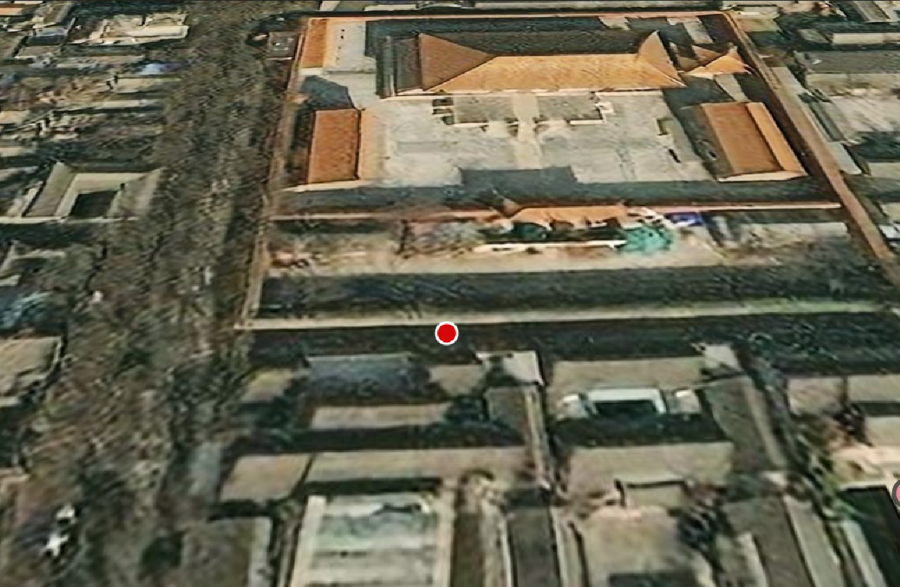

### 动态属性

1. 距离相关缩放 (scaleByDistance)

当相机靠近时点变大，远离时点变小

```js
pointEntity.point.scaleByDistance = new Cesium.NearFarScalar(
  1000, // 相机距离1000米时
  2.0, // 缩放至2倍大小
  5000, // 相机距离5000米时
  0.5 // 缩放至0.5倍大小
);
```

2. 距离相关透明度 (translucencyByDistance)

当相机靠近时透明度降低，远离时透明度升高

```js
pointEntity.point.translucencyByDistance = new Cesium.NearFarScalar(
  500, // 相机距离500米时
  1.0, // 完全不透明
  2000, // 相机距离2000米时
  0.2 // 20%透明度
);
```

3. 距离显隐控制 (distanceDisplayCondition)

相机距离 100-5000 米之间显示点

```js
pointEntity.point.distanceDisplayCondition =
  new Cesium.DistanceDisplayCondition(
    100, // 最小可见距离（米）
    5000 // 最大可见距离（米）
  );
```

### 高级技巧

聚合大量点（Cluster）

```js
// 创建支持聚合的数据源
const clusteredDataSource = new Cesium.CustomDataSource("clusteredData");

// 添加到 Viewer
viewer.dataSources.add(clusteredDataSource);

// 启用聚合
clusteredDataSource.clustering.enabled = true;

// 配置聚合参数
clusteredDataSource.clustering.pixelRange = 48; // 聚合像素范围
clusteredDataSource.clustering.minimumClusterSize = 3; // 最小聚合点数

// 添加点实体
for (let i = 0; i < 1000; i++) {
  clusteredDataSource.entities.add({
    position: Cesium.Cartesian3.fromDegrees(
      116.3975 + Math.random() * 0.01, // 随机偏移
      39.9075 + Math.random() * 0.01, // 随机偏移
      50
    ),
    point: {
      pixelSize: 15,
      color: Cesium.Color.fromRandom(),
    },
    id: `point-${i}`,
  });
}
```

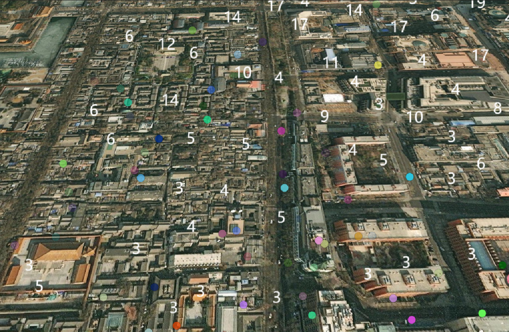

## 线（Polyline）

| 属性                     | 类型                     | 默认值                         | 描述                                                                                 |
| ------------------------ | ------------------------ | ------------------------------ | ------------------------------------------------------------------------------------ |
| show                     | Boolean                  | true                           | 是否显示线                                                                           |
| positions                | PositionProperty         | []                             | 定义折线的顶点位置（Cartesian3 数组）                                                |
| width                    | Number                   | 1.0                            | 折线宽度（像素）                                                                     |
| granularity              | Number                   | Cesium.Math.RADIANS_PER_DEGREE | 折线的粒度（用于简化折线）                                                           |
| material                 | MaterialProperty         | Color.WHITE                    | 折线的材质（颜色、纹理、特效等）                                                     |
| depthFailMaterial        | MaterialProperty         | null                           | 用于指定当多段线位于 terrain 下方时用于绘制多段线的材质                              |
| arcType                  | ArcType                  | ArcType.GEODESIC               | 线段类型：<br>• GEODESIC - 测地线（沿地球表面）<br>• RHUMB - 恒向线<br>• NONE - 直线 |
| clampToGround            | Boolean                  | false                          | 是否贴地显示（需要地形数据）                                                         |
| shadows                  | ShadowMode               | ShadowMode.DISABLED            | 指定多段线是投射还是接收来自光源的阴影                                               |
| distanceDisplayCondition | DistanceDisplayCondition | null                           | 基于距离的显隐控制                                                                   |
| classificationType       | ClassificationType       | ClassificationType.BOTH        | 指定折线应如何分类地形或 3D Tiles                                                    |
| zIndex                   | Number                   | 0                              | 控制折线的绘制顺序                                                                   |

[官网 options 介绍](https://cesium.com/learn/cesiumjs/ref-doc/PolylineGraphics.html#.ConstructorOptions)

### 基础实例

```js
const positions = Cesium.Cartesian3.fromDegreesArray([
  116.3975,
  39.9075, // 北京
  121.4737,
  31.2304, // 上海
  114.1694,
  30.5812, // 武汉
]);

const polyline = viewer.entities.add({
  polyline: {
    positions: positions,
    width: 8,
    material: Cesium.Color.BLUE,
    arcType: Cesium.ArcType.GEODESIC, // 测地线(沿地球表面)
    clampToGround: true, // 贴地显示
  },
});
```

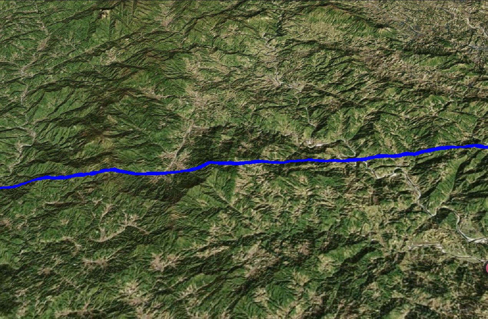

## 多边形（Polygon）

| 属性                     | 类型                     | 默认值                         | 描述                                                                                   |
| ------------------------ | ------------------------ | ------------------------------ | -------------------------------------------------------------------------------------- |
| show                     | Boolean                  | true                           | 是否显示多边形                                                                         |
| hierarchy                | PolygonHierarchy         | null                           | 定义多边形的顶点位置（Cartesian3 数组）                                                |
| material                 | MaterialProperty         | Color.WHITE                    | 多边形的材质（颜色、纹理、特效等）                                                     |
| outline                  | Boolean                  | false                          | 是否显示多边形轮廓                                                                     |
| outlineColor             | Color                    | Color.BLACK                    | 多边形轮廓的颜色                                                                       |
| outlineWidth             | Number                   | 1.0                            | 多边形轮廓的宽度（像素）                                                               |
| height                   | Number                   | 0                              | 多边形的高度（相对于地形）                                                             |
| extrudedHeight           | Number                   | 0.0                            | 多边形的拉伸高度（相对于地形）                                                         |
| perPositionHeight        | Boolean                  | false                          | 是否为每个顶点指定高度                                                                 |
| granularity              | Number                   | Cesium.Math.RADIANS_PER_DEGREE | 多边形的粒度（用于简化多边形）                                                         |
| stRotation               | Number                   | 0.0                            | 纹理旋转角度（弧度）                                                                   |
| closeTop                 | Boolean                  | true                           | 是否闭合顶部                                                                           |
| closeBottom              | Boolean                  | true                           | 是否闭合底部                                                                           |
| fill                     | Boolean                  | true                           | 是否填充多边形                                                                         |
| arcType                  | ArcType                  | ArcType.GEODESIC               | 多边形类型：<br>• GEODESIC - 测地线（沿地球表面）<br>• RHUMB - 恒向面<br>• NONE - 平面 |
| shadows                  | ShadowMode               | ShadowMode.DISABLED            | 指定多边形是投射还是接收来自光源的阴影                                                 |
| distanceDisplayCondition | DistanceDisplayCondition | null                           | 基于距离的显隐控制                                                                     |
| classificationType       | ClassificationType       | ClassificationType.BOTH        | 指定多边形应如何分类地形或 3D Tiles                                                    |
| zIndex                   | Number                   | 0                              | 控制多边形的绘制顺序                                                                   |

[官网 options 介绍](https://cesium.com/learn/cesiumjs/ref-doc/PolygonGraphics.html#.ConstructorOptions)

### 基础实例

```js
const positions = Cesium.Cartesian3.fromDegreesArray([
  116.397,
  39.907, // 第一个点
  116.407,
  39.907, // 第二个点
  116.407,
  39.917, // 第三个点
  116.397,
  39.917, // 第四个点
]);

const polygon = viewer.entities.add({
  polygon: {
    hierarchy: positions,
    material: Cesium.Color.RED.withAlpha(0.5), // 半透明红色
    outline: true,
    outlineWidth: 20,
    outlineColor: Cesium.Color.WHITE,
  },
});
```

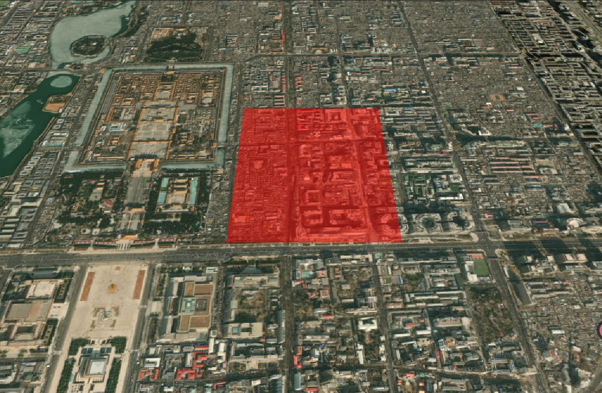

### 带孔洞多边形

hierarchy 属性为 PolygonHierarchy 类型，该类型可以接受一个 Cartesian3 数组，也可以接受一个 PolygonHierarchy 数组，用于定义多边形的顶点位置和孔的位置。

```js
const positions = Cesium.Cartesian3.fromDegreesArray([
  116.39, 39.9, 116.41, 39.9, 116.41, 39.92, 116.39, 39.92,
]);

const hole = Cesium.Cartesian3.fromDegreesArray([
  116.397, 39.907, 116.403, 39.907, 116.403, 39.913, 116.397, 39.913,
]);

const polygon = viewer.entities.add({
  polygon: {
    hierarchy: new Cesium.PolygonHierarchy(positions, [
      new Cesium.PolygonHierarchy(hole),
    ]),
    material: Cesium.Color.RED.withAlpha(0.5), // 半透明红色
    outline: true,
    outlineWidth: 20,
    outlineColor: Cesium.Color.WHITE,
    height: 100,
    extrudedHeight: 300, // 创建3D柱体
  },
});
```

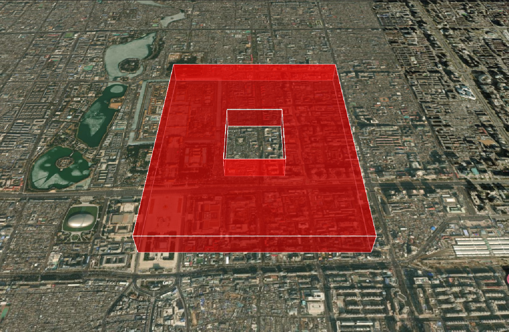

## 模型(model)

在 Cesium 中加载 3D 模型是实现复杂三维场景的关键技术

1. 支持格式

   - glTF（GL Transmission Format）：Cesium 推荐的标准格式
   - glb：glTF 的二进制版本
   - 其他格式：需转换为 glTF（如 FBX、OBJ 等）

2. 注意:路径就是`uri`,不是`url`

| 属性                       | 类型                     | 默认值                   | 描述                                                                                               |
| -------------------------- | ------------------------ | ------------------------ | -------------------------------------------------------------------------------------------------- |
| show                       | Boolean                  | true                     | 是否显示模型                                                                                       |
| uri                        | String                   | null                     | 模型文件的 URL                                                                                     |
| enableVerticalExaggeration | Boolean                  | true                     | 是否启用垂直夸大                                                                                   |
| minimumPixelSize           | Number                   | 128                      | 模型的最小像素大小（用于避免模型在屏幕上过于小）                                                   |
| maximumScale               | Number                   | Number.POSITIVE_INFINITY | 模型的最大缩放比例                                                                                 |
| incrementallyLoadTextures  | Boolean                  | true                     | 是否增量加载纹理                                                                                   |
| scale                      | Number                   | 1.0                      | 模型的缩放比例                                                                                     |
| runAnimations              | Boolean                  | true                     | 是否运行模型的动画                                                                                 |
| clampAnimations            | Boolean                  | true                     | 是否限制动画时间                                                                                   |
| animation                  | Animation                | null                     | 模型的动画                                                                                         |
| shadows                    | ShadowMode               | ShadowMode.DISABLED      | 指定模型是投射还是接收来自光源的阴影                                                               |
| heightReference            | HeightReference          | NONE                     | 高度参考模式：<br>• NONE - 绝对高度<br>• CLAMP_TO_GROUND - 贴地<br>• RELATIVE_TO_GROUND - 相对地面 |
| silhouetteColor            | Color                    | Color.RED                | 模型轮廓的颜色                                                                                     |
| silhouetteSize             | Number                   | 0.0                      | 模型轮廓的大小（像素）                                                                             |
| color                      | Color                    | Color.WHITE              | 模型的颜色                                                                                         |
| colorBlendMode             | ColorBlendMode           | ColorBlendMode.HIGHLIGHT | 颜色混合模式：<br>• HIGHLIGHT - 高亮<br>• REPLACE - 替换<br>• MIX - 混合                           |
| colorBlendAmount           | Number                   | 0.0                      | 颜色混合的强度                                                                                     |
| imageBasedLightingFactor   | Cartesian2               | new Cartesian2(1.0, 1.0) | 基于图像的光照因子                                                                                 |
| environmentMapOptions      | EnvironmentMapOptions    | null                     | 环境贴图选项                                                                                       |
| lightColor                 | Color                    | Color.WHITE              | 光照颜色                                                                                           |
| distanceDisplayCondition   | DistanceDisplayCondition | null                     | 基于距离的显隐控制                                                                                 |
| nodeTransformations        | NodeTransformations      | null                     | 节点变换                                                                                           |
| articulations              | Articulations            | null                     | 模型的关节（关节动画）                                                                             |
| clippingPlanes             | ClippingPlaneCollection  | null                     | 裁剪平面集合                                                                                       |
| customShader               | CustomShader             | null                     | 自定义着色器                                                                                       |

[官网 options 介绍](https://cesium.com/learn/cesiumjs/ref-doc/ModelGraphics.html#.ConstructorOptions)

### 基础实例

注意点: `无法使用import引入glb数据`

1. 可以将模型放在 public 目录下,建一个 models 文件,使用`/models/Cesium_Air.glb`
2. 自定义模型路径,使用`new URL("./models/Cesium_Air.glb", import.meta.url).href`引入路径
3. 以下模型是我从 cesium 官网中下载的,放在了该开源项目上,路径`/src/Aassets/Basics/models`

```js
const modelEntity = viewer.entities.add({
  position: Cesium.Cartesian3.fromDegrees(116.397, 39.907, 100),
  model: {
    // uri: '/models/Cesium_Air.glb', // 模型在public目录下
    uri: new URL("./models/Cesium_Air.glb", import.meta.url).href,
    scale: 10.0,
    minimumPixelSize: 128, // 最小像素尺寸
    maximumScale: 20000, // 最大缩放比例
  },
});
```

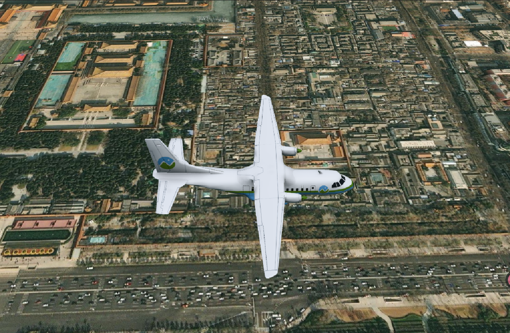

### 高级技巧

模型动画,模拟飞机不断飞行,使用`viewer.trackedEntity`使相机位置跟随实体

```js
// 动态位置
let t = 0.000001;
modelEntity.position = new Cesium.CallbackProperty(() => {
  t += 0.000001;
  return Cesium.Cartesian3.fromDegrees(116.397 + t, 39.907, 100);
}, false);

// 相机跟随实体
viewer.trackedEntity = modelEntity;
```

2. 模型裁减

```js
const clippingPlane = new Cesium.ClippingPlane(
  new Cesium.Cartesian3(1, 0, 0), // 法线向量
  0 // 距离
);

modelEntity.model.clippingPlanes = new Cesium.ClippingPlaneCollection({
  planes: [clippingPlane], // 裁剪平面集合
  edgeWidth: 1.0, // 裁剪边缘宽度
  edgeColor: Cesium.Color.RED, // 裁剪边缘颜色
});
```

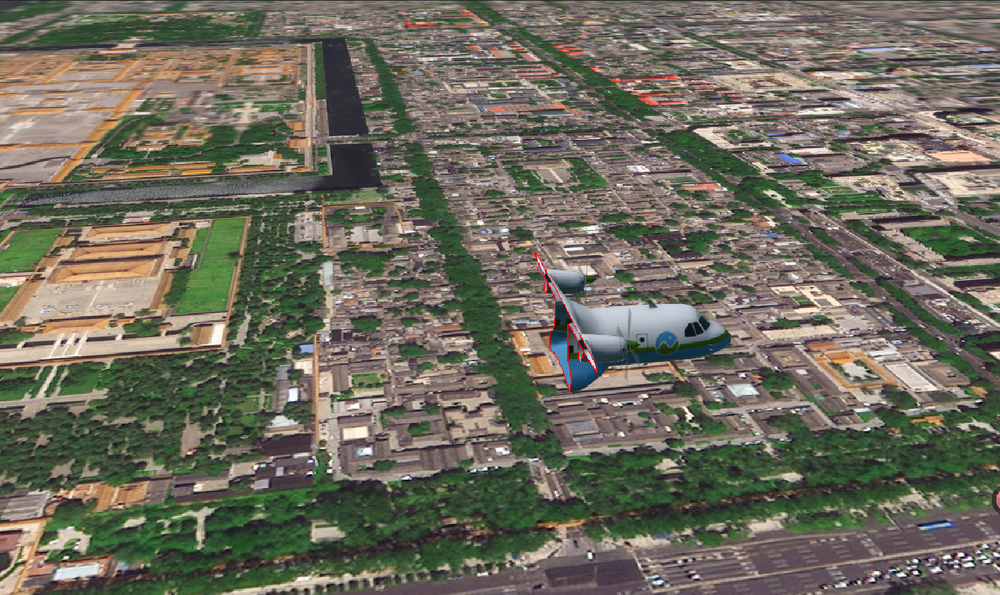

## 广告牌（Billboard）

广告牌（Billboard）是 Cesium 中用于在 3D 场景中显示 2D 图标或文本标签的核心可视化元素。广告牌始终面向相机，无论相机如何旋转，都能保持正面朝向观察者，非常适合用于标记位置、显示图标或文本标签。

| 属性                     | 类型                     | 默认值                  | 描述                                                                                                       |
| ------------------------ | ------------------------ | ----------------------- | ---------------------------------------------------------------------------------------------------------- |
| show                     | Boolean                  | true                    | 是否显示广告牌                                                                                             |
| image                    | String                   | null                    | 广告牌的图像 URL                                                                                           |
| scale                    | Number                   | 1.0                     | 广告牌的缩放比例                                                                                           |
| color                    | Color                    | Color.WHITE             | 广告牌的颜色                                                                                               |
| width                    | Number                   | 0.0                     | 广告牌的宽度（像素）                                                                                       |
| height                   | Number                   | 0.0                     | 广告牌的高度（像素）                                                                                       |
| verticalOrigin           | VerticalOrigin           | CENTER                  | 广告牌的垂直对齐方式：<br>• CENTER - 居中对齐<br>• BOTTOM - 底部对齐<br>• TOP - 顶部对齐                   |
| horizontalOrigin         | HorizontalOrigin         | CENTER                  | 广告牌的水平对齐方式：<br>• CENTER - 居中对齐<br>• LEFT - 左对齐<br>• RIGHT - 右对齐                       |
| pixelOffset              | Cartesian2               | new Cartesian2(0, 0)    | 广告牌相对于其位置的像素偏移量                                                                             |
| eyeOffset                | Cartesian3               | new Cartesian3(0, 0, 0) | 广告牌相对于相机的偏移量                                                                                   |
| rotation                 | Number                   | 0.0                     | 绕 alignedAxis 的旋转                                                                                      |
| alignedAxis              | Cartesian3               | new Cartesian3(0, 0, 1) | 指定旋转的单位向量轴                                                                                       |
| sizeInMeters             | Boolean                  | false                   | 是否以米为单位指定广告牌的大小                                                                             |
| heightReference          | HeightReference          | NONE                    | 广告牌的高度参考模式：<br>• NONE - 绝对高度<br>• CLAMP_TO_GROUND - 贴地<br>• RELATIVE_TO_GROUND - 相对地面 |
| scaleByDistance          | NearFarScalar            | null                    | 根据相机距离缩放广告牌大小                                                                                 |
| translucencyByDistance   | NearFarScalar            | null                    | 根据相机距离调整透明度                                                                                     |
| distanceDisplayCondition | DistanceDisplayCondition | null                    | 基于距离的显隐控制                                                                                         |
| disableDepthTestDistance | Number                   | null                    | 用于指定要禁用深度测试的相机的距离                                                                         |

[官网 options 介绍](https://cesium.com/learn/cesiumjs/ref-doc/BillboardGraphics.html#.ConstructorOptions)

### 基础实例

```js
const billboard = viewer.entities.add({
  position: Cesium.Cartesian3.fromDegrees(116.3975, 39.9075),
  billboard: {
    image: gg, // gg为引入的Image图片
    scale: 2,
    color: Cesium.Color.WHITE,
    horizontalOrigin: Cesium.HorizontalOrigin.CENTER, // 水平对齐方式
    verticalOrigin: Cesium.VerticalOrigin.BOTTOM, // 垂直对齐方式
  },
});
billboard.billboard.pixelOffset = new Cesium.Cartesian2(0, -50); // 向下偏移 50 像素
```

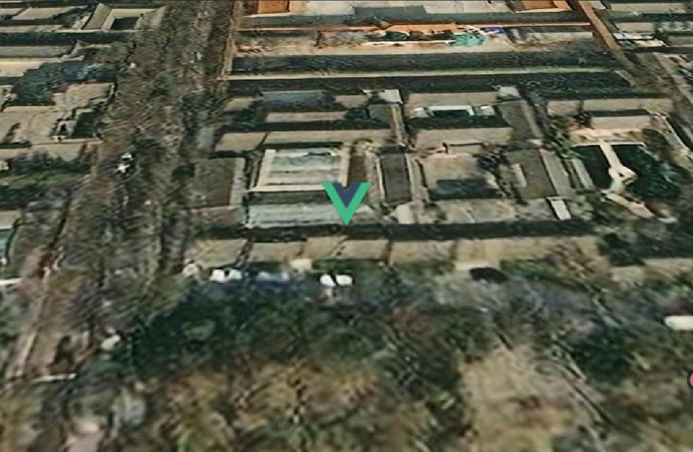

## 箱（Box）

箱（Box）是 Cesium 中用于表示三维矩形的核心元素。它可以用于创建 3D 模型、表示物体的边界框、可视化数据等。

| 属性                     | 类型                     | 默认值                        | 描述                                                                                               |
| ------------------------ | ------------------------ | ----------------------------- | -------------------------------------------------------------------------------------------------- |
| show                     | Boolean                  | true                          | 是否显示箱                                                                                         |
| dimensions               | Cartesian3               | new Cartesian3(1.0, 1.0, 1.0) | 箱的尺寸（x, y, z）                                                                                |
| heightReference          | HeightReference          | NONE                          | 高度参考模式：<br>• NONE - 绝对高度<br>• CLAMP_TO_GROUND - 贴地<br>• RELATIVE_TO_GROUND - 相对地面 |
| material                 | MaterialProperty         | Color.WHITE                   | 箱的材质（颜色、纹理、特效等）                                                                     |
| outline                  | Boolean                  | false                         | 是否显示轮廓                                                                                       |
| outlineColor             | Color                    | Color.BLACK                   | 轮廓的颜色                                                                                         |
| outlineWidth             | Number                   | 1.0                           | 轮廓的宽度（像素）                                                                                 |
| fill                     | Boolean                  | true                          | 是否填充箱                                                                                         |
| shadows                  | ShadowMode               | ShadowMode.DISABLED           | 指定箱是投射还是接收来自光源的阴影                                                                 |
| distanceDisplayCondition | DistanceDisplayCondition | null                          | 基于距离的显隐控制                                                                                 |

[官网 options 介绍](https://cesium.com/learn/cesiumjs/ref-doc/BoxGraphics.html#.ConstructorOptions)

### 基础实例

```js
const box = viewer.entities.add({
  position: Cesium.Cartesian3.fromDegrees(116.3975, 39.9075, 50),
  box: {
    dimensions: new Cesium.Cartesian3(1000, 1000, 500), // 长、宽、高
    material: Cesium.Color.RED.withAlpha(0.5), // 半透明红色
    outline: true,
    outlineColor: Cesium.Color.WHITE,
    outlineWidth: 2,
    heightReference: Cesium.HeightReference.CLAMP_TO_GROUND, // 贴地显示
  },
});
```

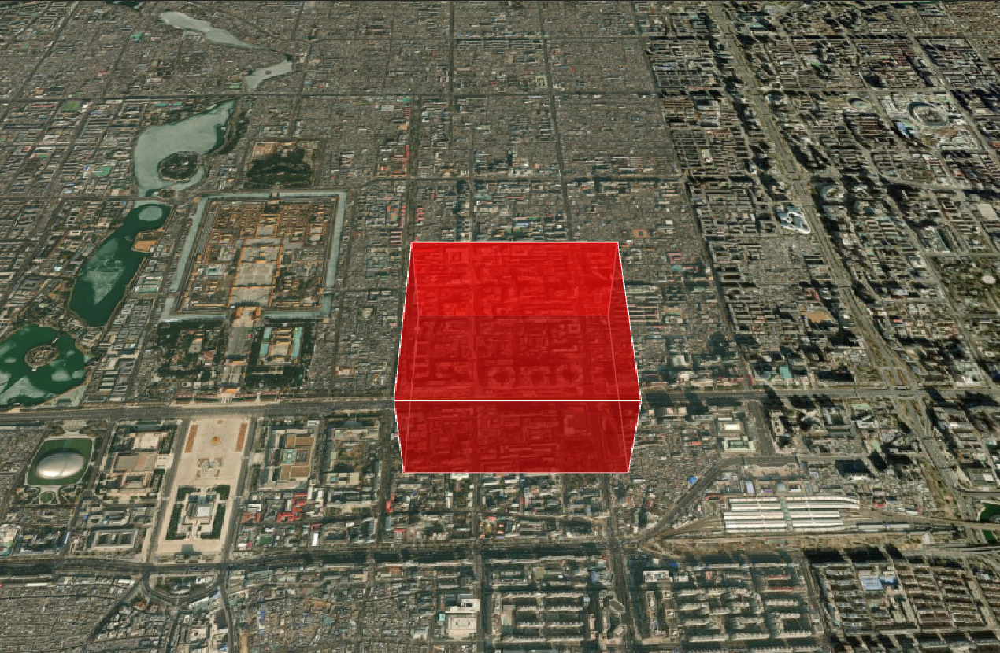

## 矩形（Rectangle）

| 属性                     | 类型                     | 默认值                    | 描述                                                                                               |
| ------------------------ | ------------------------ | ------------------------- | -------------------------------------------------------------------------------------------------- |
| show                     | Boolean                  | true                      | 是否显示矩形                                                                                       |
| coordinates              | Rectangle                | new Rectangle(0, 0, 1, 1) | 矩形的坐标（west, south, east, north）                                                             |
| height                   | Number                   | 0.0                       | 矩形的高度（相对于地形）                                                                           |
| heightReference          | HeightReference          | NONE                      | 高度参考模式：<br>• NONE - 绝对高度<br>• CLAMP_TO_GROUND - 贴地<br>• RELATIVE_TO_GROUND - 相对地面 |
| material                 | MaterialProperty         | Color.WHITE               | 矩形的材质（颜色、纹理、特效等）                                                                   |
| outline                  | Boolean                  | false                     | 是否显示轮廓                                                                                       |
| outlineColor             | Color                    | Color.BLACK               | 轮廓的颜色                                                                                         |
| outlineWidth             | Number                   | 1.0                       | 轮廓的宽度（像素）                                                                                 |
| fill                     | Boolean                  | true                      | 是否填充矩形                                                                                       |
| rotation                 | Number                   | 0.0                       | 矩形的旋转角度（弧度）                                                                             |
| stRotation               | Number                   | 0.0                       | 纹理旋转角度（弧度）                                                                               |
| extrudedHeight           | Number                   | 0.0                       | 矩形的拉伸高度（相对于地形）                                                                       |
| shadows                  | ShadowMode               | ShadowMode.DISABLED       | 指定矩形是投射还是接收来自光源的阴影                                                               |
| distanceDisplayCondition | DistanceDisplayCondition | null                      | 基于距离的显隐控制                                                                                 |

[官网 options 介绍](https://cesium.com/learn/cesiumjs/ref-doc/RectangleGraphics.html#.ConstructorOptions)

### 基础实例

```js
const rectangle = viewer.entities.add({
  position: Cesium.Cartesian3.fromDegrees(116.3975, 39.9075, 50),
  rectangle: {
    coordinates: Cesium.Rectangle.fromDegrees(
      116.3975,
      39.9075,
      116.4075,
      39.9175
    ), // 矩形的坐标
    material: Cesium.Color.GREEN.withAlpha(0.5), // 半透明绿色
    outline: true,
    outlineColor: Cesium.Color.WHITE,
    outlineWidth: 2,
    height: 100, // 矩形的高度
    extrudedHeight: 200, // 矩形的拉伸高度
    heightReference: Cesium.HeightReference.CLAMP_TO_GROUND, // 贴地显示
  },
});
```

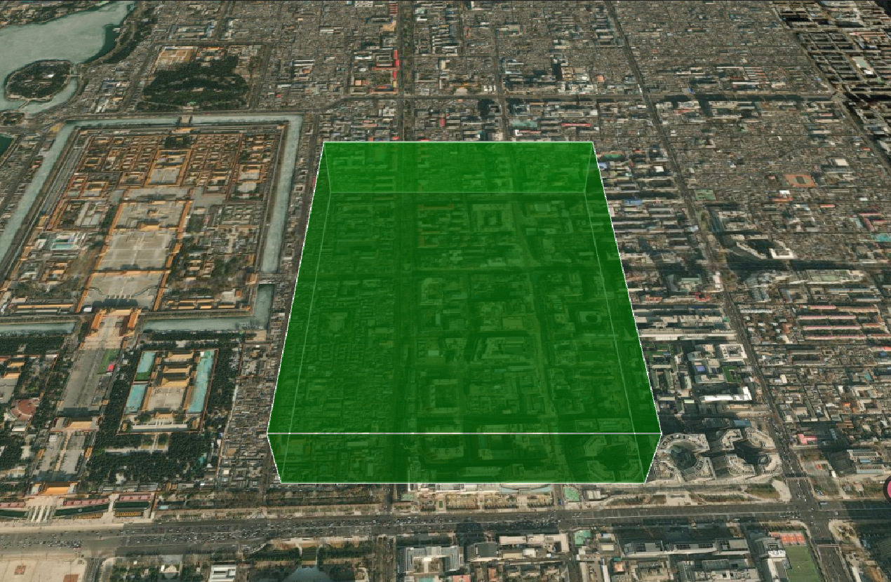

## 椭圆（Ellipse）

| 属性                     | 类型                     | 默认值                         | 描述                                                                                               |
| ------------------------ | ------------------------ | ------------------------------ | -------------------------------------------------------------------------------------------------- |
| show                     | Boolean                  | true                           | 是否显示椭圆                                                                                       |
| semiMajorAxis            | Number                   | 1.0                            | 椭圆的长半轴长度                                                                                   |
| semiMinorAxis            | Number                   | 1.0                            | 椭圆的短半轴长度                                                                                   |
| height                   | Number                   | 0.0                            | 椭圆的高度（相对于地形）                                                                           |
| heightReference          | HeightReference          | NONE                           | 高度参考模式：<br>• NONE - 绝对高度<br>• CLAMP_TO_GROUND - 贴地<br>• RELATIVE_TO_GROUND - 相对地面 |
| material                 | MaterialProperty         | Color.WHITE                    | 椭圆的材质（颜色、纹理、特效等）                                                                   |
| granularity              | Number                   | Cesium.Math.RADIANS_PER_DEGREE | 椭圆的粒度（用于简化椭圆）                                                                         |
| outline                  | Boolean                  | false                          | 是否显示轮廓                                                                                       |
| outlineColor             | Color                    | Color.BLACK                    | 轮廓的颜色                                                                                         |
| outlineWidth             | Number                   | 1.0                            | 轮廓的宽度（像素）                                                                                 |
| fill                     | Boolean                  | true                           | 是否填充椭圆                                                                                       |
| rotation                 | Number                   | 0.0                            | 椭圆的旋转角度（弧度）                                                                             |
| stRotation               | Number                   | 0.0                            | 纹理旋转角度（弧度）                                                                               |
| extrudedHeight           | Number                   | 0.0                            | 椭圆的拉伸高度（相对于地形）                                                                       |
| shadows                  | ShadowMode               | ShadowMode.DISABLED            | 指定椭圆是投射还是接收来自光源的阴影                                                               |
| distanceDisplayCondition | DistanceDisplayCondition | null                           | 基于距离的显隐控制                                                                                 |

[官网 options 介绍](https://cesium.com/learn/cesiumjs/ref-doc/EllipseGraphics.html#.ConstructorOptions)

### 基础实例

```js
const ellipse = viewer.entities.add({
  position: Cesium.Cartesian3.fromDegrees(116.3975, 39.9075, 50),
  ellipse: {
    semiMajorAxis: 1000, // 长半轴
    semiMinorAxis: 500, // 短半轴
    material: Cesium.Color.BLUE.withAlpha(0.5), // 半透明蓝色
    outline: true,
    outlineColor: Cesium.Color.WHITE,
    outlineWidth: 2,
    height: 100, // 椭圆的高度
    extrudedHeight: 200, // 椭圆的拉伸高度
    heightReference: Cesium.HeightReference.CLAMP_TO_GROUND, // 贴地显示
  },
});
```

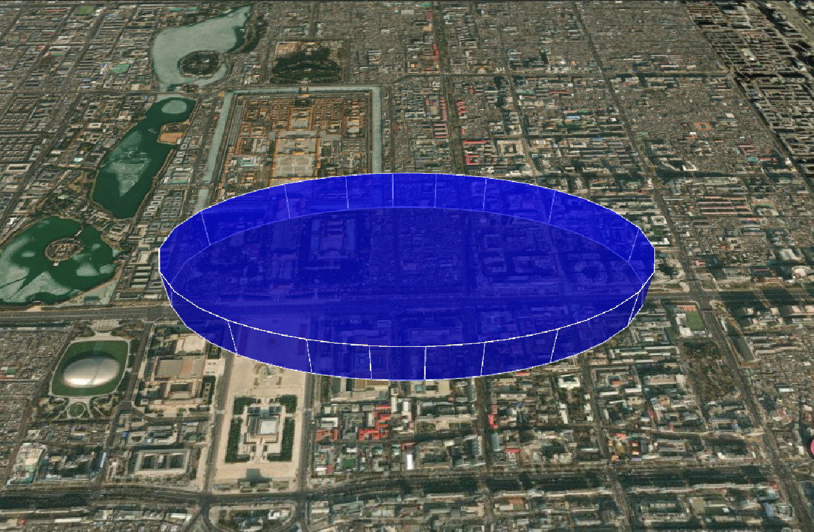

## 椭圆体（Ellipsoid）

| 属性 | 类型 | 默认值 | 描述 |
| --- | --- | --- | --- |
| show | Boolean | true | 是否显示椭圆体 |
| radii | Cartesian3 | null | 椭圆体的半径（x, y, z） |
| innerRadii | Cartesian3 | null | 椭圆体的内半径（x, y, z） |
| minimumClock | Number | 0.0 | 椭圆体的最小时钟角度（弧度） |
| maximumClock | Number | 2.0 \* Math.PI | 椭圆体的最大时钟角度（弧度） |
| minimumCone | Number | 0.0 | 椭圆体的最小圆锥角度（弧度） |
| maximumCone | Number | Math.PI | 椭圆体的最大圆锥角度（弧度） |
| heightReference | HeightReference | NONE | 高度参考模式：<br>• NONE - 绝对高度<br>• CLAMP_TO_GROUND - 贴地<br>• RELATIVE_TO_GROUND - 相对地面 |
| material | MaterialProperty | Color.WHITE | 椭圆体的材质（颜色、纹理、特效等） |
| outline | Boolean | false | 是否显示轮廓 |
| outlineColor | Color | Color.BLACK | 轮廓的颜色 |
| outlineWidth | Number | 1.0 | 轮廓的宽度（像素） |
| fill | Boolean | true | 是否填充椭圆体 |
| shadows | ShadowMode | ShadowMode.DISABLED | 指定椭圆体是投射还是接收来自光源的阴影 |
| distanceDisplayCondition | DistanceDisplayCondition | null | 基于距离的显隐控制 |
| stackPartitions | Number | 64 | 堆叠分区数 |
| slicePartitions | Number | 64 | 切片分区数 |
| subdivisions | Number | 128 | 细分次数 |

[官网 options 介绍](https://cesium.com/learn/cesiumjs/ref-doc/EllipsoidGraphics.html#.ConstructorOptions)

### 基础实例

```js
const ellipsoid = viewer.entities.add({
  position: Cesium.Cartesian3.fromDegrees(116.3975, 39.9075, 50),
  ellipsoid: {
    radii: new Cesium.Cartesian3(1000, 500, 250), // 长半轴、短半轴、高半轴
    material: Cesium.Color.YELLOW.withAlpha(0.5), // 半透明黄色
    outline: true,
    outlineColor: Cesium.Color.WHITE,
    outlineWidth: 2,
    extrudedHeight: 200, // 椭圆体的拉伸高度
    heightReference: Cesium.HeightReference.CLAMP_TO_GROUND, // 贴地显示
  },
});
```

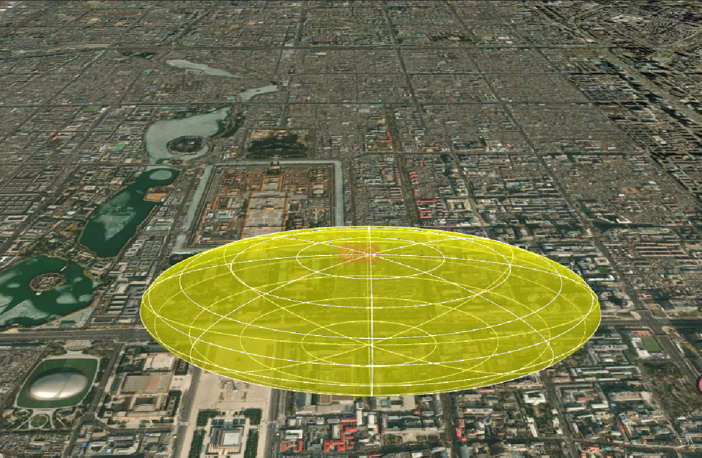

## 圆柱体（Cylinder）

| 属性 | 类型 | 默认值 | 描述 |
| --- | --- | --- | --- |
| show | Boolean | true | 是否显示圆柱体 |
| length | Number | | 圆柱体的长度 |
| topRadius | Number | | 圆柱体顶部的半径 |
| bottomRadius | Number | | 圆柱体底部的半径 |
| heightReference | HeightReference | NONE | 高度参考模式：<br>• NONE - 绝对高度<br>• CLAMP_TO_GROUND - 贴地<br>• RELATIVE_TO_GROUND - 相对地面 |
| material | MaterialProperty | Color.WHITE | 圆柱体的材质（颜色、纹理、特效等） |
| outline | Boolean | false | 是否显示轮廓 |
| outlineColor | Color | Color.BLACK | 轮廓的颜色 |
| outlineWidth | Number | 1.0 | 轮廓的宽度（像素） |
| fill | Boolean | true | 是否填充圆柱体 |
| shadows | ShadowMode | ShadowMode.DISABLED | 指定圆柱体是投射还是接收来自光源的阴影 |
| distanceDisplayCondition | DistanceDisplayCondition | null | 基于距离的显隐控制 |
| numberOfVerticalLines | Number | 16 | 垂直线条数 |
| slices | Number | 128 | 切片数 |

[官网 options 介绍](https://cesium.com/learn/cesiumjs/ref-doc/CylinderGraphics.html#.ConstructorOptions)

### 基础实例

```js
const cylinder = viewer.entities.add({
  position: Cesium.Cartesian3.fromDegrees(116.3975, 39.9075, 50),
  cylinder: {
    length: 1000, // 圆柱体的长度
    topRadius: 500, // 顶部半径
    bottomRadius: 500, // 底部半径
    material: Cesium.Color.PURPLE.withAlpha(0.5), // 半透明紫色
    extrudedHeight: 200, // 圆柱体的拉伸高度
  },
});
```

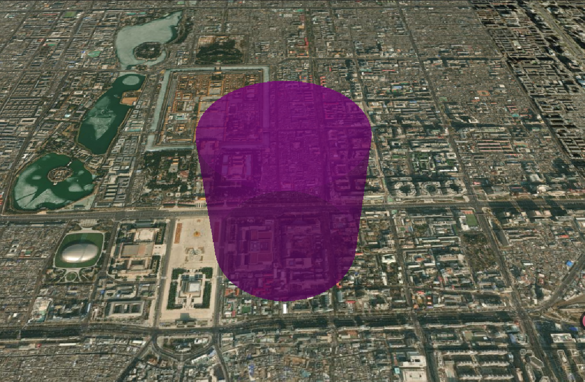

## 标签（Label）

| 属性 | 类型 | 默认值 | 描述 |
| --- | --- | --- | --- |
| show | Boolean | true | 是否显示标签 |
| text | String | | 标签的文本内容 |
| font | String | '30px sans-serif' | 标签的字体 |
| style | TextStyle | LabelStyle.FILL | 标签的样式 |
| fillColor | Color | Color.WHITE | 标签的填充颜色 |
| outlineColor | Color | Color.BLACK | 标签的轮廓颜色 |
| outlineWidth | Number | 1.0 | 标签的轮廓宽度 |
| scale | Number | 1.0 | 标签的缩放比例 |
| showBackground | Boolean | false | 是否显示背景 |
| backgroundColor | Color | Color.TRANSPARENT | 背景颜色 |
| backgroundPadding | Cartesian2 | new Cartesian2(7, 5) | 背景填充 |
| heightReference | HeightReference | NONE | 高度参考模式：<br>• NONE - 绝对高度<br>• CLAMP_TO_GROUND - 贴地<br>• RELATIVE_TO_GROUND - 相对地面 |
| horizontalOrigin | HorizontalOrigin | CENTER | 标签的水平对齐方式：<br>• CENTER - 居中对齐<br>• LEFT - 左对齐<br>• RIGHT - 右对齐 |
| verticalOrigin | VerticalOrigin | CENTER | 标签的垂直对齐方式：<br>• CENTER - 居中对齐<br>• BOTTOM - 底部对齐<br>• TOP - 顶部对齐 |
| pixelOffset | Cartesian2 | new Cartesian2(0, 0) | 标签相对于其位置的像素偏移量 |
| eyeOffset | Cartesian3 | new Cartesian3(0, 0, 0) | 标签相对于相机的偏移量 |
| pixelOffsetScaleByDistance | NearFarScalar | | 根据相机距离缩放像素偏移量 |
| scaleByDistance | NearFarScalar | | 根据相机距离缩放标签大小 |
| translucencyByDistance | NearFarScalar | | 根据相机距离调整透明度 |
| distanceDisplayCondition | DistanceDisplayCondition | | 基于距离的显隐控制 |
| disableDepthTestDistance | Number | | 用于指定要禁用深度测试的相机的距离 |

[官网 options 介绍](https://cesium.com/learn/cesiumjs/ref-doc/LabelGraphics.html#.ConstructorOptions)

### 基础实例

```js
const label = viewer.entities.add({
  position: Cesium.Cartesian3.fromDegrees(116.3975, 39.9075, 50),
  label: {
    text: "Hello World", // 标签文本
    font: "30px sans-serif", // 字体
    style: Cesium.LabelStyle.FILL, // 样式
    fillColor: Cesium.Color.WHITE, // 填充颜色
    outlineColor: Cesium.Color.BLACK, // 轮廓颜色
    outlineWidth: 2, // 轮廓宽度
    scale: 1.0, // 缩放比例
    showBackground: true, // 显示背景
    backgroundColor: Cesium.Color.TRANSPARENT, // 背景颜色
    backgroundPadding: new Cesium.Cartesian2(7, 5), // 背景填充
    heightReference: Cesium.HeightReference.CLAMP_TO_GROUND, // 贴地显示
    horizontalOrigin: Cesium.HorizontalOrigin.CENTER, // 水平对齐方式
    verticalOrigin: Cesium.VerticalOrigin.BOTTOM, // 垂直对齐方式
    pixelOffset: new Cesium.Cartesian2(0, -50), // 向下偏移 50 像素
    eyeOffset: new Cesium.Cartesian3(0, 0, 0), // 相对于相机的偏移量
  },
});
```

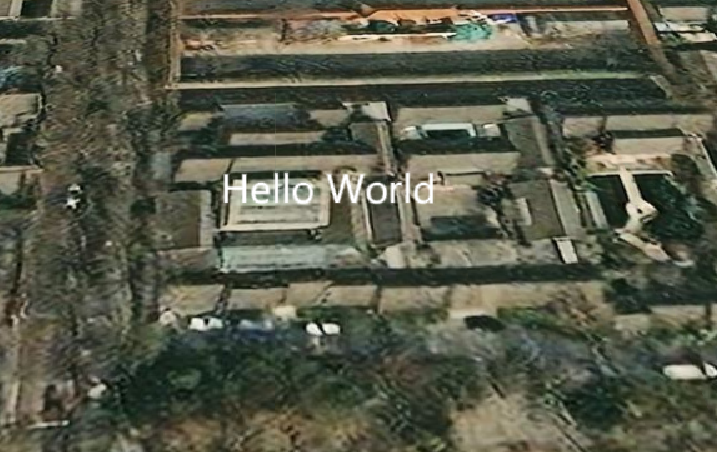

## 墙（Wall）

| 属性 | 类型 | 默认值 | 描述 |
| --- | --- | --- | --- |
| show | Boolean | true | 是否显示墙 |
| positions | Cartesian3[] | | 墙的顶点位置数组 |
| maximumHeights | Number[] | | 墙的最大高度数组 |
| minimumHeights | Number[] | | 墙的最小高度数组 |
| material | MaterialProperty | Color.WHITE | 墙的材质（颜色、纹理、特效等） |
| outline | Boolean | false | 是否显示轮廓 |
| outlineColor | Color | Color.BLACK | 轮廓的颜色 |
| outlineWidth | Number | 1.0 | 轮廓的宽度（像素） |
| fill | Boolean | true | 是否填充墙 |
| shadows | ShadowMode | ShadowMode.DISABLED | 指定墙是投射还是接收来自光源的阴影 |
| distanceDisplayCondition | DistanceDisplayCondition | | 基于距离的显隐控制 |
| granularity | Number | Cesium.Math.RADIANS_PER_DEGREE | 墙的粒度（用于简化墙） |

[官网 options 介绍](https://cesium.com/learn/cesiumjs/ref-doc/WallGraphics.html#.ConstructorOptions)

### 基础实例

```js
const wall = viewer.entities.add({
  wall: {
    positions: Cesium.Cartesian3.fromDegreesArrayHeights([
      116.3975, 39.9075, 100, 116.4075, 39.9075, 100, 116.4075, 39.9175, 100,
      116.3975, 39.9175, 100, 116.3975, 39.9075, 100,
    ]),
    material: Cesium.Color.GREEN.withAlpha(0.5), // 半透明绿色
    outline: true,
    outlineColor: Cesium.Color.WHITE,
    outlineWidth: 2,
    maximumHeights: [100, 100, 200, 100, 100], // 每个顶点的最大高度
    minimumHeights: [0, 0, 0, 0, 0], // 每个顶点的最小高度
  },
});
```

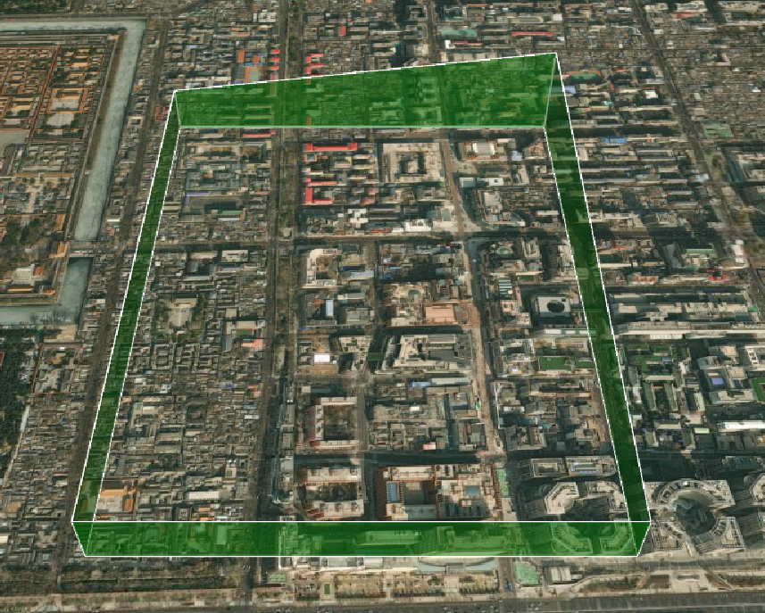

## 走廊（Corridor）

| 属性 | 类型 | 默认值 | 描述 |
| --- | --- | --- | --- |
| show | Boolean | true | 是否显示走廊 |
| positions | Cartesian3[] | | 走廊的顶点位置数组 |
| width | Number | | 走廊的宽度 |
| height | Number | | 走廊的高度（相对于地形） |
| heightReference | HeightReference | NONE | 高度参考模式：<br>• NONE - 绝对高度<br>• CLAMP_TO_GROUND - 贴地<br>• RELATIVE_TO_GROUND - 相对地面 |
| extrudedHeight | Number | | 走廊的拉伸高度（相对于地形） |
| extrudedHeightReference | HeightReference | NONE | 拉伸高度参考模式：<br>• NONE - 绝对高度<br>• CLAMP_TO_GROUND - 贴地<br>• RELATIVE_TO_GROUND - 相对地面 |
| cornerType | CornerType | ROUNDED | 走廊的拐角类型：<br>• ROUNDED - 圆角<br>• MITERED - 尖角 |
| granularity | Number | Cesium.Math.RADIANS_PER_DEGREE | 走廊的粒度（用于简化走廊） |
| material | MaterialProperty | Color.WHITE | 走廊的材质（颜色、纹理、特效等） |
| fill | Boolean | true | 是否填充走廊 |
| outline | Boolean | false | 是否显示轮廓 |
| outlineColor | Color | Color.BLACK | 轮廓的颜色 |
| outlineWidth | Number | 1.0 | 轮廓的宽度（像素） |
| shadows | ShadowMode | ShadowMode.DISABLED | 指定走廊是投射还是接收来自光源的阴影 |
| distanceDisplayCondition | DistanceDisplayCondition | | 基于距离的显隐控制 |

[官网 options 介绍](https://cesium.com/learn/cesiumjs/ref-doc/CorridorGraphics.html#.ConstructorOptions)

### 基础实例

```js
const corridor = viewer.entities.add({
  corridor: {
    positions: Cesium.Cartesian3.fromDegreesArrayHeights([
      116.3975, 39.9075, 100, 116.4075, 39.9075, 100, 116.4075, 39.9175, 100,
    ]),
    width: 100, // 走廊宽度
    height: 50, // 走廊高度
    material: Cesium.Color.ORANGE.withAlpha(0.5), // 半透明橙色
    extrudedHeight: 20, // 走廊拉伸高度
    outline: true,
    outlineColor: Cesium.Color.WHITE,
    outlineWidth: 2,
  },
});
```

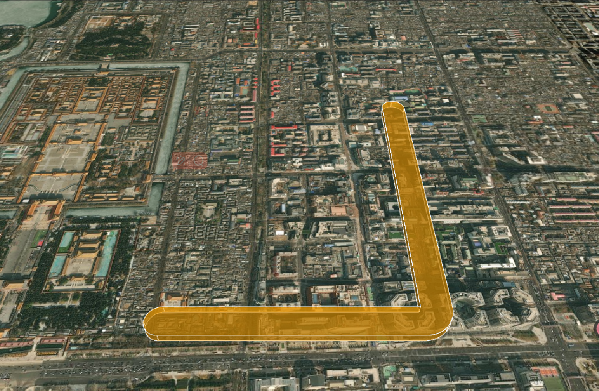

<!-- ## 路径（Path）

`配置Options` :
| 属性 | 类型 | 默认值 | 描述 |
| --- | --- | --- | --- |
| show | Boolean | true | 是否显示路径 |
| width | Number | 1.0 | 路径的宽度 |
| resolution | Number | 60 | 路径的分辨率 |
| material | MaterialProperty | Color.WHITE | 路径的材质（颜色、纹理、特效等） |
| leadTime | Number | | 路径的前导时间 |
| trailTime | Number | | 路径的后拖时间 |
| distanceDisplayCondition | DistanceDisplayCondition | | 基于距离的显隐控制 |

[官网 options 介绍](https://cesium.com/learn/cesiumjs/ref-doc/PathGraphics.html#.ConstructorOptions)

### 基础实例

```js
const path = viewer.entities.add({
  position: Cesium.Cartesian3.fromDegrees(116.3975, 39.9075, 50),
  path: {
    width: 5, // 路径宽度
    resolution: 60, // 路径分辨率
    material: Cesium.Color.RED.withAlpha(0.5), // 半透明红色
    leadTime: 3, // 前导时间,就是从当前位置往前推3秒
    trailTime: 8, // 后拖时间,就是从当前位置往后推8秒
  },
});
``` -->
