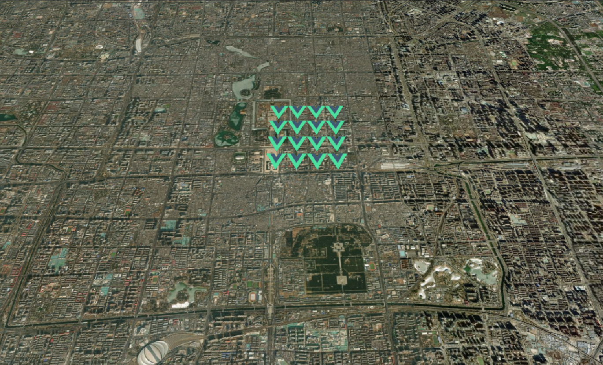
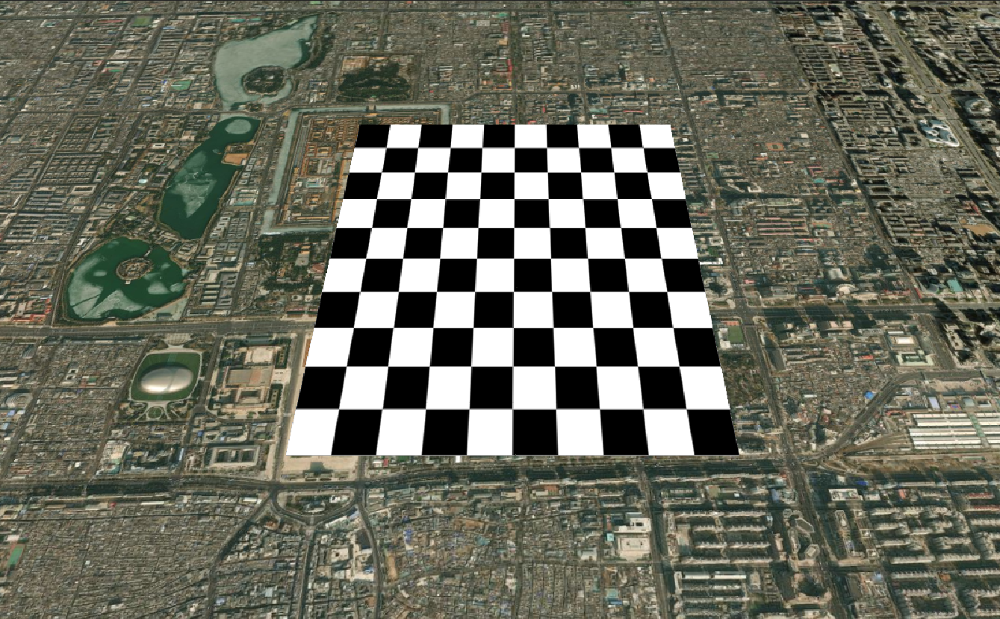
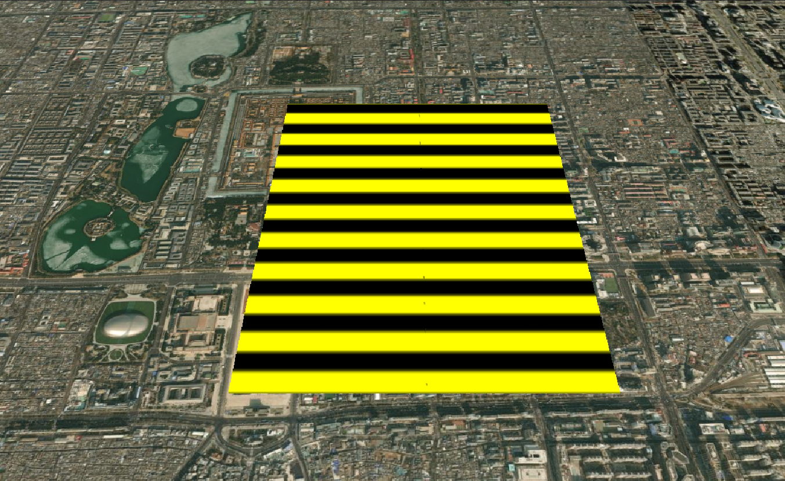
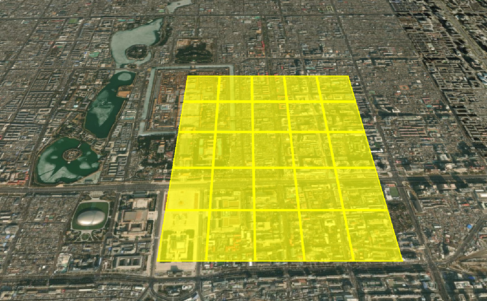
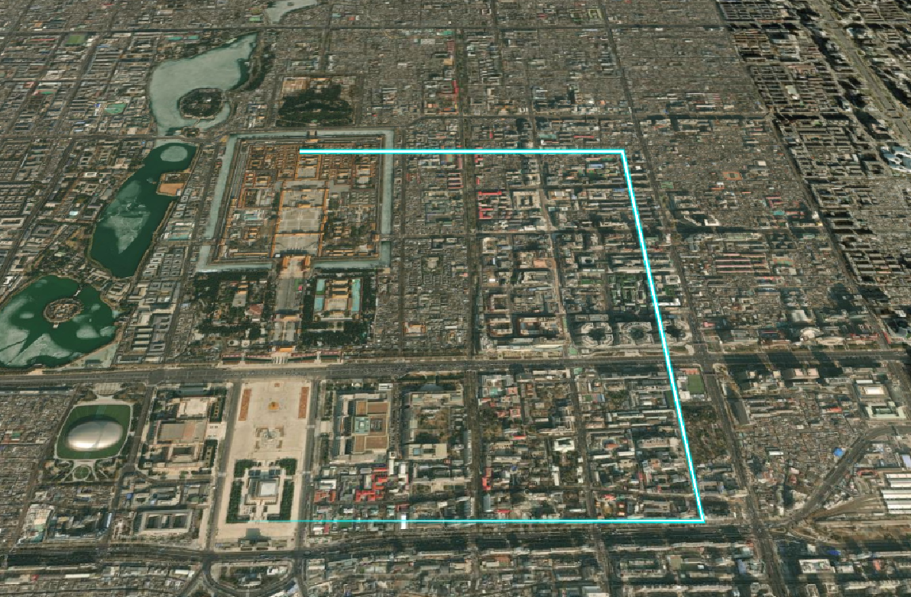
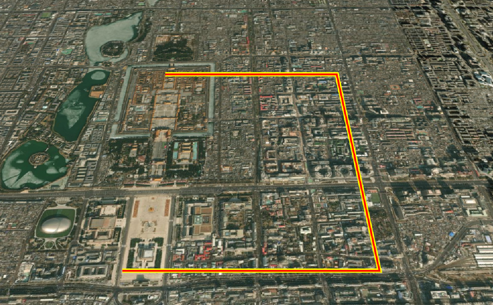
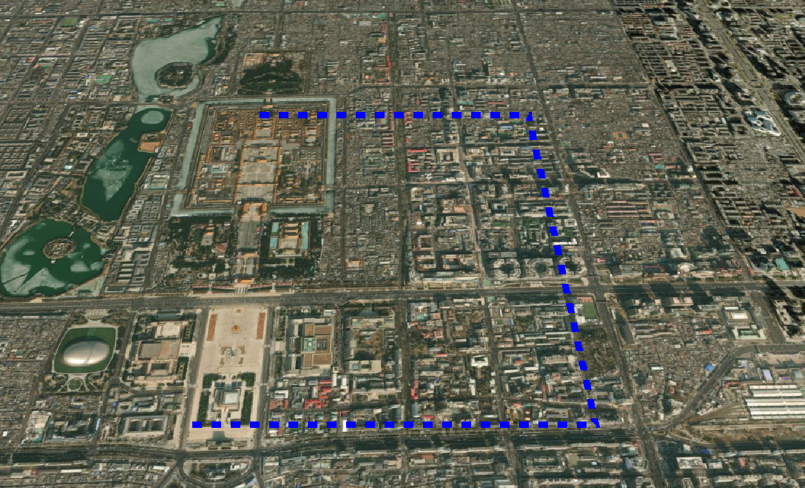
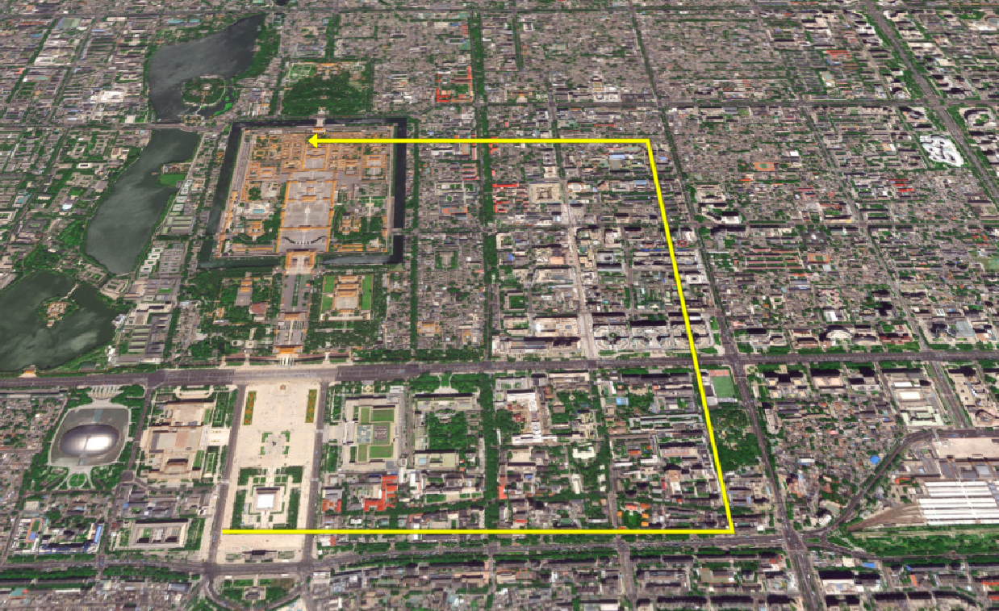

# 材质

在上一章实体的学习中，材质属性只填充了颜色，这一章将介绍更多的材质属性。材质一共包括以下几种

1. 基础材质
   - ColorMaterialProperty：颜色，所有支持材质的几何体（Polygon/Ellipse/Rectangle 等）
   - ImageMaterialProperty：图片
2. 几何图案材质
   - CheckerboardMaterialProperty：棋盘格
   - StripeMaterialProperty：条纹
   - GridMaterialProperty：网格
3. 折线专用材质
   - PolylineGlowMaterialProperty：发光材质
   - PolylineOutlineMaterialProperty：轮廓材质
   - PolylineDashMaterialProperty：虚线材质
   - PolylineArrowMaterialProperty：箭头材质

## 基础材质

### 颜色(ColorMaterialProperty)

```js
new Cesium.ColorMaterialProperty(color);
```

1. 适用于所有支持材质的几何体（Polygon/Ellipse/Rectangle 等）
2. 顺便说一下颜色：
   - `Cesium.Color.RED`：红色， 更多颜色可以参考[全部颜色](https://cesium.com/learn/cesiumjs/ref-doc/Color.html?classFilter=color)
   - `Cesium.Color.fromCssColorString("#ff0000")`：CSS 颜色字符串，如 `#ff0000` 红色
   - `Cesium.Color.fromRandom()`：随机颜色
   - `Cesium.Color.fromBytes(255, 0, 0)`：RGB 颜色，如 `(255, 0, 0)` 红色

```js
material: new Cesium.ColorMaterialProperty(
  Cesium.Color.RED.withAlpha(0.5) // 颜色+透明度
);
```

### 图片(ImageMaterialProperty)

```js
new Cesium.ImageMaterialProperty(options);
```

- `options:`
  - `image：`图片路径
  - `repeat：`纹理重复次数 (x, y)，默认 new Cartesian2(1.0, 1.0)
  - `color：`颜色，默认 Cesium.Color.WHITE
  - `transparent：`是否透明，默认 false

```js
material: new Cesium.ImageMaterialProperty({
    image: new URL("../assets/vue.svg", import.meta.url).href, // 图片路径
    repeat: new Cesium.Cartesian2(4, 4), // 平铺次数
    // color: Cesium.Color.RED, // 图片颜色
    // transparent: true, // 当图像具有透明度时设置为true
}),
```



## 几何图案材质

### 棋盘格材质(CheckerboardMaterialProperty)

```js
new Cesium.CheckerboardMaterialProperty(options);
```

- `options:`
  - `evenColor：`偶数条纹颜色
  - `oddColor：`奇数条纹颜色
  - `repeat：`棋盘格重复次数，默认 new Cartesian2(2.0, 2.0)

```js
material: new Cesium.CheckerboardMaterialProperty({
    evenColor: Cesium.Color.WHITE, // 偶数格颜色
    oddColor: Cesium.Color.BLACK, // 奇数格颜色
    repeat: new Cesium.Cartesian2(10, 10), // 交替频率
}),
```



### 条纹材质(StripeMaterialProperty)

```js
new Cesium.StripeMaterialProperty(options);
```

- `options:`
  - `evenColor：`偶数条纹颜色
  - `oddColor：`奇数条纹颜色
  - `repeat：`条纹重复次数，默认 1.0
  - `orientation：`方向 ("HORIZONTAL" 或 "VERTICAL")，默认'HORIZONTAL'
  - `offset：`偏移量，默认 0

```js
 material: new Cesium.StripeMaterialProperty({
    evenColor: Cesium.Color.YELLOW,
    oddColor: Cesium.Color.BLACK,
    orientation: Cesium.StripeOrientation.HORIZONTAL, // 条纹方向
    repeat: 20, // 条纹密度
}),
```



### 网格材质(GridMaterialProperty)

```js
new Cesium.GridMaterialProperty(options);
```

- `options:`
  - `color：`网格颜色
  - `cellAlpha：`单元格透明度 (0.0-1.0)，默认 0.1
  - `lineCount：`行列数量 (x, y)，默认值：new Cartesian2(8, 8)
  - `lineThickness：`线宽 (x, y)，默认值：new Cartesian2(1.0, 1.0)
  - `lineOffset：`线偏移 (x, y)，默认值：new Cartesian2(0.0, 0.0)

```js
material: new Cesium.GridMaterialProperty({
   color: Cesium.Color.YELLOW, // 网格线颜色
   cellAlpha: 0.6, // 单元格透明度
   lineCount: new Cesium.Cartesian2(5, 5), // 网格密度
   lineThickness: new Cesium.Cartesian2(3, 3), // 网格线宽度
}),
```



## 折线专用材质

### 折线发光材质(PolylineGlowMaterialProperty)

```js
new Cesium.PolylineGlowMaterialProperty(options);
```

- `options:`
  - `color：`颜色
  - `glowPower：`发光强度 (0.0-1.0)，默认值：0.25
  - `taperPower：`渐细效果强度 (0.0-1.0)，默认值：1.0

```js
material: new Cesium.PolylineGlowMaterialProperty({
   color: Cesium.Color.CYAN, // 颜色
   glowPower: 0.3,  // 亮度
   taperPower: 0.7, // 衰减率
}),
```



### 折线轮廓材质(PolylineOutlineMaterialProperty)

```js
new Cesium.PolylineOutlineMaterialProperty(options);
```

- `options:`
  - `color：`颜色
  - `outlineColor：`轮廓颜色，默认 Color.BLACK
  - `outlineWidth：`轮廓宽度(像素)，默认 1.0

```js
material: new Cesium.PolylineOutlineMaterialProperty({
  color: Cesium.Color.RED, // 颜色
  outlineColor: Cesium.Color.YELLOW, // 轮廓颜色
  outlineWidth: 5, // 轮廓宽度
});
```



### 折线虚线材质(PolylineDashMaterialProperty)

```js
new Cesium.PolylineDashMaterialProperty(options);
```

- `options:`
  - `color：`颜色
  - `gapColor：`间隙颜色，默认 Color.TRANSPARENT
  - `dashLength：`虚线长度(像素)，默认 16.0
  - `dashPattern：`虚线模式 (16 位二进制)，默认 255 (11111111)

```js
material: new Cesium.PolylineDashMaterialProperty({
   color: Cesium.Color.BLUE,
   // gapColor: Cesium.Color.WHITE,
   dashLength: 24,
   // dashPattern: parseInt("11110000", 2), // 长虚线
}),
```



### 折线箭头材质(PolylineArrowMaterialProperty)

```js
new Cesium.PolylineArrowMaterialProperty(color);
```

```js
material: new Cesium.PolylineArrowMaterialProperty(Cesium.Color.YELLOW),
```


