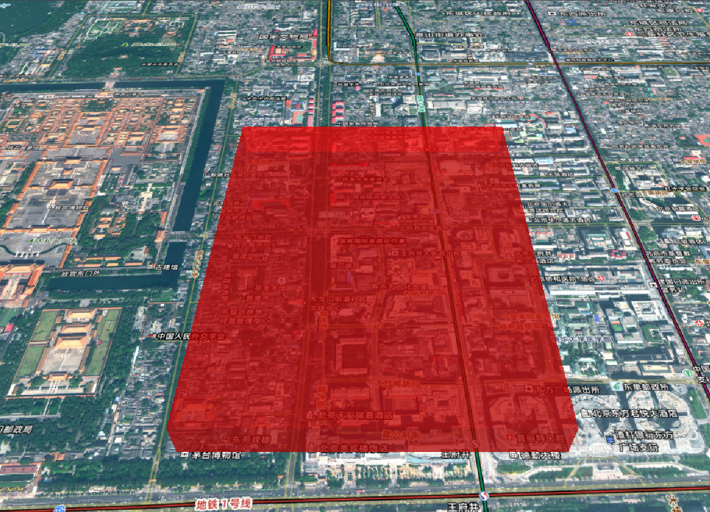

# Cesium 材质详解

在上一章实体的学习中，材质属性只填充了颜色，这一章将介绍更多的材质属性。材质一共包括以下几种

1. 基础材质
   - `ColorMaterialProperty`：颜色，所有支持材质的几何体（Polygon/Ellipse/Rectangle 等）
   - `ImageMaterialProperty`：图片
2. 几何图案材质
   - `CheckerboardMaterialProperty`：棋盘格
   - `StripeMaterialProperty`：条纹
   - `GridMaterialProperty`：网格
3. 折线专用材质
   - `PolylineGlowMaterialProperty`：发光材质
   - `PolylineOutlineMaterialProperty`：轮廓材质
   - `PolylineDashMaterialProperty`：虚线材质
   - `PolylineArrowMaterialProperty`：箭头材质

## 基础材质

### 颜色(ColorMaterialProperty)

纯色填充材质，适用于所有支持材质的几何体，是最基础也最常用的材质类型。

```js
new Cesium.ColorMaterialProperty(color);
```

#### 颜色创建方式

Cesium 提供多种颜色创建方法：

| 方法           | 示例                                         | 说明                                           |
| -------------- | -------------------------------------------- | ---------------------------------------------- |
| 预定义颜色     | `Cesium.Color.RED`                           | 直接使用内置颜色常量                           |
| CSS 颜色字符串 | `Cesium.Color.fromCssColorString("#ff0000")` | 支持所有 CSS 颜色格式                          |
| RGBA 值        | `Cesium.Color.fromBytes(255, 0, 0)`          | 字节表示法（0-255）                            |
| HSLA 值        | `Cesium.Color.fromHsl(0, 1, 0.5, 0.5)`       | 色相(0-1)、饱和度(0-1)、亮度(0-1)、透明度(0-1) |
| 随机颜色       | `Cesium.Color.fromRandom({alpha: 0.5})`      | 生成随机颜色，可指定透明度范围                 |

#### 基础实例

:::details 展开代码

```vue
<template>
  <div ref="cesiumContainer" class="container"></div>
</template>

<script setup>
import { ref, onMounted } from "vue";
import * as Cesium from "cesium";
const cesiumContainer = ref(null);
let viewer = null;

// 天地图TOKEN
const token = "05be06461004055923091de7f3e51aa6";

onMounted(() => {
  // 初始化Viewer
  viewer = new Cesium.Viewer(cesiumContainer.value, {
    geocoder: false, // 关闭地理编码搜索
    homeButton: false, // 关闭主页按钮
    sceneModePicker: false, // 关闭场景模式选择器
    baseLayerPicker: false, // 关闭底图选择器
    navigationHelpButton: false, // 关闭导航帮助
    animation: false, // 关闭动画控件
    timeline: false, // 关闭时间轴
    fullscreenButton: false, // 关闭全屏按钮
    baseLayer: false, // 关闭默认地图
  });
  // 清空logo
  viewer.cesiumWidget.creditContainer.style.display = "none";

  // 创建半透明红色材质
  const redMaterial = new Cesium.ColorMaterialProperty(
    Cesium.Color.RED.withAlpha(0.5) // 50%透明度
  );

  // 应用到多边形
  viewer.entities.add({
    polygon: {
      hierarchy: Cesium.Cartesian3.fromDegreesArray([
        116.3975, 39.9075, 116.4075, 39.9075, 116.4075, 39.9175, 116.3975,
        39.9175,
      ]),
      material: redMaterial,
      height: 0,
      extrudedHeight: 100,
    },
  });
  // 缩放到多边形
  viewer.zoomTo(viewer.entities);

  initMap();
});

// 加载天地图
const initMap = () => {
  // 以下为天地图及天地图标注加载
  const tiandituProvider = new Cesium.WebMapTileServiceImageryProvider({
    url:
      "http://{s}.tianditu.gov.cn/img_w/wmts?service=wmts&request=GetTile&version=1.0.0&LAYER=img&tileMatrixSet=w&TileMatrix={TileMatrix}&TileRow={TileRow}&TileCol={TileCol}&style=default&format=tiles&tk=" +
      token,
    layer: "img",
    style: "default",
    format: "tiles",
    tileMatrixSetID: "w", // 天地图使用 Web 墨卡托投影（EPSG:3857），需确保 tileMatrixSetID: "w"
    subdomains: ["t0", "t1", "t2", "t3", "t4", "t5", "t6", "t7"], // 子域名
    maximumLevel: 18,
    credit: new Cesium.Credit("天地图影像"),
  });

  // 添加地理标注
  const labelProvider = new Cesium.WebMapTileServiceImageryProvider({
    url:
      "http://{s}.tianditu.gov.cn/cia_w/wmts?service=wmts&request=GetTile&version=1.0.0&LAYER=cia&tileMatrixSet=w&tileMatrix={TileMatrix}&tileRow={TileRow}&tileCol={TileCol}&style=default&format=tiles&tk=" +
      token,
    layer: "img",
    style: "default",
    format: "tiles",
    tileMatrixSetID: "w",
    subdomains: ["t0", "t1", "t2", "t3", "t4", "t5", "t6", "t7"], // 子域名轮询
    maximumLevel: 18,
    credit: new Cesium.Credit("天地图影像"),
  });
  // 天地图影像添加到viewer实例的影像图层集合中
  viewer.imageryLayers.addImageryProvider(tiandituProvider);
  // 天地图地理标注（后添加的会覆盖前面的）
  viewer.imageryLayers.addImageryProvider(labelProvider);
};
</script>
<style scoped>
.container {
  width: 100vw;
  height: 100vh;
}
</style>
```

:::



#### 颜色操作方法

```js
const baseColor = Cesium.Color.RED;
const modifiedColor = baseColor
  .withAlpha(0.5) // 设置透明度
  .brighten(0.2) // 增加亮度
  .darken(0.1); // 降低亮度
```

### 图片(ImageMaterialProperty)

使用图片纹理作为材质，支持重复、旋转和颜色混合，适用于创建具有真实感的表面效果。

```js
new Cesium.ImageMaterialProperty(options);
```

- `options:`
  - `image：`图片路径
  - `repeat：`纹理重复次数 (x, y)，默认 new Cartesian2(1.0, 1.0)
  - `color：`颜色，默认 Cesium.Color.WHITE
  - `transparent：`是否透明，默认 false

```js
material: new Cesium.ImageMaterialProperty({
    image: new URL("../assets/vue.svg", import.meta.url).href, // 图片路径
    repeat: new Cesium.Cartesian2(4, 4), // 平铺次数
    // color: Cesium.Color.RED, // 图片颜色
    // transparent: true, // 当图像具有透明度时设置为true
}),
```


## 几何图案材质

### 棋盘格材质(CheckerboardMaterialProperty)

```js
new Cesium.CheckerboardMaterialProperty(options);
```

- `options:`
  - `evenColor：`偶数条纹颜色
  - `oddColor：`奇数条纹颜色
  - `repeat：`棋盘格重复次数，默认 new Cartesian2(2.0, 2.0)

```js
material: new Cesium.CheckerboardMaterialProperty({
    evenColor: Cesium.Color.WHITE, // 偶数格颜色
    oddColor: Cesium.Color.BLACK, // 奇数格颜色
    repeat: new Cesium.Cartesian2(10, 10), // 交替频率
}),
```


### 条纹材质(StripeMaterialProperty)

```js
new Cesium.StripeMaterialProperty(options);
```

- `options:`
  - `evenColor：`偶数条纹颜色
  - `oddColor：`奇数条纹颜色
  - `repeat：`条纹重复次数，默认 1.0
  - `orientation：`方向 ("HORIZONTAL" 或 "VERTICAL")，默认'HORIZONTAL'
  - `offset：`偏移量，默认 0

```js
 material: new Cesium.StripeMaterialProperty({
    evenColor: Cesium.Color.YELLOW,
    oddColor: Cesium.Color.BLACK,
    orientation: Cesium.StripeOrientation.HORIZONTAL, // 条纹方向
    repeat: 20, // 条纹密度
}),
```


### 网格材质(GridMaterialProperty)

```js
new Cesium.GridMaterialProperty(options);
```

- `options:`
  - `color：`网格颜色
  - `cellAlpha：`单元格透明度 (0.0-1.0)，默认 0.1
  - `lineCount：`行列数量 (x, y)，默认值：new Cartesian2(8, 8)
  - `lineThickness：`线宽 (x, y)，默认值：new Cartesian2(1.0, 1.0)
  - `lineOffset：`线偏移 (x, y)，默认值：new Cartesian2(0.0, 0.0)

```js
material: new Cesium.GridMaterialProperty({
   color: Cesium.Color.YELLOW, // 网格线颜色
   cellAlpha: 0.6, // 单元格透明度
   lineCount: new Cesium.Cartesian2(5, 5), // 网格密度
   lineThickness: new Cesium.Cartesian2(3, 3), // 网格线宽度
}),
```


## 折线专用材质

### 折线发光材质(PolylineGlowMaterialProperty)

```js
new Cesium.PolylineGlowMaterialProperty(options);
```

- `options:`
  - `color：`颜色
  - `glowPower：`发光强度 (0.0-1.0)，默认值：0.25
  - `taperPower：`渐细效果强度 (0.0-1.0)，默认值：1.0

:::details 展开代码

```vue
<template>
  <div ref="cesiumContainer" class="container"></div>
</template>

<script setup>
import { ref, onMounted } from "vue";
import * as Cesium from "cesium";
const cesiumContainer = ref(null);
let viewer = null;

// 天地图TOKEN
const token = "05be06461004055923091de7f3e51aa6";

onMounted(() => {
  // 初始化Viewer
  viewer = new Cesium.Viewer(cesiumContainer.value, {
    geocoder: false, // 关闭地理编码搜索
    homeButton: false, // 关闭主页按钮
    sceneModePicker: false, // 关闭场景模式选择器
    baseLayerPicker: false, // 关闭底图选择器
    navigationHelpButton: false, // 关闭导航帮助
    animation: false, // 关闭动画控件
    timeline: false, // 关闭时间轴
    fullscreenButton: false, // 关闭全屏按钮
    baseLayer: false, // 关闭默认地图
  });
  // 清空logo
  viewer.cesiumWidget.creditContainer.style.display = "none";

  const polyline = viewer.entities.add({
    polyline: {
      positions: Cesium.Cartesian3.fromDegreesArray([
        116.39, 39.9, 116.41, 39.9, 116.41, 39.92, 116.39, 39.92,
      ]),
      width: 16,
      // 发光材质
      material: new Cesium.PolylineGlowMaterialProperty({
        color: Cesium.Color.CYAN, // 颜色
        glowPower: 0.3, // 亮度
        taperPower: 0.7, // 衰减率
      }),
    },
  });
  // 定位到线
  viewer.zoomTo(polyline); // 缩放到实体位置

  initMap();
});

// 加载天地图
const initMap = () => {
  // 以下为天地图及天地图标注加载
  const tiandituProvider = new Cesium.WebMapTileServiceImageryProvider({
    url:
      "http://{s}.tianditu.gov.cn/img_w/wmts?service=wmts&request=GetTile&version=1.0.0&LAYER=img&tileMatrixSet=w&TileMatrix={TileMatrix}&TileRow={TileRow}&TileCol={TileCol}&style=default&format=tiles&tk=" +
      token,
    layer: "img",
    style: "default",
    format: "tiles",
    tileMatrixSetID: "w", // 天地图使用 Web 墨卡托投影（EPSG:3857），需确保 tileMatrixSetID: "w"
    subdomains: ["t0", "t1", "t2", "t3", "t4", "t5", "t6", "t7"], // 子域名
    maximumLevel: 18,
    credit: new Cesium.Credit("天地图影像"),
  });

  // 添加地理标注
  const labelProvider = new Cesium.WebMapTileServiceImageryProvider({
    url:
      "http://{s}.tianditu.gov.cn/cia_w/wmts?service=wmts&request=GetTile&version=1.0.0&LAYER=cia&tileMatrixSet=w&tileMatrix={TileMatrix}&tileRow={TileRow}&tileCol={TileCol}&style=default&format=tiles&tk=" +
      token,
    layer: "img",
    style: "default",
    format: "tiles",
    tileMatrixSetID: "w",
    subdomains: ["t0", "t1", "t2", "t3", "t4", "t5", "t6", "t7"], // 子域名轮询
    maximumLevel: 18,
    credit: new Cesium.Credit("天地图影像"),
  });
  // 天地图影像添加到viewer实例的影像图层集合中
  viewer.imageryLayers.addImageryProvider(tiandituProvider);
  // 天地图地理标注（后添加的会覆盖前面的）
  viewer.imageryLayers.addImageryProvider(labelProvider);
};
</script>
<style scoped>
.container {
  width: 100vw;
  height: 100vh;
}
</style>
```

:::


### 折线轮廓材质(PolylineOutlineMaterialProperty)

```js
new Cesium.PolylineOutlineMaterialProperty(options);
```

- `options:`
  - `color：`颜色
  - `outlineColor：`轮廓颜色，默认 Color.BLACK
  - `outlineWidth：`轮廓宽度(像素)，默认 1.0

```js
material: new Cesium.PolylineOutlineMaterialProperty({
  color: Cesium.Color.RED, // 颜色
  outlineColor: Cesium.Color.YELLOW, // 轮廓颜色
  outlineWidth: 5, // 轮廓宽度
});
```


### 折线虚线材质(PolylineDashMaterialProperty)

```js
new Cesium.PolylineDashMaterialProperty(options);
```

- `options:`
  - `color：`颜色
  - `gapColor：`间隙颜色，默认 Color.TRANSPARENT
  - `dashLength：`虚线长度(像素)，默认 16.0
  - `dashPattern：`虚线模式 (16 位二进制)，默认 255 (11111111)

```js
material: new Cesium.PolylineDashMaterialProperty({
   color: Cesium.Color.BLUE,
   // gapColor: Cesium.Color.WHITE,
   dashLength: 24,
   // dashPattern: parseInt("11110000", 2), // 长虚线
}),
```


### 折线箭头材质(PolylineArrowMaterialProperty)

```js
new Cesium.PolylineArrowMaterialProperty(color);
```

```js
material: new Cesium.PolylineArrowMaterialProperty(Cesium.Color.YELLOW),
```


