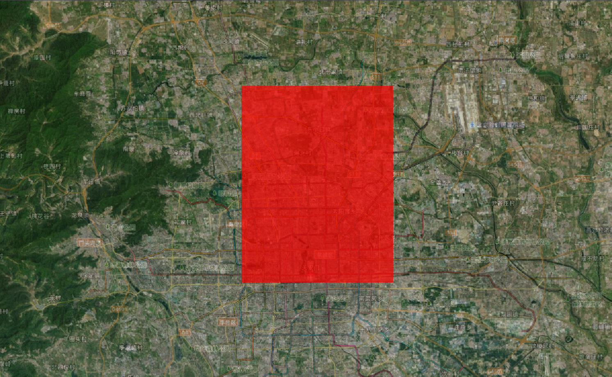

# Cesium Primitive（图元）系统深度解析

## Primitive 核心概念

Primitive（图元）是 Cesium 中直接与 WebGL 交互的底层渲染单元，提供了对渲染管线的精细控制。与高层封装的 Entity API 不同，Primitive 允许开发者直接操作几何数据、着色器和渲染状态，是实现高性能复杂场景的关键技术。

### Primitive 渲染流水线

Primitive 的渲染流程涉及以下关键步骤：

1. **几何定义**：创建 Geometry 描述顶点数据
2. **实例化**：通过 GeometryInstance 创建可渲染实例（支持属性差异化）
3. **外观定义**：通过 Appearance 指定渲染样式和着色器
4. **批处理**：合并相同外观的实例以减少绘制调用
5. **渲染状态**：配置 WebGL 渲染状态（深度测试、混合模式等）
6. **绘制**：提交 GPU 渲染指令


:::details 展开代码

```vue
<template>
  <div ref="cesiumContainer" class="container"></div>
</template>

<script setup>
import { ref, onMounted } from "vue";
import * as Cesium from "cesium";
const cesiumContainer = ref(null);
let viewer = null;

// 天地图TOKEN
const token = "05be06461004055923091de7f3e51aa6";

onMounted(() => {
  // 初始化Viewer
  viewer = new Cesium.Viewer(cesiumContainer.value, {
    geocoder: false, // 关闭地理编码搜索
    homeButton: false, // 关闭主页按钮
    sceneModePicker: false, // 关闭场景模式选择器
    baseLayerPicker: false, // 关闭底图选择器
    navigationHelpButton: false, // 关闭导航帮助
    animation: false, // 关闭动画控件
    timeline: false, // 关闭时间轴
    fullscreenButton: false, // 关闭全屏按钮
    baseLayer: false, // 关闭默认地图
  });
  // 清空logo
  viewer.cesiumWidget.creditContainer.style.display = "none";

  // 1. 定义几何体（矩形）
  const rectangleGeometry = new Cesium.RectangleGeometry({
    rectangle: Cesium.Rectangle.fromDegrees(116.3, 39.9, 116.5, 40.1),
    vertexFormat: Cesium.PerInstanceColorAppearance.VERTEX_FORMAT,
    height: 1000,
  });

  // 2. 创建几何实例（可包含实例属性）
  const instance = new Cesium.GeometryInstance({
    geometry: rectangleGeometry,
    id: "rectangle-instance",
    attributes: {
      color: Cesium.ColorGeometryInstanceAttribute.fromColor(
        Cesium.Color.RED.withAlpha(0.7)
      ),
      show: new Cesium.ShowGeometryInstanceAttribute(true),
    },
    modelMatrix: Cesium.Matrix4.IDENTITY.clone(),
  });

  // 3. 定义外观
  const appearance = new Cesium.PerInstanceColorAppearance({
    translucent: true,
    closed: true,
  });

  // 4. 创建Primitive
  const primitive = new Cesium.Primitive({
    geometryInstances: instance,
    appearance: appearance,
    asynchronous: true, // 异步加载（大场景推荐）
    releaseGeometryInstances: true, // 释放几何实例内存
    compressVertices: true, // 压缩顶点数据
    allowPicking: true, // 允许拾取
  });

  // 5. 添加到场景并监听状态
  viewer.scene.primitives.add(primitive);

  viewer.camera.setView({
    destination: Cesium.Rectangle.fromDegrees(116.3, 39.8, 116.5, 40.19),
    orientation: {
      heading: Cesium.Math.toRadians(0),
      pitch: Cesium.Math.toRadians(-90),
      roll: 0,
    },
  });

  initMap();
});

// 加载天地图
const initMap = () => {
  // 以下为天地图及天地图标注加载
  const tiandituProvider = new Cesium.WebMapTileServiceImageryProvider({
    url:
      "http://{s}.tianditu.gov.cn/img_w/wmts?service=wmts&request=GetTile&version=1.0.0&LAYER=img&tileMatrixSet=w&TileMatrix={TileMatrix}&TileRow={TileRow}&TileCol={TileCol}&style=default&format=tiles&tk=" +
      token,
    layer: "img",
    style: "default",
    format: "tiles",
    tileMatrixSetID: "w", // 天地图使用 Web 墨卡托投影（EPSG:3857），需确保 tileMatrixSetID: "w"
    subdomains: ["t0", "t1", "t2", "t3", "t4", "t5", "t6", "t7"], // 子域名
    maximumLevel: 18,
    credit: new Cesium.Credit("天地图影像"),
  });

  // 添加地理标注
  const labelProvider = new Cesium.WebMapTileServiceImageryProvider({
    url:
      "http://{s}.tianditu.gov.cn/cia_w/wmts?service=wmts&request=GetTile&version=1.0.0&LAYER=cia&tileMatrixSet=w&tileMatrix={TileMatrix}&tileRow={TileRow}&tileCol={TileCol}&style=default&format=tiles&tk=" +
      token,
    layer: "img",
    style: "default",
    format: "tiles",
    tileMatrixSetID: "w",
    subdomains: ["t0", "t1", "t2", "t3", "t4", "t5", "t6", "t7"], // 子域名轮询
    maximumLevel: 18,
    credit: new Cesium.Credit("天地图影像"),
  });
  // 天地图影像添加到viewer实例的影像图层集合中
  viewer.imageryLayers.addImageryProvider(tiandituProvider);
  // 天地图地理标注（后添加的会覆盖前面的）
  viewer.imageryLayers.addImageryProvider(labelProvider);
};
</script>
<style scoped>
.container {
  width: 100vw;
  height: 100vh;
}
</style>
```

:::



### 与 Entity 的核心区别

Entity 是基于 Primitive 的封装, 提供了更高级的 API, 更易用, 但性能不如 Primitive

| 特性         | Primitive                    | Entity                       | 技术本质   |
| ------------ | ---------------------------- | ---------------------------- | ---------- |
| **抽象层级** | 底层（接近 WebGL）           | 高层（声明式 API）           | 架构定位   |
| **性能控制** | 完全手动控制                 | 自动优化                     | 性能管理   |
| **内存占用** | 低（直接管理）               | 中（额外封装开销）           | 资源消耗   |
| **动态更新** | 复杂（需重建或更新缓冲区）   | 简单（属性直接修改）         | 交互灵活性 |
| **学习曲线** | 陡峭（需了解 WebGL 概念）    | 平缓（面向业务逻辑）         | 开发门槛   |
| **适用规模** | 大规模静态数据（10 万+对象） | 中小规模动态对象（1 万以下） | 数据量级   |

## 核心配置项

1. geometryInstances - 几何实例 [官网](https://cesium.com/learn/cesiumjs/ref-doc/GeometryInstance.html?classFilter=GeometryInstance)

   - 单个实例：直接传递一个 GeometryInstance 对象

   - 多个实例：使用数组传递多个 GeometryInstance 对象

   - 性能技巧：相同外观的几何实例应放在同一个 Primitive 中

2. appearance - 外观控制
   - 定义渲染样式（材质、着色器等）

```js
const primitive = new Cesium.Primitive({
  // 必需：几何实例（单个或多个）
  geometryInstances: [geometryInstance1, geometryInstance2],

  // 必需：外观定义
  appearance: new Cesium.PerInstanceColorAppearance(),

  // 可选：是否异步创建（默认true）
  asynchronous: true,

  // 可选：是否释放几何实例（默认true）
  releaseGeometryInstances: true,

  // 可选：是否压缩顶点（默认true）
  compressVertices: true,

  // 可选：是否允许拾取（默认true）
  allowPicking: true,

  // 可选：模型矩阵（全局变换）
  modelMatrix: Cesium.Matrix4.IDENTITY.clone(),

  // 可选：调试显示包围盒（默认false）
  debugShowBoundingVolume: false,

  // 可选：是否始终在地平线上方（默认false）
  show: true,

  // 可选：顶点缓存优化（默认false）
  interleave: false,
});
```

### 添加几何形状

1. 定义几何类型

```js
// 创建矩形几何
const rectangle = Cesium.Rectangle.fromDegrees(-120.0, 30.0, -100.0, 40.0);
const geometry = new Cesium.RectangleGeometry({
  rectangle: rectangle,
  vertexFormat: Cesium.EllipsoidSurfaceAppearance.VERTEX_FORMAT, // 使用默认的顶点格式
  height: 10000,
});
```

2. 创建几何实例

```js
const instance = new Cesium.GeometryInstance({
  geometry: geometry,
  attributes: {
    color: new Cesium.ColorGeometryInstanceAttribute(1.0, 0.0, 0.0, 0.5),
  },
});
```

3. 定义外观,这里的`material`可以选择[材质类型](https://cesium.com/learn/cesiumjs/ref-doc/Material.html?classFilter=Material)

```js
const appearance = new Cesium.EllipsoidSurfaceAppearance({
  // 材质定义,checkerboard 是一个内置的材质类型，用于创建棋盘格效果
  material: Cesium.Material.fromType("Checkerboard", {
    evenColor: Cesium.Color.WHITE,
    oddColor: Cesium.Color.BLUE,
    repeat: new Cesium.Cartesian2(10, 10),
  }),
  aboveGround: true,
});
```

4. 创建 Primitive

```js
const primitive = new Cesium.Primitive({
  geometryInstances: [instance],
  appearance: appearance,
  releaseGeometryInstances: false,
  compressVertices: true, // 顶点压缩优化
});

viewer.scene.primitives.add(primitive);
viewer.camera.flyTo({
  destination: rectangle,
  orientation: {
    heading: Cesium.Math.toRadians(0),
    pitch: Cesium.Math.toRadians(-90),
    roll: 0,
  },
});
```


## GeometryInstance 详解

### 创建 GeometryInstance

```js
const geometryInstance = new Cesium.GeometryInstance({
  geometry: new Cesium.RectangleGeometry({
    // 几何体定义
    rectangle: Cesium.Rectangle.fromDegrees(-110.0, 20.0, -100.0, 30.0),
    vertexFormat: Cesium.PerInstanceColorAppearance.VERTEX_FORMAT,
  }),
  attributes: {
    // 实例属性
    color: new Cesium.ColorGeometryInstanceAttribute(1.0, 0.0, 0.0, 0.5),
  },
  modelMatrix: Cesium.Matrix4.IDENTITY.clone(), // 模型矩阵
  id: "rectangle-instance", // 唯一标识符
});
```

### 几何体属性 (Attributes)

```js
attributes: {
  // 颜色属性 (RGBA)
  color: new Cesium.ColorGeometryInstanceAttribute(
    red, green, blue, alpha
  ),

  // 是否显示
  show: new Cesium.ShowGeometryInstanceAttribute(
    true
  ),

  // 距离显示属性
  distanceDisplayCondition: new Cesium.DistanceDisplayConditionGeometryInstanceAttribute(
    nearDistance, farDistance
  )
}
```

### 模型变换 (ModelMatrix)

```js
// 创建平移矩阵
const translation = new Cesium.Cartesian3(10000, 0, 0);
const modelMatrix = Cesium.Transforms.eastNorthUpToFixedFrame(
  Cesium.Cartesian3.fromDegrees(-105.0, 40.0, 1000),
  Cesium.Ellipsoid.WGS84,
  new Cesium.Matrix4()
);
Cesium.Matrix4.multiplyByTranslation(modelMatrix, translation, modelMatrix);

// 创建旋转矩阵
const rotation = Cesium.Matrix3.fromRotationX(Cesium.Math.toRadians(45));
Cesium.Matrix4.multiplyByMatrix3(modelMatrix, rotation, modelMatrix);
```

## Geometry 类型大全

### 基础几何类型

| 几何类型          | 描述      | 典型应用       |
| ----------------- | --------- | -------------- |
| BoxGeometry       | 3D 长方体 | 建筑、立方体   |
| CylinderGeometry  | 圆柱体    | 柱状物、树木   |
| EllipsoidGeometry | 椭球体    | 行星、球体     |
| SphereGeometry    | 完美球体  | 标记点、气泡   |
| PolylineGeometry  | 折线      | 路径、边界     |
| PolygonGeometry   | 多边形    | 区域、地块     |
| RectangleGeometry | 矩形      | 地图瓦片、区域 |

### 地表几何类型

| 几何类型               | 描述     | 典型应用       |
| ---------------------- | -------- | -------------- |
| WallGeometry           | 垂直墙   | 围栏、堤坝     |
| PolylineVolumeGeometry | 体积折线 | 管道、道路     |
| CorridorGeometry       | 走廊     | 河流、通道     |
| EllipseGeometry        | 椭圆     | 圆形区域       |
| CircleGeometry         | 正圆     | 范围圈、影响区 |

### 高级几何类型

| 几何类型                | 描述       | 典型应用       |
| ----------------------- | ---------- | -------------- |
| FrustumGeometry         | 视锥体     | 相机视野       |
| GroundPolylineGeometry  | 地表折线   | 贴合地面的路径 |
| CoplanarPolygonGeometry | 共面多边形 | 复杂平面图形   |

### 创建 BoxGeometry

```js
// 1. 定义盒子中心位置（WGS84坐标）
const center = Cesium.Cartesian3.fromDegrees(116.39, 39.9, 1000);

// 2. 定义盒子尺寸（单位：米）
const boxSize = new Cesium.Cartesian3(500.0, 800.0, 300.0); // 长(x)、宽(y)、高(z)

// 3. 计算最小和最大点（以中心为原点）
const halfSize = Cesium.Cartesian3.multiplyByScalar(
  boxSize,
  0.5,
  new Cesium.Cartesian3()
);
const minimum = Cesium.Cartesian3.negate(halfSize, new Cesium.Cartesian3());
const maximum = halfSize;

// 4. 创建盒子几何体（使用正确的参数）
const boxGeometry = new Cesium.BoxGeometry({
  vertexFormat: Cesium.VertexFormat.POSITION_AND_NORMAL, // 包含法线信息（用于光照）
  minimum: minimum,
  maximum: maximum,
});

// 5. 创建模型矩阵（包含位置和方向）
const modelMatrix = Cesium.Transforms.eastNorthUpToFixedFrame(center);

// 6. 创建几何实例
const instance = new Cesium.GeometryInstance({
  geometry: boxGeometry,
  modelMatrix: modelMatrix,
  id: "custom-box", // 可选ID，用于拾取识别
  attributes: {
    color: Cesium.ColorGeometryInstanceAttribute.fromColor(
      Cesium.Color.RED.withAlpha(0.7)
    ), // 带透明度
  },
});

// 7. 创建Primitive并添加到场景
const boxPrimitive = new Cesium.Primitive({
  geometryInstances: instance,
  appearance: new Cesium.PerInstanceColorAppearance({
    closed: true, // 封闭几何体（盒子必须封闭）
    translucent: true, // 启用透明度
  }),
  asynchronous: false, // 同步加载（小几何体适用）
});

viewer.scene.primitives.add(boxPrimitive);

// 8. 视角定位
viewer.camera.flyTo({
  destination: center,
  offset: new Cesium.HeadingPitchRange(0, Cesium.Math.toRadians(-45), 2000),
});
```

### 销毁流程

1. `remove(boxPrimitive)`从场景中移除

```js
// 从场景中移除
viewer.scene.primitives.remove(boxPrimitive);
// 检查是否销毁
console.log(boxPrimitive.isDestroyed()); // true
```

2. `destroy()`显式销毁,一旦对象被销毁，就不应该使用它;调用 isDestroyed 将导致 DeveloperError 异常,`DeveloperError : This object was destroyed, i.e., destroy() was called.`

```js
// 显式销毁
boxPrimitive = boxPrimitive && boxPrimitive.destroy();
```

### 海量数据渲染

例举集中大量数据渲染集合，更多信息可参考[PrimitiveCollection](https://cesium.com/learn/cesiumjs/ref-doc/PrimitiveCollection.html)

| 数据类型                 | 典型应用                | 性能关键点     | 推荐结构          |
| ------------------------ | ----------------------- | -------------- | ----------------- |
| BillboardCollection      | POI 点、图标 纹理合并、 | 批次渲染       | 单集合 10 万+图标 |
| PointPrimitiveCollection | 纯色点（无纹理）        | 顶点着色器渲染 | 单集合 100 万+点  |
| PolylineCollection       | 路径、轨迹              | 批次渲染       | 单集合 10 万+路径 |
| LabelCollection          | 文本标签、标注          | 字体纹理合并   | 单集合 10 万+标签 |

```js
// 添加大量广告牌集合
const billboardCollection = viewer.scene.primitives.add(
  new Cesium.BillboardCollection()
);
for (let i = 0; i < 10000; i++) {
  billboardCollection.add({
    position: Cesium.Cartesian3.fromDegrees(
      Math.random() * 360 - 180, // 经度
      Math.random() * 180 - 90, // 纬度
      50
    ),
    image: "/src/assets/vue.svg", // 替换为实际图片路径
    width: 32,
    height: 32,
    // scaleByDistance: new Cesium.NearFarScalar(10000, 1.0, 100000, 0.1), // 按距离缩放：避免远处图标浪费像素
  });
}
```


### 加载模型

```js
const position = Cesium.Cartesian3.fromDegrees(116.3975, 39.9075, 500);
const headingPositionRoll = new Cesium.HeadingPitchRoll();
const fixedFrameTransform = Cesium.Transforms.localFrameToFixedFrameGenerator(
  "north",
  "west"
);
try {
  let animations;
  const model = await Cesium.Model.fromGltfAsync({
    url: new URL("./models/Cesium_Air.glb", import.meta.url).href,
    modelMatrix: Cesium.Transforms.headingPitchRollToFixedFrame(
      position,
      headingPositionRoll,
      Cesium.Ellipsoid.WGS84,
      fixedFrameTransform
    ),
    gltfCallback: (gltf) => {
      animations = gltf.animations;
    },
    minimumPixelSize: 128, // 最小像素大小
    scale: 2.0, // 模型缩放比例
  });
  viewer.scene.primitives.add(model);
  viewer.camera.setView({
    destination: Cesium.Cartesian3.fromDegrees(116.3975, 39.9075, 550),
    orientation: {
      heading: Cesium.Math.toRadians(180),
      pitch: Cesium.Math.toRadians(-80),
      roll: 0,
    },
  });
  viewer.clock.shouldAnimate = true;
  // 播放模型的动画
  model.readyEvent.addEventListener(() => {
    model.activeAnimations.add({
      index: animations.length - 1,
      loop: Cesium.ModelAnimationLoop.REPEAT,
      multiplier: 0.5,
    });
  });
} catch (error) {
  console.log(`Failed to load model. ${error}`);
}
```

<video controls width="600">
  <source src="../Aassets/Basics/模型动画.mp4" type="video/mp4" />
  您的浏览器不支持HTML5视频标签。
</video>
