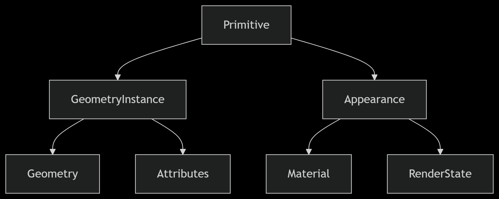
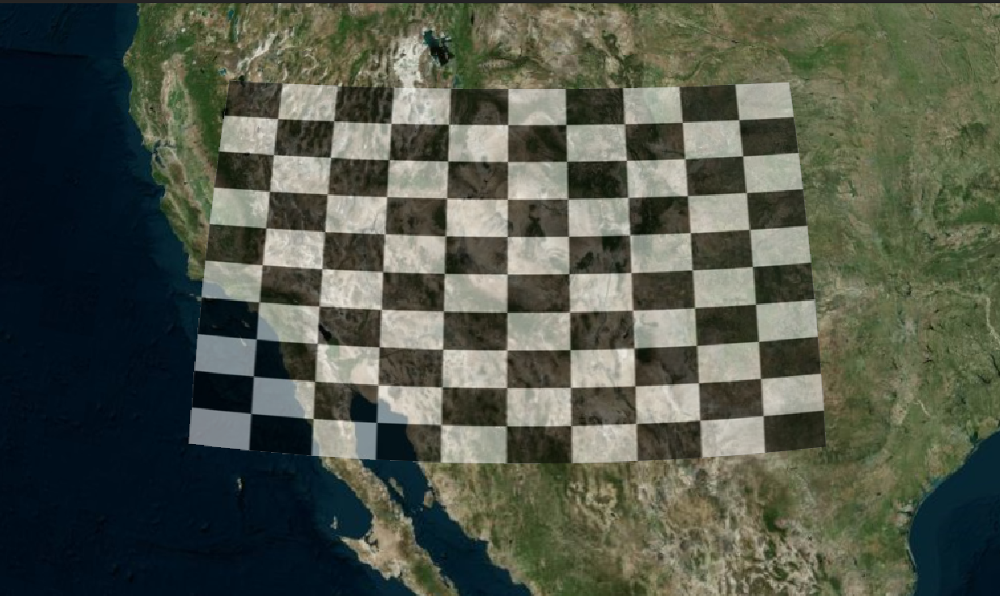

# Cesium Primitive（图元）系统深度解析

## 什么是 Primitive？

Primitive（图元） 是 Cesium 中用于直接渲染几何图形的底层构建块。它们提供了比 Entity API 更接近 WebGL 的抽象层，允许开发者进行更精细的控制和优化。



### 与 Entity 的核心区别

Entity 是基于 Primitive 的封装, 提供了更高级的 API, 更易用, 但性能不如 Primitive

| 特性     | Primitive            | Entity       |
| -------- | -------------------- | ------------ |
| 抽象层级 | 低级别               | 高级别       |
| 性能     | ⚡️ 更高（批量渲染） | 良好         |
| 灵活性   | 🔧 极高（完全控制）  | 中等         |
| 学习曲线 | 📈 陡峭              | 平缓         |
| 最佳场景 | 大规模静态数据       | 动态交互对象 |

## 核心配置项

1. geometryInstances - 几何实例

   - 单个实例：直接传递一个 GeometryInstance 对象

   - 多个实例：使用数组传递多个 GeometryInstance 对象

   - 性能技巧：相同外观的几何实例应放在同一个 Primitive 中

2. appearance - 外观控制
   - 定义渲染样式（材质、着色器等）

```js
const primitive = new Cesium.Primitive({
  // 必需：几何实例（单个或多个）
  geometryInstances: geometryInstance,

  // 必需：外观定义
  appearance: appearance,

  // 可选：是否异步创建（默认true）
  asynchronous: true,

  // 可选：是否释放几何实例（默认true）
  releaseGeometryInstances: true,

  // 可选：是否压缩顶点（默认true）
  compressVertices: true,

  // 可选：是否允许拾取（默认true）
  allowPicking: true,

  // 可选：模型矩阵（全局变换）
  modelMatrix: Cesium.Matrix4.IDENTITY.clone(),

  // 可选：调试显示包围盒（默认false）
  debugShowBoundingVolume: false,

  // 可选：是否始终在地平线上方（默认false）
  show: true,

  // 可选：顶点缓存优化（默认false）
  interleave: false,
});
```

### 添加几何形状

1. 定义几何类型

```js
// 创建矩形几何
const rectangle = Cesium.Rectangle.fromDegrees(-120.0, 30.0, -100.0, 40.0);
const geometry = new Cesium.RectangleGeometry({
  rectangle: rectangle,
  vertexFormat: Cesium.EllipsoidSurfaceAppearance.VERTEX_FORMAT, // 使用默认的顶点格式
  height: 10000,
});
```

2. 创建几何实例

```js
const instance = new Cesium.GeometryInstance({
  geometry: geometry,
  attributes: {
    color: new Cesium.ColorGeometryInstanceAttribute(1.0, 0.0, 0.0, 0.5),
  },
});
```

3. 定义外观

```js
const appearance = new Cesium.EllipsoidSurfaceAppearance({
  // 材质定义,checkerboard 是一个内置的材质类型，用于创建棋盘格效果
  material: Cesium.Material.fromType("Checkerboard", {
    evenColor: Cesium.Color.WHITE,
    oddColor: Cesium.Color.BLUE,
    repeat: new Cesium.Cartesian2(10, 10),
  }),
  aboveGround: true,
});
```

4. 创建 Primitive

```js
const primitive = new Cesium.Primitive({
  geometryInstances: instance,
  appearance: appearance,
  releaseGeometryInstances: false,
  compressVertices: true, // 顶点压缩优化
});

viewer.scene.primitives.add(primitive);
viewer.camera.flyTo({
  destination: rectangle,
  orientation: {
    heading: Cesium.Math.toRadians(0),
    pitch: Cesium.Math.toRadians(-90),
    roll: 0,
  },
});
```



## Geometry 类型大全

### 基础几何类型

| 几何类型          | 描述      | 典型应用       |
| ----------------- | --------- | -------------- |
| BoxGeometry       | 3D 长方体 | 建筑、立方体   |
| CylinderGeometry  | 圆柱体    | 柱状物、树木   |
| EllipsoidGeometry | 椭球体    | 行星、球体     |
| SphereGeometry    | 完美球体  | 标记点、气泡   |
| PolylineGeometry  | 折线      | 路径、边界     |
| PolygonGeometry   | 多边形    | 区域、地块     |
| RectangleGeometry | 矩形      | 地图瓦片、区域 |

### 地表几何类型

| 几何类型               | 描述     | 典型应用       |
| ---------------------- | -------- | -------------- |
| WallGeometry           | 垂直墙   | 围栏、堤坝     |
| PolylineVolumeGeometry | 体积折线 | 管道、道路     |
| CorridorGeometry       | 走廊     | 河流、通道     |
| EllipseGeometry        | 椭圆     | 圆形区域       |
| CircleGeometry         | 正圆     | 范围圈、影响区 |

### 高级几何类型

| 几何类型                | 描述       | 典型应用       |
| ----------------------- | ---------- | -------------- |
| FrustumGeometry         | 视锥体     | 相机视野       |
| GroundPolylineGeometry  | 地表折线   | 贴合地面的路径 |
| CoplanarPolygonGeometry | 共面多边形 | 复杂平面图形   |
