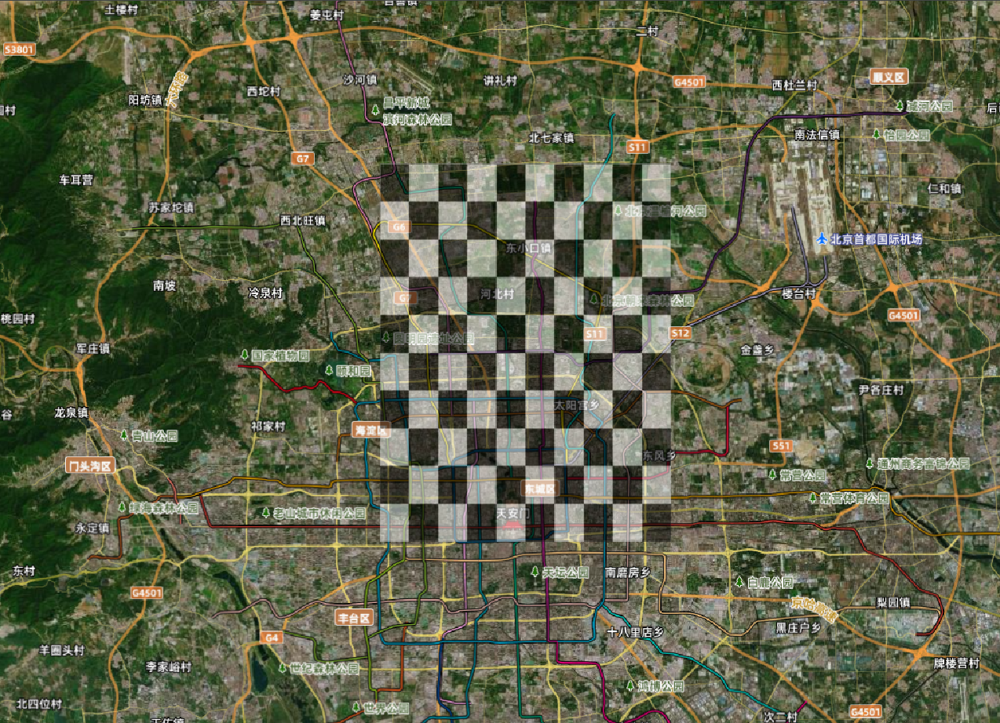
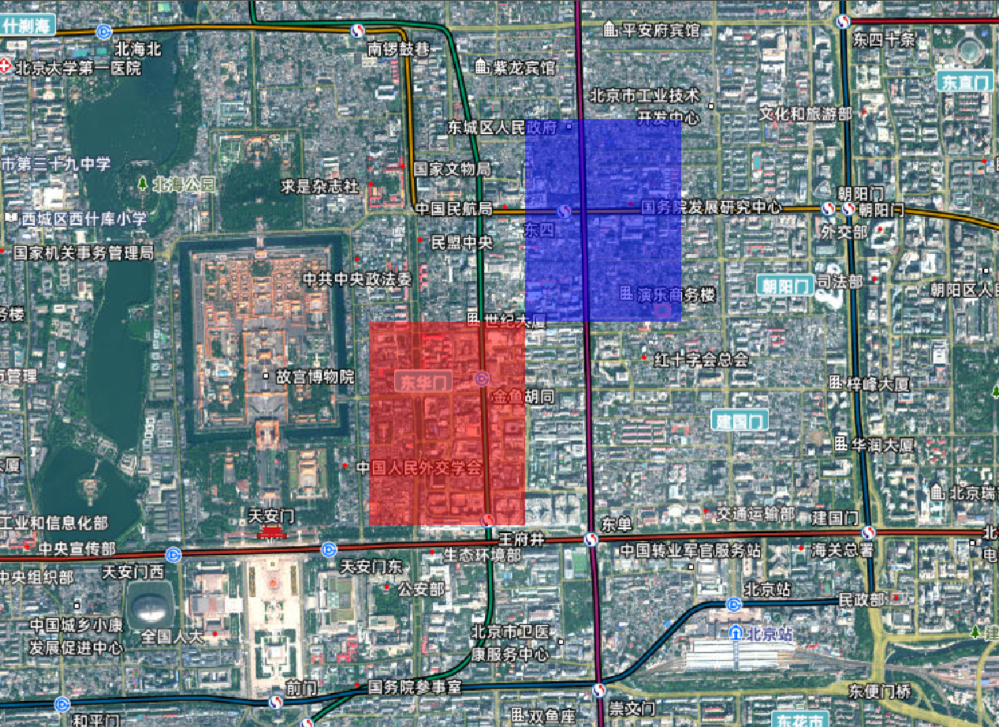
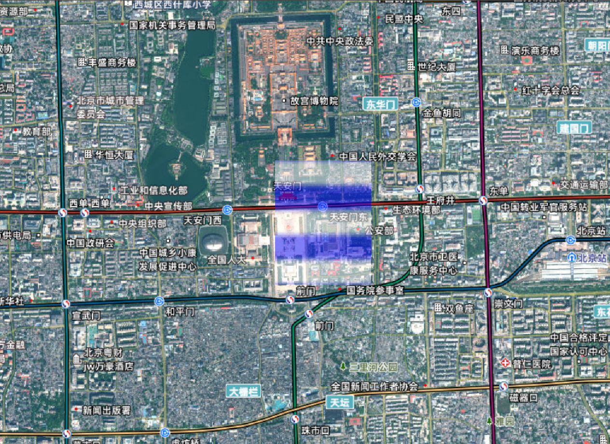
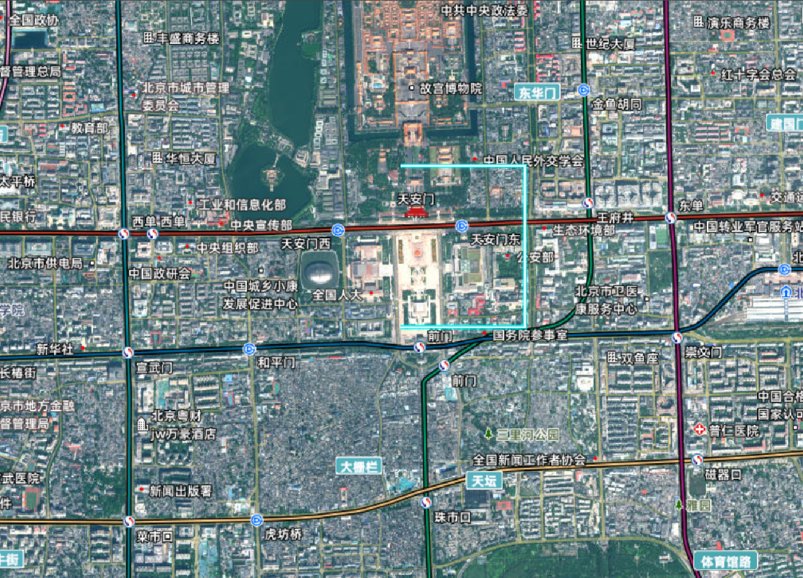

# Cesium Appearance（外观）系统深度解析

## 什么是 Appearance？

Appearance（外观） 是 Cesium 中控制图元视觉呈现的核心组件，它定义了如何渲染几何体的表面特性。Appearance 系统包含以下核心功能：

### Appearance 在渲染流水线中的作用

Cesium 渲染流水线中的 Appearance 职责：

1. **顶点数据处理**：定义顶点属性的解释方式
2. **材质与着色**：控制表面颜色、纹理和光照效果
3. **渲染状态管理**：配置 WebGL 上下文状态（深度测试、混合等）
4. **着色器生成**：根据配置自动生成或整合自定义 GLSL 代码
5. **性能优化**：批处理、状态缓存和渲染顺序控制

> **注意**：Appearance 本身不包含几何数据，而是与 Primitive 结合使用，决定几何数据的渲染方式。

## Appearance 类型体系

| 外观类型                     | 描述         | 典型应用             |
| ---------------------------- | ------------ | -------------------- |
| `MaterialAppearance`         | 通用材质外观 | 大多数表面渲染       |
| `PerInstanceColorAppearance` | 实例颜色外观 | 批量渲染不同颜色对象 |
| `EllipsoidSurfaceAppearance` | 椭球表面外观 | 贴合地球表面的图元   |
| `PolylineMaterialAppearance` | 折线材质外观 | 带材质的折线         |
| `PolylineColorAppearance`    | 折线颜色外观 | 固定颜色的折线       |
| `DebugAppearance`            | 调试外观     | 显示几何结构         |

### 类型选择决策指南

选择合适的 Appearance 类型可显著提升性能：

1. **静态单一颜色表面** → PerInstanceColorAppearance
2. **复杂纹理或材质** → MaterialAppearance
3. **地形表面几何** → EllipsoidSurfaceAppearance
4. **简单折线** → PolylineColorAppearance
5. **带材质的折线** → PolylineMaterialAppearance
6. **开发调试** → DebugAppearance

## Appearance 核心配置选项

### MaterialAppearance 通用材质外观

最灵活的外观类型，支持所有内置材质和自定义材质

```js
const appearance = new Cesium.MaterialAppearance({
  // 材质定义（必需）
  material: Cesium.Material.fromType("DiffuseMap"),

  // 是否半透明（影响渲染顺序和混合）
  translucent: true,

  // 是否闭合几何（用于背面渲染）
  closed: false,

  // 是否启用平面着色
  flat: false,
  // 顶点着色器替换（自定义顶点处理）
  vertexShaderSource: "",

  // 片元着色器替换（自定义像素处理）
  fragmentShaderSource: "",

  // 渲染状态配置
  renderState: {
    /* 渲染状态 */
  },
});
```

#### 基础示例

使用`Cesium.Material.fromType`创建材质,材质配置项可参考[基础材质](./09_材质.md),
更多内置材质可参考[内置材质](https://cesium.com/learn/cesiumjs/ref-doc/Material.html)

:::details 展开代码

```vue
<template>
  <div ref="cesiumContainer" class="container"></div>
</template>

<script setup>
import { ref, onMounted } from "vue";
import * as Cesium from "cesium";
const cesiumContainer = ref(null);
let viewer = null;

// 天地图TOKEN
const token = "05be06461004055923091de7f3e51aa6";

onMounted(() => {
  // 初始化Viewer
  viewer = new Cesium.Viewer(cesiumContainer.value, {
    geocoder: false, // 关闭地理编码搜索
    homeButton: false, // 关闭主页按钮
    sceneModePicker: false, // 关闭场景模式选择器
    baseLayerPicker: false, // 关闭底图选择器
    navigationHelpButton: false, // 关闭导航帮助
    animation: false, // 关闭动画控件
    timeline: false, // 关闭时间轴
    fullscreenButton: false, // 关闭全屏按钮
    baseLayer: false, // 关闭默认地图
  });
  // 清空logo
  viewer.cesiumWidget.creditContainer.style.display = "none";

  // 1. 定义几何体（矩形）
  const rectangleGeometry = new Cesium.RectangleGeometry({
    rectangle: Cesium.Rectangle.fromDegrees(116.3, 39.9, 116.5, 40.1),
    height: 1000,
  });

  // 2. 创建几何实例（可包含实例属性）
  const instance = new Cesium.GeometryInstance({
    geometry: rectangleGeometry,
    id: "rectangle-instance",
    attributes: {
      color: Cesium.ColorGeometryInstanceAttribute.fromColor(
        Cesium.Color.RED.withAlpha(0.7)
      ),
      show: new Cesium.ShowGeometryInstanceAttribute(true),
    },
    modelMatrix: Cesium.Matrix4.IDENTITY.clone(),
  });

  // 3. 定义外观、创建棋盘格材质
  const checkerboardMaterial = Cesium.Material.fromType("Checkerboard", {
    evenColor: Cesium.Color.WHITE,
    oddColor: Cesium.Color.BLACK,
    repeat: new Cesium.Cartesian2(10, 10),
  });
  const appearance = new Cesium.MaterialAppearance({
    material: checkerboardMaterial,
    translucent: true,
    closed: true,
  });

  // 4. 创建Primitive
  const primitive = new Cesium.Primitive({
    geometryInstances: instance,
    appearance: appearance,
    asynchronous: true, // 异步加载（大场景推荐）
    releaseGeometryInstances: true, // 释放几何实例内存
    compressVertices: true, // 压缩顶点数据
    allowPicking: true, // 允许拾取
  });

  // 5. 添加到场景并监听状态
  viewer.scene.primitives.add(primitive);

  viewer.camera.setView({
    destination: Cesium.Rectangle.fromDegrees(116.3, 39.8, 116.5, 40.19),
    orientation: {
      heading: Cesium.Math.toRadians(0),
      pitch: Cesium.Math.toRadians(-90),
      roll: 0,
    },
  });

  initMap();
});

// 加载天地图
const initMap = () => {
  // 以下为天地图及天地图标注加载
  const tiandituProvider = new Cesium.WebMapTileServiceImageryProvider({
    url:
      "http://{s}.tianditu.gov.cn/img_w/wmts?service=wmts&request=GetTile&version=1.0.0&LAYER=img&tileMatrixSet=w&TileMatrix={TileMatrix}&TileRow={TileRow}&TileCol={TileCol}&style=default&format=tiles&tk=" +
      token,
    layer: "img",
    style: "default",
    format: "tiles",
    tileMatrixSetID: "w", // 天地图使用 Web 墨卡托投影（EPSG:3857），需确保 tileMatrixSetID: "w"
    subdomains: ["t0", "t1", "t2", "t3", "t4", "t5", "t6", "t7"], // 子域名
    maximumLevel: 18,
    credit: new Cesium.Credit("天地图影像"),
  });

  // 添加地理标注
  const labelProvider = new Cesium.WebMapTileServiceImageryProvider({
    url:
      "http://{s}.tianditu.gov.cn/cia_w/wmts?service=wmts&request=GetTile&version=1.0.0&LAYER=cia&tileMatrixSet=w&tileMatrix={TileMatrix}&tileRow={TileRow}&tileCol={TileCol}&style=default&format=tiles&tk=" +
      token,
    layer: "img",
    style: "default",
    format: "tiles",
    tileMatrixSetID: "w",
    subdomains: ["t0", "t1", "t2", "t3", "t4", "t5", "t6", "t7"], // 子域名轮询
    maximumLevel: 18,
    credit: new Cesium.Credit("天地图影像"),
  });
  // 天地图影像添加到viewer实例的影像图层集合中
  viewer.imageryLayers.addImageryProvider(tiandituProvider);
  // 天地图地理标注（后添加的会覆盖前面的）
  viewer.imageryLayers.addImageryProvider(labelProvider);
};
</script>
<style scoped>
.container {
  width: 100vw;
  height: 100vh;
}
</style>
```

:::



```js
// 创建棋盘格材质
const checkerboardMaterial = Cesium.Material.fromType("Checkerboard", {
  evenColor: Cesium.Color.WHITE,
  oddColor: Cesium.Color.BLACK,
  repeat: new Cesium.Cartesian2(10, 10),
});

// 创建条纹材质
const stripeMaterial = Cesium.Material.fromType("Stripe", {
  evenColor: Cesium.Color.RED,
  oddColor: Cesium.Color.BLUE,
  repeat: 5,
  orientation: Cesium.StripeOrientation.VERTICAL,
});

// 创建网格材质
const gridMaterial = Cesium.Material.fromType("Grid", {
  color: Cesium.Color.YELLOW,
  cellAlpha: 0.2,
  lineCount: new Cesium.Cartesian2(8, 8),
  lineThickness: new Cesium.Cartesian2(2.0, 2.0),
});
```

### PerInstanceColorAppearance 实例颜色外观

使用 instance 中`attributes`默认颜色外观,为每个几何体实例设置不同的颜色，适合批量渲染不同颜色的图元。

```js
const appearance = new Cesium.PerInstanceColorAppearance({
  translucent: true, // 是否半透明
  closed: false, // 是否封闭几何体
  flat: false, // 是否使用平面着色,不考虑光照
  renderState: {
    // 自定义渲染状态
    depthTest: {
      enabled: true,
    },
  },
});
```

#### 基础示例

:::details 展开代码

```vue
<template>
  <div ref="cesiumContainer" class="container"></div>
</template>

<script setup>
import { ref, onMounted } from "vue";
import * as Cesium from "cesium";
const cesiumContainer = ref(null);
let viewer = null;

// 天地图TOKEN
const token = "05be06461004055923091de7f3e51aa6";

onMounted(() => {
  // 初始化Viewer
  viewer = new Cesium.Viewer(cesiumContainer.value, {
    geocoder: false, // 关闭地理编码搜索
    homeButton: false, // 关闭主页按钮
    sceneModePicker: false, // 关闭场景模式选择器
    baseLayerPicker: false, // 关闭底图选择器
    navigationHelpButton: false, // 关闭导航帮助
    animation: false, // 关闭动画控件
    timeline: false, // 关闭时间轴
    fullscreenButton: false, // 关闭全屏按钮
    baseLayer: false, // 关闭默认地图
  });
  // 清空logo
  viewer.cesiumWidget.creditContainer.style.display = "none";

  // 创建矩形几何体
  const instance = new Cesium.GeometryInstance({
    geometry: new Cesium.RectangleGeometry({
      rectangle: Cesium.Rectangle.fromDegrees(
        116.3975,
        39.9075,
        116.4075,
        39.9175
      ),
    }),
    attributes: {
      color: new Cesium.ColorGeometryInstanceAttribute(1.0, 0.0, 0.0, 0.5),
    },
  });

  // 创建另一个几何体
  const anotherInstance = new Cesium.GeometryInstance({
    geometry: new Cesium.RectangleGeometry({
      rectangle: Cesium.Rectangle.fromDegrees(
        116.4075,
        39.9175,
        116.4175,
        39.9275
      ),
    }),
    attributes: {
      color: new Cesium.ColorGeometryInstanceAttribute(0.0, 0.0, 1.0, 0.5),
    },
  });

  // 创建Primitive
  const rectanglePrimitive = new Cesium.Primitive({
    geometryInstances: [instance, anotherInstance],
    // 使用PerInstanceColorAppearance以支持每个实例的颜色
    appearance: new Cesium.PerInstanceColorAppearance({
      flat: true, // 不考虑光照
      translucent: true, // 启用透明度
    }),
  });
  viewer.scene.primitives.add(rectanglePrimitive);
  // 定位
  viewer.camera.setView({
    destination: Cesium.Cartesian3.fromDegrees(116.3975, 39.9075, 5000), // 设置初始视角
  });

  initMap();
});

// 加载天地图
const initMap = () => {
  // 以下为天地图及天地图标注加载
  const tiandituProvider = new Cesium.WebMapTileServiceImageryProvider({
    url:
      "http://{s}.tianditu.gov.cn/img_w/wmts?service=wmts&request=GetTile&version=1.0.0&LAYER=img&tileMatrixSet=w&TileMatrix={TileMatrix}&TileRow={TileRow}&TileCol={TileCol}&style=default&format=tiles&tk=" +
      token,
    layer: "img",
    style: "default",
    format: "tiles",
    tileMatrixSetID: "w", // 天地图使用 Web 墨卡托投影（EPSG:3857），需确保 tileMatrixSetID: "w"
    subdomains: ["t0", "t1", "t2", "t3", "t4", "t5", "t6", "t7"], // 子域名
    maximumLevel: 18,
    credit: new Cesium.Credit("天地图影像"),
  });

  // 添加地理标注
  const labelProvider = new Cesium.WebMapTileServiceImageryProvider({
    url:
      "http://{s}.tianditu.gov.cn/cia_w/wmts?service=wmts&request=GetTile&version=1.0.0&LAYER=cia&tileMatrixSet=w&tileMatrix={TileMatrix}&tileRow={TileRow}&tileCol={TileCol}&style=default&format=tiles&tk=" +
      token,
    layer: "img",
    style: "default",
    format: "tiles",
    tileMatrixSetID: "w",
    subdomains: ["t0", "t1", "t2", "t3", "t4", "t5", "t6", "t7"], // 子域名轮询
    maximumLevel: 18,
    credit: new Cesium.Credit("天地图影像"),
  });
  // 天地图影像添加到viewer实例的影像图层集合中
  viewer.imageryLayers.addImageryProvider(tiandituProvider);
  // 天地图地理标注（后添加的会覆盖前面的）
  viewer.imageryLayers.addImageryProvider(labelProvider);
};
</script>
<style scoped>
.container {
  width: 100vw;
  height: 100vh;
}
</style>
```

:::



#### 性能优势

PerInstanceColorAppearance 通过以下方式优化性能：

- 单一绘制调用渲染多个颜色不同的实例
- 颜色数据存储在顶点属性中，避免材质切换
- 自动合并相同配置的实例，减少状态切换

### EllipsoidSurfaceAppearance

椭球表面外观，专门用于渲染贴合地球表面的图元，支持多种材质。

#### 基础示例

:::details 展开代码

```vue
<template>
  <div ref="cesiumContainer" class="container"></div>
</template>

<script setup>
import { ref, onMounted } from "vue";
import * as Cesium from "cesium";
const cesiumContainer = ref(null);
let viewer = null;

// 天地图TOKEN
const token = "05be06461004055923091de7f3e51aa6";

onMounted(() => {
  // 初始化Viewer
  viewer = new Cesium.Viewer(cesiumContainer.value, {
    geocoder: false, // 关闭地理编码搜索
    homeButton: false, // 关闭主页按钮
    sceneModePicker: false, // 关闭场景模式选择器
    baseLayerPicker: false, // 关闭底图选择器
    navigationHelpButton: false, // 关闭导航帮助
    animation: false, // 关闭动画控件
    timeline: false, // 关闭时间轴
    fullscreenButton: false, // 关闭全屏按钮
    baseLayer: false, // 关闭默认地图
  });
  // 清空logo
  viewer.cesiumWidget.creditContainer.style.display = "none";

  // 1. 定义椭球体几何体
  const geometry = new Cesium.PolygonGeometry({
    polygonHierarchy: new Cesium.PolygonHierarchy(
      Cesium.Cartesian3.fromDegreesArray([
        116.39,
        39.9, // 第一个点
        116.4,
        39.9, // 第二个点
        116.4,
        39.91, // 第三个点
        116.39,
        39.91, // 第四个点
      ])
    ),
    height: 0, // 高度为0，表示在地面上
    vertexFormat: Cesium.EllipsoidSurfaceAppearance.VERTEX_FORMAT, // 包含位置和法线信息
  });
  // 2. 创建几何实例
  const geometryInstance = new Cesium.GeometryInstance({
    geometry,
  });
  // 3. 创建外观
  const appearance = new Cesium.EllipsoidSurfaceAppearance({
    material: Cesium.Material.fromType("Stripe"),
  });

  // 4. 创建 Primitive
  const primitive = new Cesium.Primitive({
    geometryInstances: [geometryInstance],
    appearance,
  });

  viewer.scene.primitives.add(primitive);

  // 定位
  viewer.camera.setView({
    destination: Cesium.Cartesian3.fromDegrees(116.395, 39.905, 5000), // 设置初始视角
  });

  initMap();
});

// 加载天地图
const initMap = () => {
  // 以下为天地图及天地图标注加载
  const tiandituProvider = new Cesium.WebMapTileServiceImageryProvider({
    url:
      "http://{s}.tianditu.gov.cn/img_w/wmts?service=wmts&request=GetTile&version=1.0.0&LAYER=img&tileMatrixSet=w&TileMatrix={TileMatrix}&TileRow={TileRow}&TileCol={TileCol}&style=default&format=tiles&tk=" +
      token,
    layer: "img",
    style: "default",
    format: "tiles",
    tileMatrixSetID: "w", // 天地图使用 Web 墨卡托投影（EPSG:3857），需确保 tileMatrixSetID: "w"
    subdomains: ["t0", "t1", "t2", "t3", "t4", "t5", "t6", "t7"], // 子域名
    maximumLevel: 18,
    credit: new Cesium.Credit("天地图影像"),
  });

  // 添加地理标注
  const labelProvider = new Cesium.WebMapTileServiceImageryProvider({
    url:
      "http://{s}.tianditu.gov.cn/cia_w/wmts?service=wmts&request=GetTile&version=1.0.0&LAYER=cia&tileMatrixSet=w&tileMatrix={TileMatrix}&tileRow={TileRow}&tileCol={TileCol}&style=default&format=tiles&tk=" +
      token,
    layer: "img",
    style: "default",
    format: "tiles",
    tileMatrixSetID: "w",
    subdomains: ["t0", "t1", "t2", "t3", "t4", "t5", "t6", "t7"], // 子域名轮询
    maximumLevel: 18,
    credit: new Cesium.Credit("天地图影像"),
  });
  // 天地图影像添加到viewer实例的影像图层集合中
  viewer.imageryLayers.addImageryProvider(tiandituProvider);
  // 天地图地理标注（后添加的会覆盖前面的）
  viewer.imageryLayers.addImageryProvider(labelProvider);
};
</script>
<style scoped>
.container {
  width: 100vw;
  height: 100vh;
}
</style>

```

:::



### PolylineMaterialAppearance

折线材质外观，支持多种材质类型，适合渲染带有特殊效果的折线。

#### 基础示例
:::details 展开代码

```vue
<template>
  <div ref="cesiumContainer" class="container"></div>
</template>

<script setup>
import { ref, onMounted } from "vue";
import * as Cesium from "cesium";
const cesiumContainer = ref(null);
let viewer = null;

// 天地图TOKEN
const token = "05be06461004055923091de7f3e51aa6";

onMounted(() => {
  // 初始化Viewer
  viewer = new Cesium.Viewer(cesiumContainer.value, {
    geocoder: false, // 关闭地理编码搜索
    homeButton: false, // 关闭主页按钮
    sceneModePicker: false, // 关闭场景模式选择器
    baseLayerPicker: false, // 关闭底图选择器
    navigationHelpButton: false, // 关闭导航帮助
    animation: false, // 关闭动画控件
    timeline: false, // 关闭时间轴
    fullscreenButton: false, // 关闭全屏按钮
    baseLayer: false, // 关闭默认地图
  });
  // 清空logo
  viewer.cesiumWidget.creditContainer.style.display = "none";

  // 1. 定义线段几何体
  const geometryInstance = new Cesium.GeometryInstance({
    geometry: new Cesium.PolylineGeometry({
      positions: Cesium.Cartesian3.fromDegreesArray([
        116.39,
        39.9, // 第一个点
        116.4,
        39.9, // 第二个点
        116.4,
        39.91, // 第三个点
        116.39,
        39.91, // 第四个点
      ]),
      width: 10.0,
      vertexFormat: Cesium.PolylineMaterialAppearance.VERTEX_FORMAT,
    }),
  });

  // 2. 创建外观
  const appearance = new Cesium.PolylineMaterialAppearance({
    material: Cesium.Material.fromType("PolylineGlow", {
      color: Cesium.Color.CYAN,
      glowPower: 0.2,
    }),
  });

  // 3. 创建几何体实例
  const primitive = new Cesium.Primitive({
    geometryInstances: [geometryInstance],
    appearance,
  });

  viewer.scene.primitives.add(primitive);
  viewer.camera.setView({
    destination: Cesium.Cartesian3.fromDegrees(116.39, 39.9, 5000),
    orientation: {
      heading: Cesium.Math.toRadians(0),
      pitch: Cesium.Math.toRadians(-90),
      roll: 0,
    },
  });

  initMap();
});

// 加载天地图
const initMap = () => {
  // 以下为天地图及天地图标注加载
  const tiandituProvider = new Cesium.WebMapTileServiceImageryProvider({
    url:
      "http://{s}.tianditu.gov.cn/img_w/wmts?service=wmts&request=GetTile&version=1.0.0&LAYER=img&tileMatrixSet=w&TileMatrix={TileMatrix}&TileRow={TileRow}&TileCol={TileCol}&style=default&format=tiles&tk=" +
      token,
    layer: "img",
    style: "default",
    format: "tiles",
    tileMatrixSetID: "w", // 天地图使用 Web 墨卡托投影（EPSG:3857），需确保 tileMatrixSetID: "w"
    subdomains: ["t0", "t1", "t2", "t3", "t4", "t5", "t6", "t7"], // 子域名
    maximumLevel: 18,
    credit: new Cesium.Credit("天地图影像"),
  });

  // 添加地理标注
  const labelProvider = new Cesium.WebMapTileServiceImageryProvider({
    url:
      "http://{s}.tianditu.gov.cn/cia_w/wmts?service=wmts&request=GetTile&version=1.0.0&LAYER=cia&tileMatrixSet=w&tileMatrix={TileMatrix}&tileRow={TileRow}&tileCol={TileCol}&style=default&format=tiles&tk=" +
      token,
    layer: "img",
    style: "default",
    format: "tiles",
    tileMatrixSetID: "w",
    subdomains: ["t0", "t1", "t2", "t3", "t4", "t5", "t6", "t7"], // 子域名轮询
    maximumLevel: 18,
    credit: new Cesium.Credit("天地图影像"),
  });
  // 天地图影像添加到viewer实例的影像图层集合中
  viewer.imageryLayers.addImageryProvider(tiandituProvider);
  // 天地图地理标注（后添加的会覆盖前面的）
  viewer.imageryLayers.addImageryProvider(labelProvider);
};
</script>
<style scoped>
.container {
  width: 100vw;
  height: 100vh;
}
</style>
```
:::



<!-- ### Appearance 核心配置

#### 渲染状态 (RenderState)

```js
const renderState = {
  depthTest: {
    enabled: true, // 启用深度测试
    func: Cesium.DepthFunction.LESS, // 深度测试函数
  },
  blending: Cesium.BlendingState.ALPHA_BLEND, // 混合模式
  cull: {
    enabled: true, // 启用面剔除
    face: Cesium.CullFace.BACK, // 剔除背面
  },
  stencilTest: {
    // 模板测试
    enabled: true,
    frontFunction: Cesium.StencilFunction.ALWAYS,
    backFunction: Cesium.StencilFunction.ALWAYS,
  },
  scissorTest: {
    // 裁剪测试
    enabled: false,
  },
};

const appearance = new Cesium.MaterialAppearance({
  renderState: renderState,
});
```

#### 顶点属性格式 (VertexFormat)

```js
// 常用顶点格式组合
const vertexFormat = Cesium.VertexFormat.concat([
  Cesium.VertexFormat.POSITION, // 位置
  Cesium.VertexFormat.NORMAL, // 法线
  Cesium.VertexFormat.ST, // 纹理坐标
  Cesium.VertexFormat.COLOR, // 颜色
]);

const appearance = new Cesium.MaterialAppearance({
  vertexFormat: vertexFormat,
  material: Cesium.Material.fromType("DiffuseMap", {
    image: "texture.jpg",
  }),
});
```

### 着色器自定义

```js
const appearance = new Cesium.MaterialAppearance({
  material: Cesium.Material.fromType("DiffuseMap", {
    image: "texture.jpg",
  }),
  vertexShaderSource: `
    // 扩展内置顶点着色器
    attribute vec3 position;
    attribute vec3 normal;
    attribute vec2 st;

    varying vec3 v_positionEC;
    varying vec3 v_normalEC;
    varying vec2 v_st;

    void main() {
      // 调用内置函数
      czm_position = czm_modelViewProjection * vec4(position, 1.0);

      // 传递变量
      v_positionEC = (czm_modelView * vec4(position, 1.0)).xyz;
      v_normalEC = czm_normal * normal;
      v_st = st;

      // 添加自定义变换
      gl_Position = czm_position;
    }
  `,
  fragmentShaderSource: `
    // 扩展内置片元着色器
    uniform sampler2D diffuseMap;

    varying vec3 v_positionEC;
    varying vec3 v_normalEC;
    varying vec2 v_st;

    void main() {
      // 基础材质计算
      vec4 color = texture2D(diffuseMap, v_st);

      // 添加边缘发光效果
      vec3 viewDir = normalize(-v_positionEC);
      float rim = 1.0 - max(dot(viewDir, v_normalEC), 0.0);
      vec3 emission = vec3(0.0, 0.5, 1.0) * pow(rim, 3.0);

      gl_FragColor = vec4(color.rgb + emission, color.a);
    }
  `,
});
``` -->
