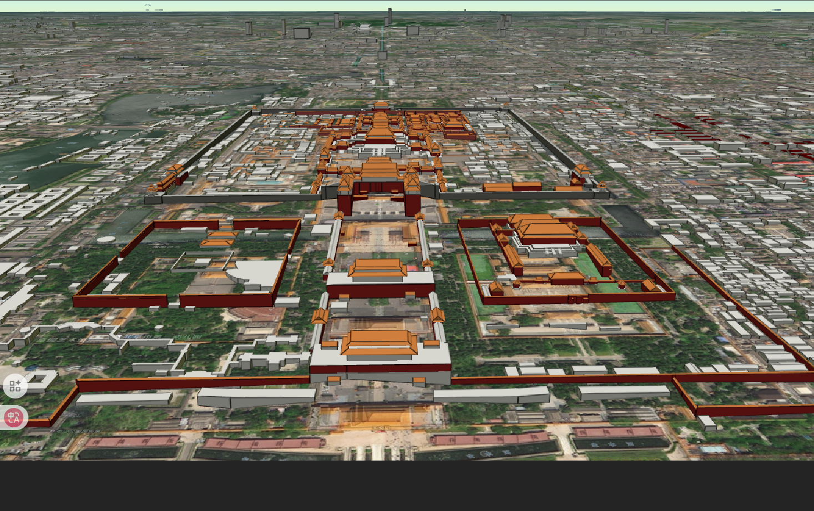
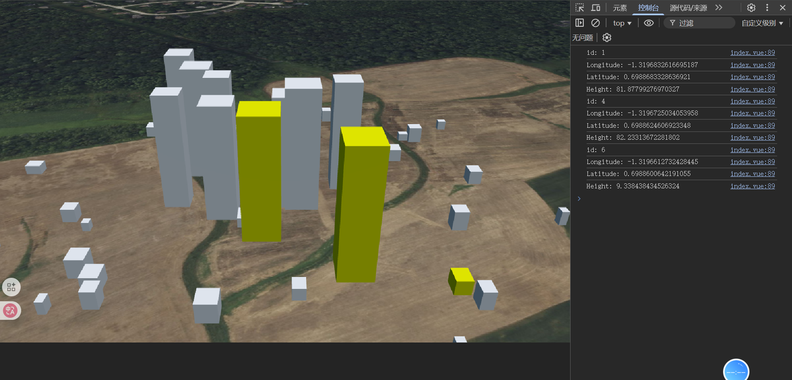
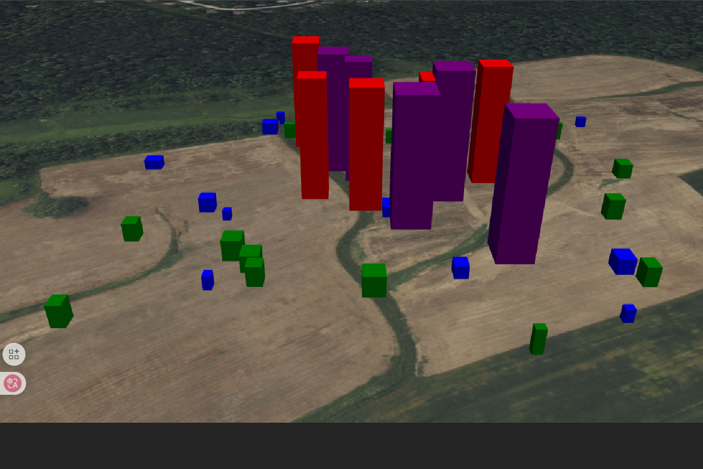

# 3D Tiles 大规模三维地理空间数据的开放标准

## 什么是 3D Tiles？

简单理解：想象一下你要在手机上查看整个城市的三维模型，但手机内存有限装不下所有数据。3D Tiles 就像一个智能的"数据快递员"：

- 它把庞大的 3D 模型切成小块（瓦片）
- 只加载你当前能看到的部分
- 当你移动时，动态加载新区域
- 离得远时显示简化版，离得近时显示精细版可以参考 [3D Tiles 官方文档](https://github.com/CesiumGS/3d-tiles/tree/main/specification)。

### 加载全球建筑

`createOsmBuildingsAsync` 为 Cesium OSM 建筑瓦片集创建一个 Cesium3DTileset 实例

```js
const tileset = await Cesium.createOsmBuildingsAsync();
viewer.scene.primitives.add(tileset);
// 定位到北京天安门
viewer.camera.setView({
  destination: Cesium.Cartesian3.fromDegrees(116.3911, 39.9067, 500),
  orientation: {
    heading: Cesium.Math.toRadians(0),
    pitch: Cesium.Math.toRadians(-90),
    roll: Cesium.Math.toRadians(0),
  },
});
```



### 加载 3D Tiles 数据

使用异步方法 `Cesium.Cesium3DTileset.fromUrl(url, options)` 加载 3D Tiles 数据集。

options: [详情](https://cesium.com/learn/cesiumjs/ref-doc/Cesium3DTileset.html#.ConstructorOptions)

- `maximumScreenSpaceError`: 最大屏幕空间误差，值越小越精细（默认 16）

```js
// 创建3D Tileset
const tileset = await Cesium.Cesium3DTileset.fromUrl(
  new URL("./models/Tileset/tileset.json", import.meta.url).href,
  {
    maximumScreenSpaceError: 16, // 最大屏幕空间误差
    maximumMemoryUsage: 512, // 最大内存使用量
    skipLevelOfDetail: true, // 跳过细节层级
    dynamicScreenSpaceError: true, // 动态屏幕空间误差
    dynamicScreenSpaceErrorDensity: 0.001, // 动态屏幕空间误差密度
  }
);
viewer.scene.primitives.add(tileset);
viewer.zoomTo(tileset); // 缩放到3D Tileset
```

#### 查看属性

添加点击事件，当前点击的瓦片会变为黄色，并打印出该瓦片的属性。

```js
viewer.screenSpaceEventHandler.setInputAction((click) => {
  const picked = viewer.scene.pick(click.position);
  if (picked instanceof Cesium.Cesium3DTileFeature) {
    // 当前点击为黄色
    picked.color = Cesium.Color.YELLOW;
    const properties = picked.getPropertyIds();
    // 获取属性并打印
    properties.forEach((name) => {
      console.log(`${name}: ${picked.getProperty(name)}`);
    });
  }
}, Cesium.ScreenSpaceEventType.LEFT_CLICK);
```



#### 添加调试面板

```js
viewer.extend(Cesium.viewerCesium3DTilesInspectorMixin);
```

#### 添加样式(按条件着色)

文档: [Cesium3DTileStyle](https://cesium.com/learn/cesiumjs/ref-doc/Cesium3DTileStyle.html?classFilter=Cesium3DTileStyle)

```js
tileset.style = new Cesium.Cesium3DTileStyle({
  color: {
    conditions: [
      ["${Height} >= 80", "color('purple')"],
      ["${Height} >= 50", "color('red')"],
      ["${Height} >= 10", "color('green')"],
      ["true", "color('blue')"],
    ],
  },
});
```


