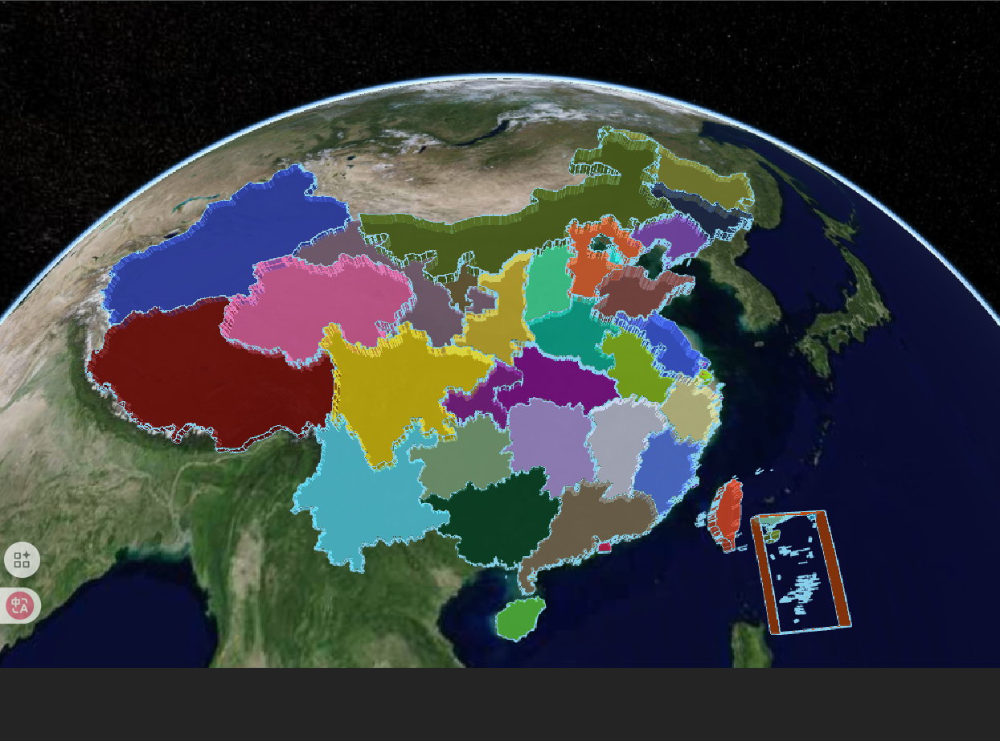
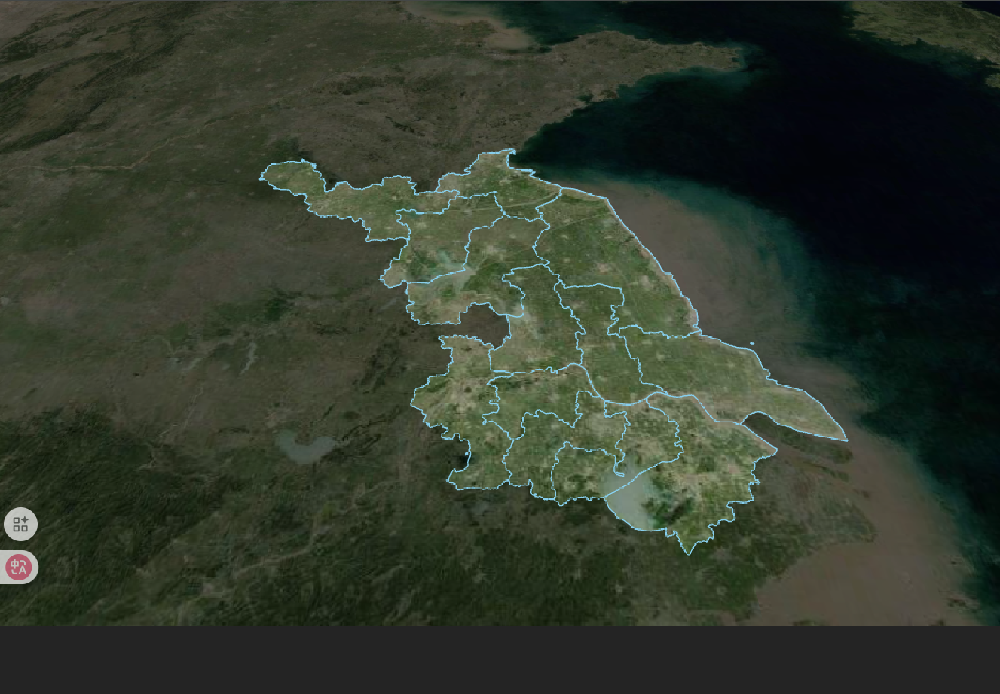
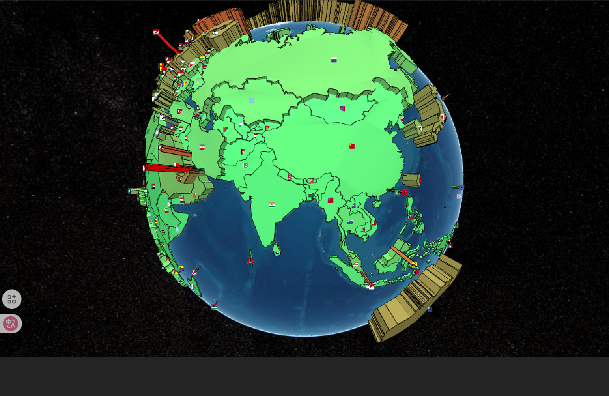

<!-- GeoJson 数据格式
CZML 数据格式
KML 数据格式
MVT 数据格式
SHP 数据格式
dbf 数据格式
prj 数据格式 -->

# 数据加载

## GeoJson 数据加载

GeoJson 数据是一种常用的地理数据格式，可以通过 `GeoJsonDataSource` 类来实现。GeoJson 是一种常用的地理数据格式，适用于表示地理特征和属性。

### 示例代码

```js
// 异步加载中国GeoJson数据
const geoJsonData = Cesium.GeoJsonDataSource.load(
  "https://geojson.cn/api/china/1.6.2/china.json",
  {
    stroke: Cesium.Color.SKYBLUE, // 边框颜色
    fill: Cesium.Color.PINK, // 填充颜色
    strokeWidth: 3, // 边框宽度
  }
);

// 将数据源添加到Viewer中
geoJsonData.then((dataSource) => {
  viewer.dataSources.add(dataSource);
  // 遍历所有实体
  dataSource.entities.values.forEach((entity) => {
    if (entity.polygon) {
      // 设置随机颜色
      entity.polygon.material = new Cesium.ColorMaterialProperty(
        Cesium.Color.fromRandom({
          alpha: 0.8, // 设置透明度
        })
      );
      // 区域随机拉伸高度
      entity.polygon.extrudedHeight = Math.random() * 100000;
    }
  });
  // 设置视图范围
  viewer.zoomTo(dataSource);
});
```



### 经典案例(遮罩)

实现原理：创建 polygon 覆盖全球，并在其上添加多个洞（holes），每个洞对应一个独立的多边形区域。[边界数据下载地址](https://geojson.hxkj.vip/)

```js
const geoJsonData = new Cesium.GeoJsonDataSource().load(jiangsu, {
  stroke: Cesium.Color.SKYBLUE, // 边框颜色
  fill: Cesium.Color.fromAlpha(Cesium.Color.WHITE, 0), // 填充颜色
  strokeWidth: 3, // 边框宽度
});

geoJsonData.then((datasource) => {
  viewer.dataSources.add(datasource);
  viewer.flyTo(datasource, { duration: 3 });

  // 存储所有洞的区域（每个独立多边形一个数组）
  const holes = [];

  // 收集所有多边形点位（按独立区域分组）
  datasource.entities.values.forEach((entity) => {
    const hierarchy = entity.polygon.hierarchy.getValue(
      Cesium.JulianDate.now()
    );
    if (hierarchy) {
      holes.push(hierarchy.positions); // 每个区域单独存储
    }
  });
  // 创建覆盖全球的蒙层（带多个洞）
  viewer.entities.add({
    polygon: {
      hierarchy: new Cesium.PolygonHierarchy(
        Cesium.Cartesian3.fromDegreesArray([30, 0, 30, 89, 180, 89, 180, 0]),
        holes.map((hole) => new Cesium.PolygonHierarchy(hole))
      ),
      material: Cesium.Color.BLACK.withAlpha(0.4),
    },
    perPositionHeight: true,
  });
});
```



## CZML 数据加载

CZML（Cesium Language）是一种用于描述动态场景的 JSON 格式，专门为 Cesium 设计。它允许开发者描述`随时间变化`的图形和属性，特别适合用于描述移动对象、传感器范围、轨迹等动态场景。

### 示例代码

案例来自于 [Cesium 官方文档](https://sandcastle.cesium.com/index.html?src=CZML%20Model%20Articulations.html&label=CZML)

:::details 点击查看代码

```js
const czml = [
  {
    id: "document",
    name: "CZML Model",
    version: "1.0",
    clock: {
      interval: "2019-06-01T16:00:00Z/2019-06-01T16:10:00Z",
      currentTime: "2019-06-01T16:00:00Z",
      multiplier: 60,
      range: "LOOP_STOP",
      step: "SYSTEM_CLOCK_MULTIPLIER",
    },
  },
  {
    id: "test model",
    name: "Cesium Air",
    position: {
      cartographicDegrees: [-77, 37, 10000],
    },
    model: {
      gltf: "https://cesium.com/public/SandcastleSampleData/launchvehicle.glb",
      scale: 2.0,
      minimumPixelSize: 128,
      runAnimations: false,
      articulations: {
        "Fairing Open": {
          epoch: "2019-06-01T16:00:00Z",
          number: [0, 0, 600, 120],
        },
        "Fairing Separate": {
          epoch: "2019-06-01T16:00:00Z",
          number: [0, 0, 400, -50],
        },
        "Fairing Drop": {
          epoch: "2019-06-01T16:00:00Z",
          interpolationAlgorithm: "LAGRANGE",
          interpolationDegree: 2,
          number: [0, 0, 80, 0, 100, 0, 120, -1, 600, -120],
        },
      },
    },
  },
];

// 加载CZML数据
viewer.clock.shouldAnimate = true; // 开启动画

const dataSource = Cesium.CzmlDataSource.load(czml);
viewer.dataSources
  .add(dataSource)
  .then(function (dataSource) {
    viewer.trackedEntity = dataSource.entities.getById("test model");
  })
  .catch(function (error) {
    console.error(error);
  });
```

:::

<video controls width="600">
  <source src="../../Aassets/Basics/CZML.mp4" type="video/mp4" />
  您的浏览器不支持HTML5视频标签。
</video>

### 获取实体

可以通过 `dataSource.entities.getById("test model")` 获取到 CZML 中定义的实体。

## KML 数据加载

KML（Keyhole Markup Language）是一种基于 XML 的地理数据格式，用于在地理浏览器中表示地理特征和可视化数据

KML 核心特点：

- XML 格式：结构化、可读性强
- 支持多种地理特征：点、线、面、模型、图像叠加层等
- 样式丰富：支持自定义图标、颜色、标签等
- 层级结构：通过文件夹组织内容
- 时间支持：可表示时间动画数据
- 网络链接：支持动态加载远程资源

### 示例代码

案例来自于 [Cesium 官方文档](https://sandcastle.cesium.com/index.html?src=KML.html&label=CZML)

```js
viewer.dataSources.add(
  Cesium.KmlDataSource.load(
    new URL("./models/kml/gdpPerCapita2008.kmz", import.meta.url).href,
    {
      camera: viewer.scene.camera,
      canvas: viewer.scene.canvas,
    }
  )
);
```


