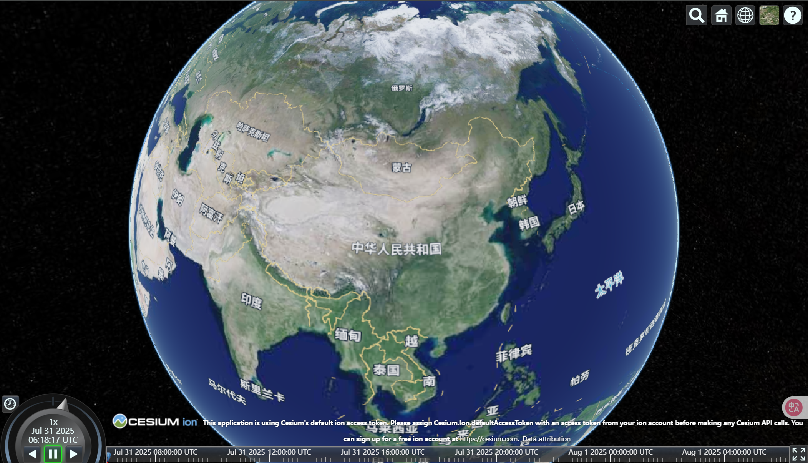

# 底图更换

Cesium 默认使用 Bing Maps 作为地图源，但由于 Bing Maps 在国内可能存在访问限制，开发者常需替换为更适合国内使用的地图服务,以下以天地图为例来更换底图

## 前置工作

- 需要申请[天地图](http://lbs.tianditu.gov.cn/home.html)的 key

## 替换默认底图
使用 WebMapTileServiceImageryProvider 或 UrlTemplateImageryProvider 加载天地图的瓦片服务

## 天地图影像

```js
// 替换为天地图影像服务
const tiandituProvider = new Cesium.WebMapTileServiceImageryProvider({
  url:
    "http://{s}.tianditu.gov.cn/img_w/wmts?service=wmts&request=GetTile&version=1.0.0&LAYER=img&tileMatrixSet=w&TileMatrix={TileMatrix}&TileRow={TileRow}&TileCol={TileCol}&style=default&format=tiles&tk=" +
    "密钥",
  layer: "img",
  style: "default",
  format: "tiles",
  tileMatrixSetID: "w", // 天地图使用 Web 墨卡托投影（EPSG:3857），需确保 tileMatrixSetID: "w"
  subdomains: ["t0", "t1", "t2", "t3", "t4", "t5", "t6", "t7"], // 子域名
  maximumLevel: 18,
  credit: new Cesium.Credit("天地图影像"),
});
// 将天地图影像添加到viewer实例的影像图层集合中
viewer.imageryLayers.addImageryProvider(tiandituProvider);
```

## 添加地理标注

```js
const labelProvider = new Cesium.WebMapTileServiceImageryProvider({
  url:
    "http://{s}.tianditu.gov.cn/cia_w/wmts?service=wmts&request=GetTile&version=1.0.0&LAYER=cia&tileMatrixSet=w&tileMatrix={TileMatrix}&tileRow={TileRow}&tileCol={TileCol}&style=default&format=tiles&tk=" +
    "密钥",
  layer: "img",
  style: "default",
  format: "tiles",
  tileMatrixSetID: "w",
  subdomains: ["t0", "t1", "t2", "t3", "t4", "t5", "t6", "t7"], // 子域名轮询
  maximumLevel: 18,
  credit: new Cesium.Credit("天地图影像"),
});
// 添加到viewer实例的影像图层集合中
viewer.imageryLayers.addImageryProvider(labelProvider);
```

## 效果图



## 高德地图

```js
const gaodeProvider = new Cesium.UrlTemplateImageryProvider({
  url: "https://webst0{s}.is.autonavi.com/appmaptile?style=6&x={x}&y={y}&z={z}",
  subdomains: ["1", "2", "3", "4"],
});
viewer.imageryLayers.addImageryProvider(gaodeProvider);
```
