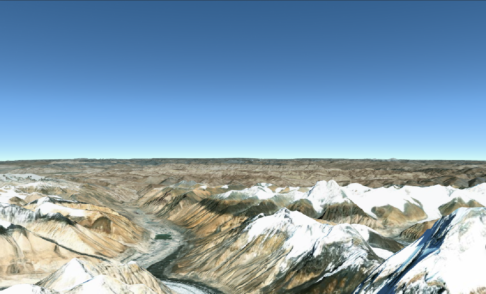

# Viewer：三维场景的“外壳”

[Viewer](https://cesium.com/learn/cesiumjs/ref-doc/Viewer.html?classFilter=viewer) 是 Cesium 的核心容器，负责整合所有可视化组件（地图、控件、实体等），提供一个完整的 3D 地球视图框架。


## 创建 Viewer 实例

- container：指定容器元素，通常是一个 HTML 元素。
- options：可选配置项，包括场景设置、相机设置、控件设置等。

```js
const viewer = new Cesium.Viewer(container, options);
```

## 核心特性

### 集成控件

常见控件：
| 控件名称 | 描述 | 类型 | 默认值 |
| --- | --- | --- | --- |
| geocoder | 地理编码搜索 | boolean | true |
| homeButton | 主页按钮 | boolean | true |
| sceneModePicker | 场景模式选择器 | boolean | true |
| baseLayerPicker | 底图选择器 | boolean | true |
| navigationHelpButton | 导航帮助按钮 | boolean | true |
| animation | 动画控件 | boolean | true |
| timeline | 时间轴 | boolean | true |
| fullscreenButton | 全屏按钮 | boolean | true |
| vrButton | VR 按钮 | boolean | false |
| infoBox | 信息框 | boolean | true |

使用方式：

```js
const viewer = new Cesium.Viewer(cesiumContainer.value, {
  geocoder: false, // 关闭地理编码搜索
  homeButton: false, // 关闭主页按钮
  sceneModePicker: false, // 关闭场景模式选择器
  baseLayerPicker: false, // 关闭底图选择器
  navigationHelpButton: false, // 关闭导航帮助
  animation: false, // 关闭动画控件
  timeline: false, // 关闭时间轴
  fullscreenButton: false, // 关闭全屏按钮
});
```

### 场景管理(scene)

Scene 是 Viewer 的内部对象，管理 WebGL 渲染、相机、光照和几何体绘制

1. 设置背景颜色：

方式一：

```js
// 需将skybox属性设置为false，否则会覆盖背景颜色
const viewer = new Cesium.Viewer(cesiumContainer.value, {
  skyBox: false, // 关闭天空盒
});
// 设置场景背景颜色为天空蓝
viewer.scene.backgroundColor = Cesium.Color.SKYBLUE;
```

方式二：

```js
viewer.scene.skyBox.show = false;
viewer.scene.backgroundColor = Cesium.Color.SKYBLUE;
```


2. 关闭大气层显示

```js
// 方式一
viewer.scene.skyAtmosphere.show = false;
// 方式二：在options中设置
const viewer = new Cesium.Viewer(cesiumContainer.value, {
  skyAtmosphere: false, // 关闭大气层
});
```


3. 显示帧率

```js
viewer.scene.debugShowFramesPerSecond = true;
```

### 实体添加(entity)、GeoJson 数据添加

#### 实体添加：

案例请参考[实体添加](./entityAdd.md)
| 实体类型 | 描述 |
| --- | --- |
| 点（Point） | 表示一个点 |
| 线（Polyline） | 表示一条线 |
| 面（Polygon） | 表示一个面 |
| 模型（Model） | 表示一个 3D 模型 |
| 广告牌（Billboard） | 表示一个 2D 标签 |
| 路径（Path） | 表示一条经纬度线 |
| 矩形（Rectangle） | 表示一个矩形 |
| 椭圆（Ellipse） | 表示一个椭圆 |
| 椭圆体（Ellipsoid） | 表示一个椭圆体 |
| 飞机（Plane） | 表示一个飞机 |
| 墙（Wall） | 表示一个墙 |

#### GeoJson 数据添加：
GeoJson是一种用于描述地理空间数据的开放标准，支持点、线、面等几何对象。
```js
// 模拟一个GeoJson数据
const geojson = {
  type: "FeatureCollection",
  features: [
    {
      type: "Feature",
      properties: {
        name: "City A",
      },
      geometry: {
        type: "Point",
        coordinates: [116.404, 39.915],
      },
    },
  ],
};
// 加载GeoJson数据
const dataSource = Cesium.GeoJsonDataSource.load(geojson);
viewer.dataSources.add(dataSource);
viewer.flyTo(dataSource);
```

#### 添加3D建筑(待完善)
```js
// 加载3D建筑(场景)
viewer.scene.primitives.add(
  new Cesium.createOsmBuildings()
  // new Cesium.Cesium3DTileset({
  //   url:""
  // })
)
```

### 地形(terrain)
Cesium 的地形系统允许在三维地球表面呈现真实高程数据（山脉、峡谷、河流等地貌），结合 地形瓦片 和 LOD（细节层次） 技术实现高效渲染。以下从 **地形加载**、**配置参数**、**可视化效果** 和 **性能优化** 四个维度详细解析
1. 地形加载：地形加载有多种方式，这里介绍两种，一种是使用 Cesium 提供的默认地形，另一种是使用自定义地形数据。
```js
// 使用默认地形
const viewer = new Cesium.Viewer('cesiumContainer', {
  terrainProvider: await Cesium.createWorldTerrainAsync({
    requestVertexNormals: true,   // 真实光照效果
    requestWaterMask: true        // 真实水面流动效果
  })
});
```


### Viewer 常用方法

- `zoomTo(target,offset)`：相机自动调整到指定实体的视野。
- `flyTo(target, options)`：相机平滑过渡到指定实体的位置。
- `trackedEntity`：设置或获取当前跟踪的实体。
- `destroy()`：销毁 Viewer 实例。
