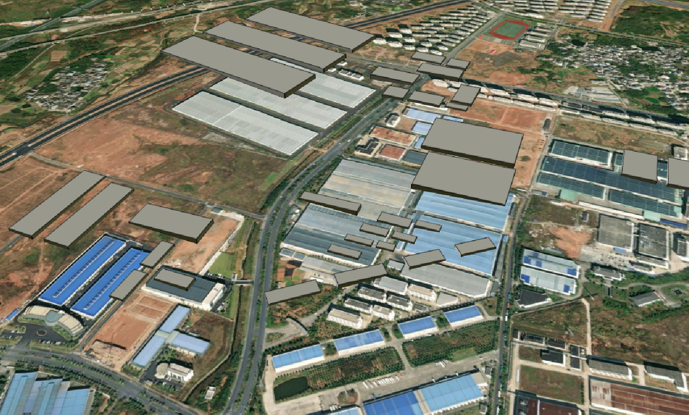

## 添加 3d 实体

```js
try {
  const tileset = await Cesium.createOsmBuildingsAsync();
  viewer.scene.primitives.add(tileset);
} catch (error) {
  console.log(`Error creating tileset: ${error}`);
}
```

