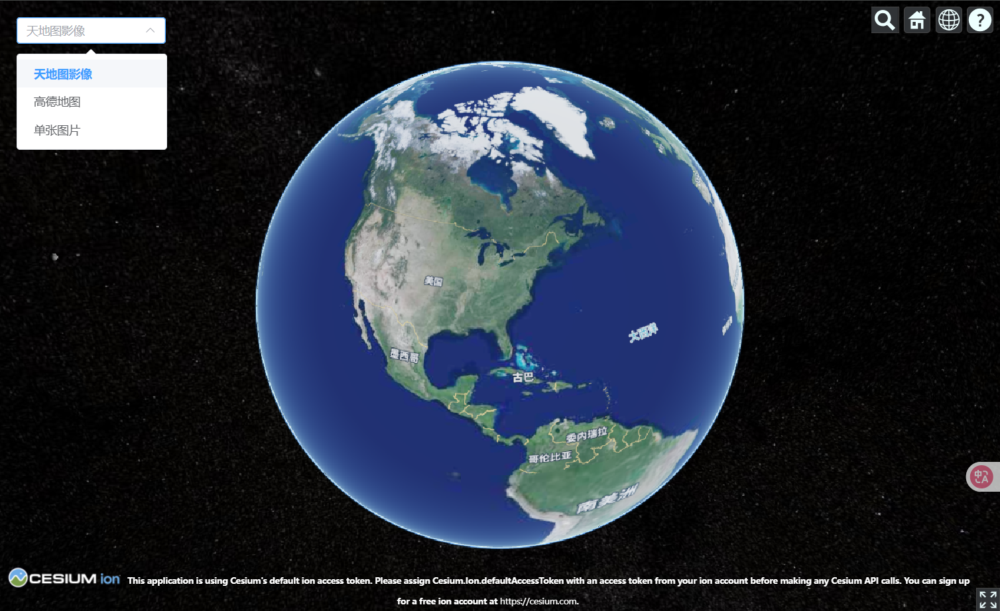

# 综合案例

- 该案例展示了同时添加`WMTS`、`XYZ`、`单张图片`三种底图，通过切换选择器进行底图切换。
- 使用`show`属性控制图层的显示与隐藏。

:::details 展开代码

```vue
<template>
  <div class="map-switcher">
    <el-select v-model="currentMap" @change="switchMap">
      <el-option label="天地图影像" value="tianditu"></el-option>
      <el-option label="高德地图" value="gaode"></el-option>
      <el-option label="单张图片" value="singleTile"></el-option>
    </el-select>
    <div ref="cesiumContainer" class="container"></div>
  </div>
</template>

<script setup>
import { ref, onMounted, reactive } from "vue";
import * as Cesium from "cesium";

const cesiumContainer = ref(null);
const currentMap = ref("tianditu");
const viewer = ref(null);
const imageryLayers = reactive({
  tianditu: [], // 天地图图层数组
  gaode: [], // 高德图层数组
  singleTile: [], // 单张图片图层数组
});

onMounted(() => {
  // 初始化Viewer时不加载任何底图
  viewer.value = new Cesium.Viewer(cesiumContainer.value, {
    baseLayer: false,
    baseLayerPicker: false,
    timeline: false,
    animation: false,
  });
  loadAllMaps(); // 预加载所有底图
});

// 预加载所有底图图层
const loadAllMaps = async () => {
  // 天地图WMTS - 底图
  const tiandituBase = new Cesium.ImageryLayer(
    new Cesium.WebMapTileServiceImageryProvider({
      url: "http://{s}.tianditu.gov.cn/img_w/wmts?service=wmts&request=GetTile&version=1.0.0&LAYER=img&tileMatrixSet=w&TileMatrix={TileMatrix}&TileRow={TileRow}&TileCol={TileCol}&style=default&format=tiles&tk=05be06461004055923091de7f3e51aa6",
      layer: "img",
      style: "default",
      format: "tiles",
      tileMatrixSetID: "w",
      subdomains: ["t0", "t1", "t2", "t3", "t4", "t5", "t6", "t7"],
      maximumLevel: 18,
    })
  );
  tiandituBase.mapType = "tianditu"; // 添加地图类型标识
  imageryLayers.tianditu.push(tiandituBase);

  // 天地图WMTS - 标注
  const tiandituLabel = new Cesium.ImageryLayer(
    new Cesium.WebMapTileServiceImageryProvider({
      url: "http://{s}.tianditu.gov.cn/cia_w/wmts?service=wmts&request=GetTile&version=1.0.0&LAYER=cia&tileMatrixSet=w&tileMatrix={TileMatrix}&TileRow={TileRow}&TileCol={TileCol}&style=default&format=tiles&tk=05be06461004055923091de7f3e51aa6",
      layer: "cia",
      style: "default",
      format: "tiles",
      tileMatrixSetID: "w",
      subdomains: ["t0", "t1", "t2", "t3", "t4", "t5", "t6", "t7"],
      maximumLevel: 18,
    })
  );
  tiandituLabel.mapType = "tianditu"; // 添加地图类型标识
  imageryLayers.tianditu.push(tiandituLabel);

  // 高德XYZ
  const gaodeLayer = new Cesium.ImageryLayer(
    new Cesium.UrlTemplateImageryProvider({
      url: "https://webst0{s}.is.autonavi.com/appmaptile?style=6&x={x}&y={y}&z={z}",
      subdomains: ["1", "2", "3", "4"],
    })
  );
  gaodeLayer.mapType = "gaode"; // 添加地图类型标识
  imageryLayers.gaode.push(gaodeLayer);

  // 单张图片
  const singleTileLayer = new Cesium.ImageryLayer(
    await Cesium.SingleTileImageryProvider.fromUrl(
      "/src/assets/earthbump1k.jpg",
      { rectangle: Cesium.Rectangle.fromDegrees(-180.0, -90.0, 180.0, 90.0) }
    )
  );
  singleTileLayer.mapType = "singleTile"; // 添加地图类型标识
  imageryLayers.singleTile.push(singleTileLayer);

  // 将所有图层添加到viewer，但默认隐藏
  Object.values(imageryLayers).forEach((layerArray) => {
    layerArray.forEach((layer) => {
      viewer.value.imageryLayers.add(layer);
      layer.show = false; // 默认隐藏所有图层
    });
  });

  // 默认显示天地图
  switchMap("tianditu");
};

// 切换底图显示
const switchMap = (mapType) => {
  // 隐藏所有图层
  viewer.value.imageryLayers._layers.forEach((layer) => {
    layer.show = false;
  });

  // 显示选中的地图类型的所有图层
  if (imageryLayers[mapType]) {
    imageryLayers[mapType].forEach((layer) => {
      layer.show = true;
    });
  }

  // 更新当前地图类型
  currentMap.value = mapType;
};
</script>

<style scoped>
.map-switcher {
  position: relative;
  height: 100vh;
}
.container {
  width: 100%;
  height: 100%;
}
.el-select {
  position: absolute;
  top: 20px;
  left: 20px;
  z-index: 1;
  width: 180px;
}
</style>
```

:::


