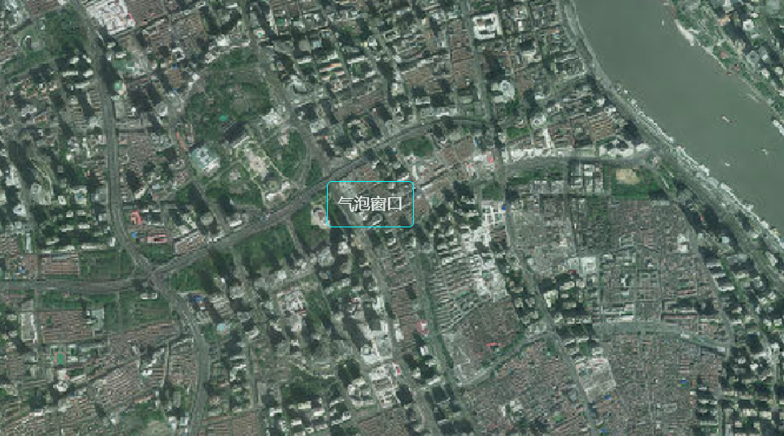

#### 添加气泡窗口

您可以在 CesiumJS 场景中叠加自定义的 HTML 元素，例如气泡窗口，并通过 JavaScript 控制其位置，使其始终跟随三维空间中的某个点。

**实现步骤**：

1. 创建 HTML 元素作为气泡窗口容器
2. 使用`scene.cartesianToCanvasCoordinates`将三维坐标转换为屏幕坐标
3. 在`preRender`事件中实时更新元素位置

**API 补充说明**：

- `viewer.scene.cartesianToCanvasCoordinates(cartesian, result)`: 将三维笛卡尔坐标转换为屏幕二维坐标
- `viewer.scene.preRender.addEventListener(callback)`: 场景渲染前触发的事件，用于实时更新 UI
- `Cesium.Cartesian3.fromDegrees(longitude, latitude, height)`: 从经纬度创建三维坐标

:::details 展开代码

```vue
<template>
  <div ref="cesiumContainer" class="container"></div>
  <div ref="popup" class="popup-window">气泡窗口</div>
</template>

<script setup>
import { ref, onMounted } from "vue";
import * as Cesium from "cesium";

const cesiumContainer = ref(null);
const popup = ref(null);
let viewer = null;

// 天地图TOKEN
const token = "05be06461004055923091de7f3e51aa6";

onMounted(() => {
  // 初始化Viewer
  viewer = new Cesium.Viewer(cesiumContainer.value, {
    geocoder: false, // 关闭地理编码搜索
    homeButton: false, // 关闭主页按钮
    sceneModePicker: false, // 关闭场景模式选择器
    baseLayerPicker: false, // 关闭底图选择器
    navigationHelpButton: false, // 关闭导航帮助
    animation: false, // 关闭动画控件
    timeline: false, // 关闭时间轴
    fullscreenButton: false, // 关闭全屏按钮
    baseLayer: false, // 关闭默认地图
  });

  // 清空logo
  viewer.cesiumWidget.creditContainer.style.display = "none";

  // 设置相机视角
  viewer.camera.setView({
    destination: Cesium.Cartesian3.fromDegrees(121.4737, 31.2304, 5000),
    orientation: {
      heading: Cesium.Math.toRadians(0),
      pitch: Cesium.Math.toRadians(-90),
      roll: 0,
    },
  });

  // 添加preRender事件，使窗口位置保持不变
  viewer.scene.preRender.addEventListener(function () {
    const htmlPop = viewer.scene.cartesianToCanvasCoordinates(
      Cesium.Cartesian3.fromDegrees(121.4737, 31.2304, 0),
      new Cesium.Cartesian2()
    );
    if (popup.value && htmlPop) {
      popup.value.style.left = htmlPop.x + "px";
      popup.value.style.top = htmlPop.y + "px";
    }
  });

  initMap();
});

// 加载天地图
const initMap = () => {
  // 以下为天地图及天地图标注加载
  const tiandituProvider = new Cesium.WebMapTileServiceImageryProvider({
    url:
      "http://{s}.tianditu.gov.cn/img_w/wmts?service=wmts&request=GetTile&version=1.0.0&LAYER=img&tileMatrixSet=w&TileMatrix={TileMatrix}&TileRow={TileRow}&TileCol={TileCol}&style=default&format=tiles&tk=" +
      token,
    layer: "img",
    style: "default",
    format: "tiles",
    tileMatrixSetID: "w",
    subdomains: ["t0", "t1", "t2", "t3", "t4", "t5", "t6", "t7"], // 子域名
    maximumLevel: 18,
    credit: new Cesium.Credit("天地图影像"),
  });

  // 添加地理标注
  const labelProvider = new Cesium.WebMapTileServiceImageryProvider({
    url:
      "http://{s}.tianditu.gov.cn/cia_w/wmts?service=wmts&request=GetTile&version=1.0.0&LAYER=cia&tileMatrixSet=w&tileMatrix={TileMatrix}&tileRow={TileRow}&tileCol={TileCol}&style=default&format=tiles&tk=" +
      token,
    layer: "img",
    style: "default",
    format: "tiles",
    tileMatrixSetID: "w",
    subdomains: ["t0", "t1", "t2", "t3", "t4", "t5", "t6", "t7"], // 子域名轮询
    maximumLevel: 18,
    credit: new Cesium.Credit("天地图影像"),
  });

  // 天地图影像添加到viewer实例的影像图层集合中
  viewer.imageryLayers.addImageryProvider(tiandituProvider);
  // 天地图地理标注（后添加的会覆盖前面的）
  viewer.imageryLayers.addImageryProvider(labelProvider);
};
</script>
``
<style scoped>
.container {
  width: 100vw;
  height: 100vh;
}

.popup-window {
  position: absolute;
  padding: 12px 18px;
  background-color: rgba(44, 62, 80, 0.85);
  color: #ecf0f1;
  border: 1px solid #3498db;
  border-radius: 8px;
  box-shadow: 0 4px 12px rgba(0, 0, 0, 0.3);
  font-family: "Segoe UI", Tahoma, Geneva, Verdana, sans-serif;
  font-size: 14px;
  text-align: center;
  min-width: 120px;
  pointer-events: none;
  transform: translate(-50%, -100%);
}

.popup-window::after {
  content: "";
  position: absolute;
  bottom: -10px;
  left: 50%;
  transform: translateX(-50%);
  border-width: 10px 10px 0;
  border-style: solid;
  border-color: #3498db transparent transparent transparent;
  display: block;
  width: 0;
  height: 0;
}

.popup-window::before {
  content: "";
  position: absolute;
  bottom: -9px;
  left: 50%;
  transform: translateX(-50%);
  border-width: 9px 9px 0;
  border-style: solid;
  border-color: rgba(44, 62, 80, 0.85) transparent transparent transparent;
  display: block;
  width: 0;
  height: 0;
}
</style>
```

:::


