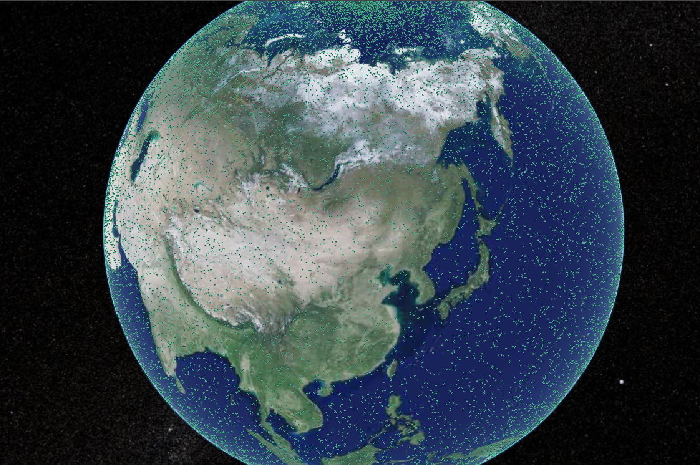

### 海量图标添加

- 对于大规模数据可视化，考虑使用`Primitive`而非`Entity`以获得更好性能
- 合理设置`viewer.resolutionScale`控制渲染分辨率
- 使用`viewer.scene.requestRenderMode = true`启用按需渲染

1. **实体批处理**：对于大量实体，使用 `Primitive` 统一管理

下面案例使用`BillboardCollection`和`Primitive`添加五万个图标，同时保证高性能渲染

:::details 点击查看代码

```vue
<template>
  <div ref="cesiumContainer" class="container"></div>
</template>

<script setup>
import { ref, onMounted } from "vue";
import * as Cesium from "cesium";
const cesiumContainer = ref(null);
let viewer = null;

// 天地图TOKEN
const token = "05be06461004055923091de7f3e51aa6";

onMounted(() => {
  // 初始化Viewer
  viewer = new Cesium.Viewer(cesiumContainer.value, {
    geocoder: false, // 关闭地理编码搜索
    homeButton: false, // 关闭主页按钮
    sceneModePicker: false, // 关闭场景模式选择器
    baseLayerPicker: false, // 关闭底图选择器
    navigationHelpButton: false, // 关闭导航帮助
    animation: false, // 关闭动画控件
    timeline: false, // 关闭时间轴
    fullscreenButton: false, // 关闭全屏按钮
    baseLayer: false, // 关闭默认地图
  });
  // 清空logo
  viewer.cesiumWidget.creditContainer.style.display = "none";
  initMap();

  // 添加大量广告牌集合
  const billboardCollection = viewer.scene.primitives.add(
    new Cesium.BillboardCollection()
  );
  for (let i = 0; i < 50000; i++) {
    billboardCollection.add({
      position: Cesium.Cartesian3.fromDegrees(
        Math.random() * 360 - 180, // 经度
        Math.random() * 180 - 90, // 纬度
        50
      ),
      image: "/src/assets/vue.svg", // 替换为实际图片路径
      width: 32,
      height: 32,
      scaleByDistance: new Cesium.NearFarScalar(10000, 1.0, 100000, 0.1), // 按距离缩放：避免远处图标浪费像素
    });
  }
});

// 加载天地图
const initMap = () => {
  // 以下为天地图及天地图标注加载
  const tiandituProvider = new Cesium.WebMapTileServiceImageryProvider({
    url:
      "http://{s}.tianditu.gov.cn/img_w/wmts?service=wmts&request=GetTile&version=1.0.0&LAYER=img&tileMatrixSet=w&TileMatrix={TileMatrix}&TileRow={TileRow}&TileCol={TileCol}&style=default&format=tiles&tk=" +
      token,
    layer: "img",
    style: "default",
    format: "tiles",
    tileMatrixSetID: "w",
    subdomains: ["t0", "t1", "t2", "t3", "t4", "t5", "t6", "t7"], // 子域名
    maximumLevel: 18,
    credit: new Cesium.Credit("天地图影像"),
  });
  // 天地图影像添加到viewer实例的影像图层集合中
  viewer.imageryLayers.addImageryProvider(tiandituProvider);
};
</script>
<style scoped>
.container {
  width: 100vw;
  height: 100vh;
}
</style>
```

:::

<Demo />
<script setup>
import Demo from '@/Components/基础/10_海量图标.vue'
</script>

<!--  -->
