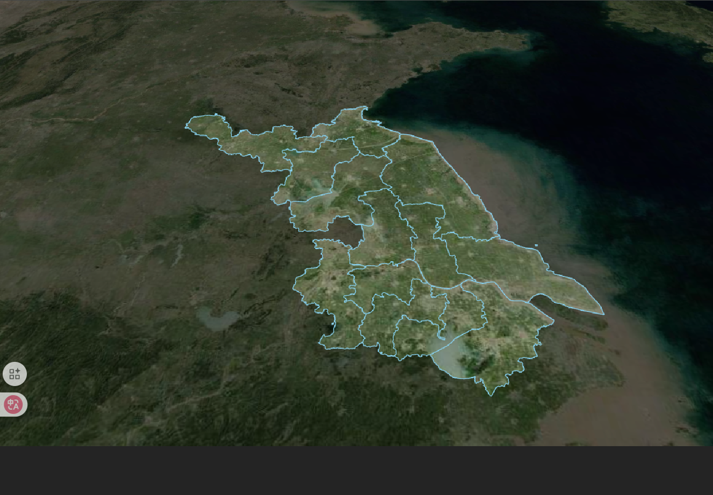

# 区域掩膜

实现原理：创建 polygon 覆盖全球，并在其上添加多个洞（holes），每个洞对应一个独立的多边形区域。



:::details 展开代码

```vue
<template>
  <div ref="cesiumContainer" class="container"></div>
</template>

<script setup>
import { ref, onMounted } from "vue";
import * as Cesium from "cesium";
const cesiumContainer = ref(null);
let viewer = null;

// 天地图TOKEN
const token = "2b34f6afbcd235c2bc4bed3f7735f1f5";

onMounted(() => {
  // 初始化Viewer
  viewer = new Cesium.Viewer(cesiumContainer.value, {
    geocoder: false, // 关闭地理编码搜索
    homeButton: false, // 关闭主页按钮
    sceneModePicker: false, // 关闭场景模式选择器
    baseLayerPicker: false, // 关闭底图选择器
    navigationHelpButton: false, // 关闭导航帮助
    animation: false, // 关闭动画控件
    timeline: false, // 关闭时间轴
    fullscreenButton: false, // 关闭全屏按钮
    baseLayer: false, // 关闭默认地图
  });
  // 清空logo
  viewer.cesiumWidget.creditContainer.style.display = "none";
  initMap();

  // 区域掩膜
  const geoJsonData = new Cesium.GeoJsonDataSource().load(
    "/src/cesium/models/jiangsu.json",
    {
      stroke: Cesium.Color.SKYBLUE, // 边框颜色
      fill: Cesium.Color.fromAlpha(Cesium.Color.WHITE, 0), // 填充颜色
      strokeWidth: 3, // 边框宽度
    }
  );

  geoJsonData.then((datasource) => {
    viewer.dataSources.add(datasource);
    viewer.flyTo(datasource, { duration: 3 });

    // 存储所有洞的区域（每个独立多边形一个数组）
    const holes = [];

    // 收集所有多边形点位（按独立区域分组）
    datasource.entities.values.forEach((entity) => {
      const hierarchy = entity.polygon.hierarchy.getValue(
        Cesium.JulianDate.now()
      );
      if (hierarchy) {
        holes.push(hierarchy.positions); // 每个区域单独存储
      }
    });
    // 创建覆盖全球的蒙层（带多个洞）
    viewer.entities.add({
      polygon: {
        hierarchy: new Cesium.PolygonHierarchy(
          Cesium.Cartesian3.fromDegreesArray([30, 0, 30, 89, 180, 89, 180, 0]),
          holes.map((hole) => new Cesium.PolygonHierarchy(hole))
        ),
        material: Cesium.Color.BLACK.withAlpha(0.4),
      },
      perPositionHeight: true,
    });
  });
});

// 加载天地图
const initMap = () => {
  // 以下为天地图及天地图标注加载
  const tiandituProvider = new Cesium.WebMapTileServiceImageryProvider({
    url:
      "http://{s}.tianditu.gov.cn/img_w/wmts?service=wmts&request=GetTile&version=1.0.0&LAYER=img&tileMatrixSet=w&TileMatrix={TileMatrix}&TileRow={TileRow}&TileCol={TileCol}&style=default&format=tiles&tk=" +
      token,
    layer: "img",
    style: "default",
    format: "tiles",
    tileMatrixSetID: "w",
    subdomains: ["t0", "t1", "t2", "t3", "t4", "t5", "t6", "t7"], // 子域名
    maximumLevel: 18,
    credit: new Cesium.Credit("天地图影像"),
  });
  // 天地图影像添加到viewer实例的影像图层集合中
  viewer.imageryLayers.addImageryProvider(tiandituProvider);
};
</script>
<style scoped>
.container {
  width: 100vw;
  height: 100vh;
}
</style>
```

:::

<Demo />
<script setup>
import Demo from "@/Components/基础/55_区域掩膜.vue";
</script>
